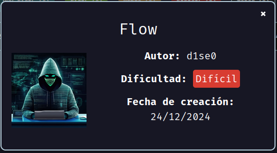
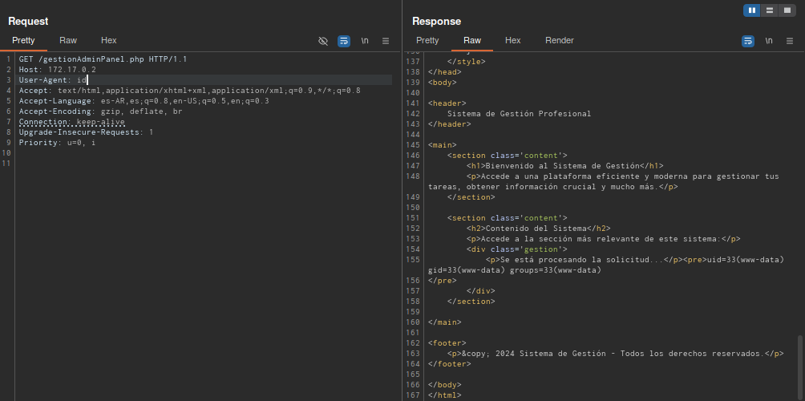

Máquina **Flow** de [DockerLabs](https://dockerlabs.es)

Autor: [d1se0](https://github.com/D1se0)

Dificultad: Dificil



# Reconocimiento

Comenzamos con un escaneo de `nmap`:

```css
nmap -sSVC -p- --open --min-rate 5000 -n -Pn -vvv 172.17.0.2 -oN escaneo.txt
```

```ruby
# Nmap 7.95 scan initiated Tue Dec 24 15:26:25 2024 as: nmap -sSVC -p- --open --min-rate 5000 -n -Pn -vvv -oN escaneo.txt 172.17.0.2
Nmap scan report for 172.17.0.2
Host is up, received arp-response (0.000012s latency).
Scanned at 2024-12-24 15:26:25 -03 for 8s
Not shown: 65533 closed tcp ports (reset)
PORT   STATE SERVICE REASON         VERSION
22/tcp open  ssh     syn-ack ttl 64 OpenSSH 9.6p1 Ubuntu 3ubuntu13.5 (Ubuntu Linux; protocol 2.0)
| ssh-hostkey: 
|   256 a4:30:b7:53:8c:cd:b3:5e:a2:7b:84:a0:e2:8b:26:de (ECDSA)
| ecdsa-sha2-nistp256 AAAAE2VjZHNhLXNoYTItbmlzdHAyNTYAAAAIbmlzdHAyNTYAAABBBHiHCVEfjf7qeFCWCS4xe8uPPHmHjQucfYiQ9WscYBiCH7voggRMAuMQGe5nOTSRFyFWOG5jXMVoPhwojthclfQ=
|   256 4c:7d:75:cf:08:77:21:76:94:8f:16:22:f3:b4:d1:79 (ED25519)
|_ssh-ed25519 AAAAC3NzaC1lZDI1NTE5AAAAIMg+N6LzkrrlWQj2YMZaZWsAQYp3LLNw4bzfTYv6YlpN
80/tcp open  http    syn-ack ttl 64 Apache httpd 2.4.58 ((Ubuntu))
|_http-title: Login - P\xC3\xA1gina Segura
|_http-server-header: Apache/2.4.58 (Ubuntu)
| http-methods: 
|_  Supported Methods: GET HEAD POST OPTIONS
MAC Address: 02:42:AC:11:00:02 (Unknown)
Service Info: OS: Linux; CPE: cpe:/o:linux:linux_kernel

Read data files from: /usr/bin/../share/nmap
Service detection performed. Please report any incorrect results at https://nmap.org/submit/ .
# Nmap done at Tue Dec 24 15:26:33 2024 -- 1 IP address (1 host up) scanned in 8.56 seconds
```

solo tenemos dos puertos abiertos:

•`Puerto 22: OpenSSH 9.6p1`

•`Puerto 80: Apache https 2.4.58`

Ahora vamos desde el navegador y vemos un panel de login. Luego de revisar un poco, veo que en el codigo fuente se encuentra lo siguiente:

```html
<!-- d1se0  -->
```

al parecer tenemos un usuario, por lo que intento un ataque de fuerza bruta al panel de login:

```css
hydra -l d1se0 -P /opt/rockyou.txt 172.17.0.2 http-post-form '/index.php:username=^USER^&password=^PASS^:¡Ups! Las credenciales no son correctas. Intenta nuevamente.'
```

una vez lo hacemos, obtenemos las credenciales:


Estando en "gestionAdminPanel.php", pruebo a capturar la petición con burpsuite, y reemplazar el "User-agent" por un comando, y revisando la respuesta, veo que podemos ejecutar comandos:



Sabiendo esto, podemos intentar enumerar un poco de ahí mismo. Para esto vamos a primero enumerar usuarios leyendo con `cat` el archivo `/etc/passwd` y veo que tenemos uno:

`flow`

# Intrusión

Ahora ejecutamos el comando `find` para buscar archivos que le pertenezcan a `flow`:

```css
find / -user "flow" 2>/dev/null
```

una vez ejecutado, vemos que existe un archivo llamado "secret" en `/usr/bin/secret` el cual si lo leemos dice lo siguiente:

```css
MQYXGZJQNFZXI2DFMJSXG5CAEQSCC===
```

Luego de pasar el mensaje de `base32` a texto, vemos lo siguiente:

```css
d1se0isthebest@$$!
```

por lo que para entrar debemos ejecutar `ssh flow@172.17.0.2` y poner la contraseña "d1se0isthebest@$$!"

# Escalada de privilegios

## Flow

#### Buffer overflow

https://youtu.be/09WQgOV1FtI


Gracias por leer y ver :)
