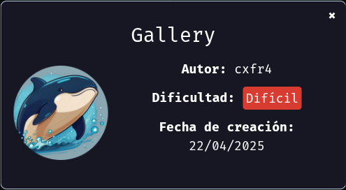
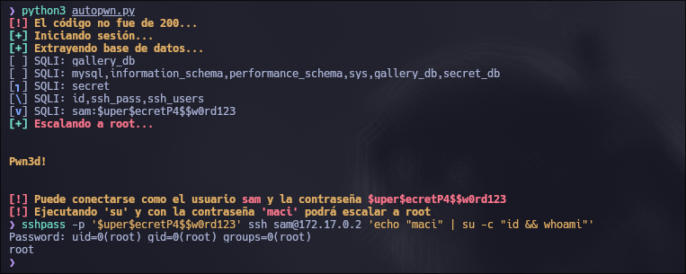

Máquina **Gallery** de la plataforma [DockerLabs](https://dockerlabs.es/)

Autor: [cxfr4](https://cxfr4.vercel.app/)

Dificultad: Dificil (Mi opinión: Fácil)



# AutoPwn

Esta máquina es muy buena ya que podemos practicar inyecciónes sql de manera manual y un command injection. En cualquier caso, para entender bien el proceso de completar la máquina puedes pedirle a *ChatGPT* que te explique el código del autopwn.

# Uso

```css
pip install -r requirements.txt
```

```css
python3 autopwn.py
```

**En caso de que la ip de la máquina sea distinta a '172.17.0.2', puedes cambiarla en el script de la siguiente manera:**

```css
sed 's/172.17.0.2/DIRECCION IP DE LA MAQUINA/g' -i autopwn.py
```





[AutoPwn](https://github.com/maciferna/gitbook/blob/main/writeups/dockerlabs/scripts/gallery/autopwn.py)
